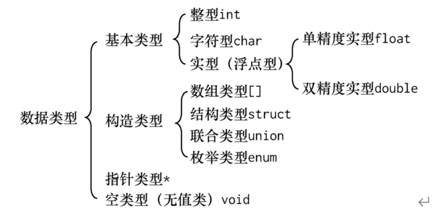

# 学习目标

1. 变量和常量
2. 预处理命令
3. 数据类型（整型、浮点型、字符型）
4. 算术运算符、表达式

# 变量和常量

## 常量

常量指的是在程序运行过程中，其中不变化的量。常量的分类：

- 整型：100,125，-100,0
- 实型（浮点型）：3.14 , 0.125 ，-3.789
- 字符型： 'a'    ,   'b'  ,   '2'
- 字符串型："a"  ,  "ab"  ， "123"   ,  " "

整型、实型、字符型变量是在编译时可以直接编入代码的常量

字符串型常量是指存放在字符串型常量区中的常量

## 变量

变量名链接着储存单元，储存单元放着变量的值

C语言：变量只能有字母、数字、下划线组成，并且第一个字符必须是字母或者下划线

# 数据类型



## 整型

### 符号常量

```c
#define PI 3  //PI是常量，PI是符号常量
int main(){
	int a = PI*2;
    PI = 2 //常量不可修改 ，会编译报错，只有变量才能赋值
}
```

## 浮点型

### 浮点型常量

表示浮点型常量的2种方式：

- 小数形式：0.123
- 指数形式：3e-3（为3x10^-3,即0.003），字母e（或E）之前必须有数字，e后的指数必须为整数
  - 不推荐使用，容易人为出错

### 浮点型变量

```
float f 定义浮点变量，f占4个字节
```

## 字符型

### 字符型常量

正确的字符型常量： ' '  , 'a',  '1'

错误的字符型常量：'ab' , " ",  "a"

特殊字符型常量   转义字符：\n 换行    \b退格  \\反斜杠

### 字符型变量

```
char c 定义字符型变量，一个c占用一个字节
```

## 字符串型

### 字符串型常量

字符串型常量是用双引号括起来的，如" " , "a", "123"

### 字符串型变量

- c语言中没有定义字符串型变量的关键字，是用字符数组存放字符串的
- C语言规定，在每个字符串型常量的结尾加上一个'\0'作为字符串结束的标志
- 字符串在输出时不显示'\0'，因为'\0'无法显示