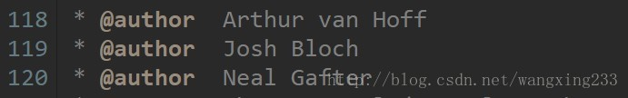
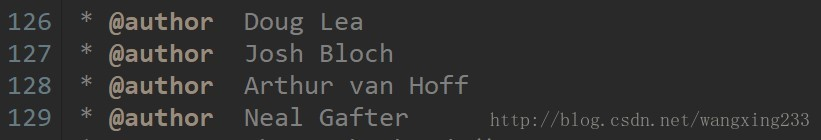
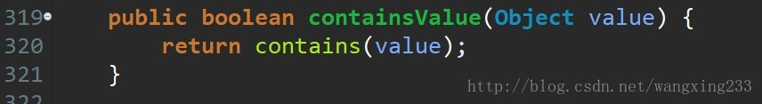
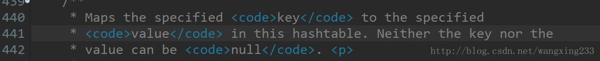
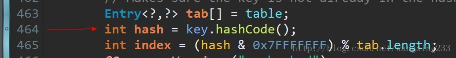
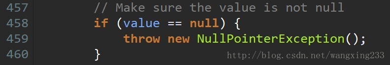
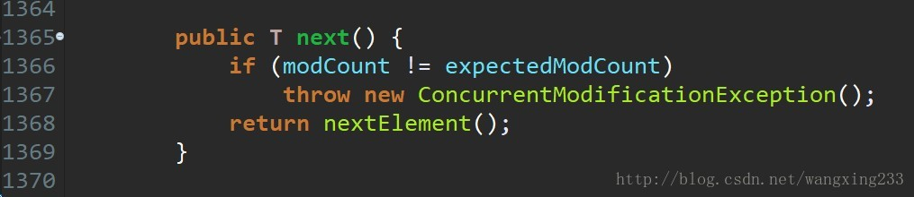
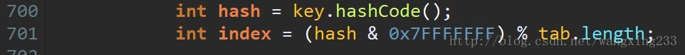
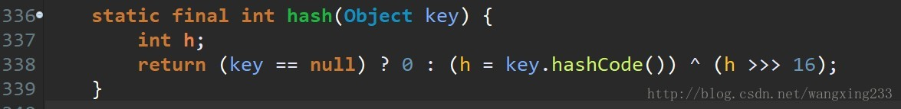

## HashMap 与HashTable的区别

#### 1.作者

Hashtable的作者：

HashMap的作者：

Hash Map的作者比Hashtable的作者多了著名顶顶的并发大神Doug Lea。他写了util.concurrent包。著有并发编程圣经Concurrent Programming in Java: Design Principles and Patterns 一书

#### 2 产生时间

Hashtable是java一开始发布时就提供的键值映射的数据结构，而HashMap产生于JDK1.2。虽然Hashtable比HashMap出现的早一些，但是现在Hashtable基本上已经被弃用了。而HashMap已经成为应用最为广泛的一种数据类型了。造成这样的原因一方面是因为Hashtable是线程安全的，效率比较低。

#### 3.继承的父类不同
HashMap和Hashtable不仅作者不同，而且连父类也是不一样的。HashMap是继承自AbstractMap类，而HashTable是继承自Dictionary类。不过它们都实现了同时实现了map、Cloneable（可复制）、Serializable（可序列化）这三个接口

Dictionary类是一个已经被废弃的类（见其源码中的注释）。父类都被废弃，自然而然也没人用它的子类Hashtable了。

- NOTE: This class is obsolete. New implementations should
- implement the Map interface, rather than extending this class.

#### 4 对外提供的接口不同
Hashtable比HashMap多提供了elments() 和contains() 两个方法。

elments() 方法继承自Hashtable的父类Dictionnary。elements() 方法用于返回此Hashtable中的value的枚举。

contains()方法判断该Hashtable是否包含传入的value。它的作用与containsValue()一致。事实上，contansValue() 就只是调用了一下contains() 方法。

#### 5 对Null key 和Null value的支持不同
Hashtable既不支持Null key也不支持Null value。Hashtable的put()方法的注释中有说明。

当key为Null时，调用put() 方法，运行到下面这一步就会抛出空指针异常。因为拿一个Null值去调用方法了。

当value为null值时，Hashtable对其做了限制，运行到下面这步也会抛出空指针异常。

HashMap中，null可以作为键，这样的键只有一个；可以有一个或多个键所对应的值为null。当get()方法返回null值时，可能是 HashMap中没有该键，也可能使该键所对应的值为null。因此，在HashMap中不能由get()方法来判断HashMap中是否存在某个键， 而应该用containsKey()方法来判断。
#### 6 线程安全性不同
- Hashtable是线程安全的，它的每个方法中都加入了Synchronize方法。在多线程并发的环境下，可以直接使用Hashtable，不需要自己为它的方法实现同步

- 虽然HashMap不是线程安全的，但是它的效率会比Hashtable要好很多。这样设计是合理的。在我们的日常使用当中，大部分时间是单线程操作的。HashMap把这部分操作解放出来了。当需要多线程操作的时候可以使用线程安全的ConcurrentHashMap。
- ConcurrentHashMap虽然也是线程安全的，但是它的效率比Hashtable要高好多倍。因为ConcurrentHashMap使用了分段锁，并不对整个数据进行锁定。

#### 7 遍历方式的内部实现上不同
Hashtable、HashMap都使用了 Iterator。而由于历史原因，Hashtable还使用了Enumeration的方式 。

HashMap的Iterator是fail-fast迭代器。当有其它线程改变了HashMap的结构（增加，删除，修改元素），将会抛出ConcurrentModificationException。不过，通过Iterator的remove()方法移除元素则不会抛出ConcurrentModificationException异常。但这并不是一个一定发生的行为，要看JVM。

JDK8之前的版本中，Hashtable是没有fast-fail机制的。在JDK8及以后的版本中 ，HashTable也是使用fast-fail的， 源码如下：

#### △8 .初始容量大小和每次扩充容量大小的不同
- Hashtable
  - 默认的初始大小为11，之后每次扩充，容量变为原来的2n+1。
  - 创建时，如果给定了容量初始值，那么Hashtable会直接使用你给定的大小，也就是说Hashtable会尽量使用素数、奇数
  - Hashtable的侧重点是哈希的结果更加均匀，使得哈希冲突减少。当哈希表的大小为素数时，简单的取模哈希的结果会更加均匀

- HashMap
  - 默认的初始化大小为16。之后每次扩充，容量变为原来的2倍。
  - 创建时，如果给定了容量初始值，HashMap会将其扩充为2的幂次方大小，HashMap总是使用2的幂作为哈希表的大小
  - HashMap更加关注hash的计算效率问题。在取模计算时，如果模数是2的幂，那么我们可以直接使用位运算来得到结果，效率要大大高于做除法。HashMap为了加快hash的速度，将哈希表的大小固定为了2的幂。当然这引入了哈希分布不均匀的问题，所以HashMap为解决这问题，又对hash算法做了一些改动。这从而导致了Hashtable和HashMap的计算hash值的方法不同

#### 9 计算hash值的方法不同
为了得到元素的位置，首先需要根据元素的 KEY计算出一个hash值，然后再用这个hash值来计算得到最终的位置。

Hashtable直接使用对象的hashCode。hashCode是JDK根据对象的地址或者字符串或者数字算出来的int类型的数值。然后再使用除留余数发来获得最终的位置。

Hashtable在计算元素的位置时需要进行一次除法运算，而除法运算是比较耗时的。
HashMap为了提高计算效率，将哈希表的大小固定为了2的幂，这样在取模预算时，不需要做除法，只需要做位运算。位运算比除法的效率要高很多。

HashMap的效率虽然提高了，但是hash冲突却也增加了。因为它得出的hash值的低位相同的概率比较高，而计算位运算

为了解决这个问题，HashMap重新根据hashcode计算hash值后，又对hash值做了一些运算来打散数据。使得取得的位置更加分散，从而减少了hash冲突。当然了，为了高效，HashMap只做了一些简单的位处理。从而不至于把使用2 的幂次方带来的效率提升给抵消掉。
