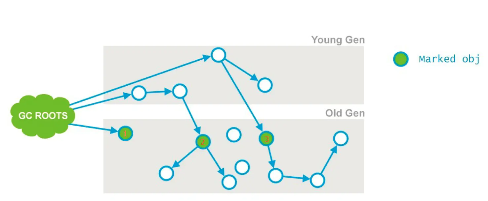

# GC算法

## GC root

java中可作为GC root 的对象

1. 虚拟机栈(栈桢中的本地变量表)中的引用的对象 ；
2. 方法区中的类静态属性引用的对象 ；
3. 方法区中的常量引用的对象 ；
4. 本地方法栈中JNI的引用的对象；

ps：对于CMS为了加快此阶段处理速度，减少停顿时间，可以开启初始标记并行化，-XX:+CMSParallelInitialMarkEnabled，同时调大并行标记的线程数，线程数不要超过cpu的核数。

# G1

# CMS

## 过程：

1. 初始化标记(CMS-initial-mark) ,标记root，会导致stw；
2. 并发标记(CMS-concurrent-mark)，与用户线程同时运行；
3. 预清理（CMS-concurrent-preclean），与用户线程同时运行；
4. 重新标记(CMS-remark) ，会导致stw；
5. 并发清除(CMS-concurrent-sweep)，与用户线程同时运行；
6. 调整堆大小，设置CMS在清理之后进行内存压缩，目的是清理内存中的碎片；
7. 并发重置状态等待下次CMS的触发(CMS-concurrent-reset)，与用户线程同时运行；

### 初始标记

1. 标记老年代中所有的GC Roots对象

2. 标记年轻代中活着的对象引用到的老年代的对象（指的是年轻带中还存活的引用类型对象，引用指向老年代中的对象）如图节点2、3

### 并发标记

- 从“初始标记”阶段标记的对象开始找出所有存活的对象;
-  因为是并发运行的，在运行期间会发生新生代的对象晋升到老年代、或者是直接在老年代分配对象、或者更新老年代对象的引用关系等等，对于这些对象，都是需要进行重新标记的，否则有些对象就会被遗漏，发生漏标的情况。为了提高重新标记的效率，该阶段会把上述对象所在的Card标识为Dirty，后续只需扫描这些Dirty Card的对象，避免扫描整个老年代；
-  并发标记阶段只负责将引用发生改变的Card标记为Dirty状态，不负责处理；
   如图所示，也就是节点1、2、3，最终找到了节点4和5。并发标记的特点是和应用程序线程同时运行。并不是老年代的所有存活对象都会被标记，因为标记的同时应用程序会改变一些对象的引用等。
   由于这个阶段是和用户线程并发的，可能会导致concurrent mode failure。

### 预清理

- 前一个阶段已经说明，不能标记出老年代全部的存活对象，是因为标记的同时应用程序会改变一些对象引用，这个阶段就是用来处理前一个阶段因为引用关系改变导致没有标记到的存活对象的，它会扫描所有标记为Dirty的Card
- 如图所示，在并发清理阶段，节点3的引用指向了6；则会把节点3的card标记为Dirty；

- 最后将6标记为存活

### 可终止预处理

- 这个阶段尝试着去承担下一个阶段Final Remark阶段足够多的工作。这个阶段持续的时间依赖好多的因素，由于这个阶段是重复的做相同的事情直到发生abort的条件（比如：重复的次数、多少量的工作、持续的时间等等）之一才会停止。
-  ps:此阶段最大持续时间为5秒，之所以可以持续5秒，另外一个原因也是为了期待这5秒内能够发生一次ygc，清理年轻带的引用，是的下个阶段的重新标记阶段，扫描年轻带指向老年代的引用的时间减少；

### 重新标记

- 这个阶段会导致第二次stop the word，该阶段的任务是完成标记整个年老代的所有的存活对象。
- 这个阶段，重新标记的内存范围是整个堆，包含_young_gen和_old_gen。为什么要扫描新生代呢，因为对于老年代中的对象，如果被新生代中的对象引用，那么就会被视为存活对象，即使新生代的对象已经不可达了，也会使用这些不可达的对象当做cms的“gc root”，来扫描老年代； 因此对于老年代来说，引用了老年代中对象的新生代的对象，也会被老年代视作“GC ROOTS”
- 当此阶段耗时较长的时候，可以加入参数-XX:+CMSScavengeBeforeRemark，在重新标记之前，先执行一次ygc，回收掉年轻带的对象无用的对象，并将对象放入幸存带或晋升到老年代，这样再进行年轻带扫描时，只需要扫描幸存区的对象即可，一般幸存带非常小，这大大减少了扫描时间。
- 一般CMS的GC耗时80%都在remark阶段，如果发现remark阶段停顿时间很长，可以尝试添加该参数：
   -XX:+CMSScavengeBeforeRemark。
   在执行remark操作之前先做一次Young GC，目的在于减少年轻代对老年代的无效引用，降低remark时的开销。
- 由于之前的预处理阶段是与用户线程并发执行的，这时候可能年轻带的对象对老年代的引用已经发生了很多改变，这个时候，remark阶段要花很多时间处理这些改变，会导致很长stop the word，所以通常CMS尽量运行Final Remark阶段在年轻代是足够干净的时候。
   另外，还可以开启并行收集：-XX:+CMSParallelRemarkEnabled。