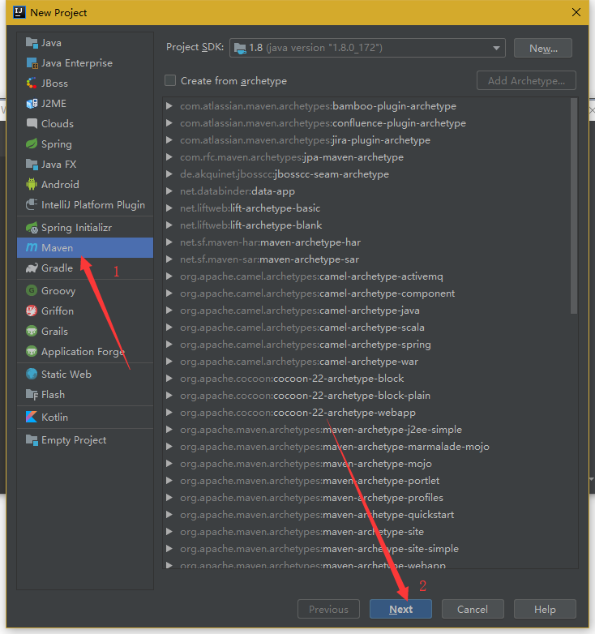
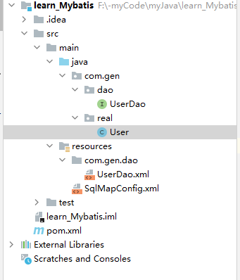
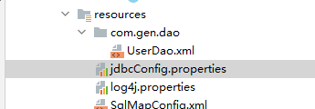
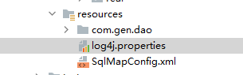
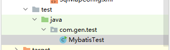

# 简单的跑起来

## 一、导入依赖

#### 1.创建项目

创建maven项目，别的什么都不选



#### 2.导入依赖

在项目的pom.xml文件中编辑如下

   

```xml
<?xml version="1.0" encoding="UTF-8"?>
<project xmlns="http://maven.apache.org/POM/4.0.0"
         xmlns:xsi="http://www.w3.org/2001/XMLSchema-instance"
         xsi:schemaLocation="http://maven.apache.org/POM/4.0.0 http://maven.apache.org/xsd/maven-4.0.0.xsd">
    <modelVersion>4.0.0</modelVersion>

    <groupId>org.example</groupId>
    <artifactId>learn_Mybatis</artifactId>
    <version>1.0-SNAPSHOT</version>

    <properties>
        <maven.compiler.source>8</maven.compiler.source>
        <maven.compiler.target>8</maven.compiler.target>
    </properties>
    <!--  上面的都是自带的  -->
    <!--  打包方式：jar包就行了  -->
    <packaging>jar</packaging>

    <!--  依赖  -->
    <dependencies>
        <!--导入mybitis-->
        <dependency>
            <groupId>org.mybatis</groupId>
            <artifactId>mybatis</artifactId>
            <version>3.4.5</version>
        </dependency>
        <!--mysql-->
        <dependency>
            <groupId>mysql</groupId>
            <artifactId>mysql-connector-java</artifactId>
            <version>5.1.6</version>
        </dependency>
<!--日志-->
        <dependency>
            <groupId>log4j</groupId>
            <artifactId>log4j</artifactId>
            <version>1.2.12</version>
        </dependency>
<!--        单元测试-->
        <dependency>
            <groupId>junit</groupId>
            <artifactId>junit</artifactId>
            <version>3.8.2</version>
            <scope>test</scope>
        </dependency>
    </dependencies>

</project>
```

## 二、数据库、实体类、查询操作、配置

#### 1.定义实体类和数据库操作dao



User,实体类，属性和数据库属性一致，生成getset方法和tostring方法

```java
public class User implements Serializable {
    private Integer id;
    private String mail;

    public Integer getId() {
        return id;
    }

    public void setId(Integer id) {
        this.id = id;
    }

    public String getMail() {
        return mail;
    }

    public void setMail(String mail) {
        this.mail = mail;
    }

    @Override
    public String toString() {
        return "User{" +
                "id=" + id +
                ", mail='" + mail + '\'' +
                '}';
    }
}
```

UserDao，数据库操作方法

```java
public interface UserDao {
    /**
     * 查询所有
     */
    List<User> findAll();
}
```

#### 2.配置文件

mybatis主配置文件，命名随意，在resources文件夹下

这里是SqlMapConfig.xml


编辑配置如下：

```xml
<?xml version="1.0" encoding="UTF-8" ?>
<!DOCTYPE configuration
        PUBLIC "-//mybatis.org//DTD Config 3.0//EN"
        "http://mybatis.org/dtd/mybatis-3-config.dtd">

<!--mybatis主配置文件-->
<configuration>
    <!--环境配置-->
    <!--默认环境选择-->
    <environments default="mysql">
        <!--id名为mysql的一个环境-->
        <environment id="mysql">
            <!--配置事务类型  这里写JDBC-->
            <transactionManager type="JDBC"></transactionManager>
            <!-- 配置数据源(连接池) 有三个 这里用POOLED-->
            <dataSource type="POOLED">
                <!--连接信息-->
                <!--数据库驱动-->
                <property name="driver" value="com.mysql.jdbc.Driver"/>
                <property name="url" value="jdbc:mysql://localhost:3306/gen"/>
                <property name="username" value="root"/>
                <property name="password" value="1001086"/>
            </dataSource>
        </environment>
    </environments>

<!--指定映射文件，映射文件是每个dao独立的配置文件    -->
    <mappers>
        <mapper resource="com/gen/dao/UserDao.xml"/>
    </mappers>
</configuration>
```

如上面代码块结尾，映射文件的配置是UserDao.xml


编辑如下：

```xml
<?xml version="1.0" encoding="UTF-8" ?>
<!DOCTYPE mapper
        PUBLIC "-//ibatis.apache.org//DTD Mapper 3.0//EN"
        "http://ibatis.apache.org/dtd/ibatis-3-mapper.dtd">

<mapper namespace="com.gen.dao.UserDao">
    <!-- SQL语句 -->
    <!--查询所有-->
    <select id="findAll" resultType="com.gen.real.User">
        select * from User
    </select>

</mapper>
```

#### 3.配置文件另外用法：以后常用这种



新增jdbcConfig.properties

```
driver=com.mysql.jdbc.Driver
url=jdbc:mysql://localhost:3306/gen
username=root
password=1001086
```

在上面2的基础上修改SqlMapConfig.xml  这里修改成立注释开发版本模板

```xml
<?xml version="1.0" encoding="UTF-8" ?>
<!DOCTYPE configuration
        PUBLIC "-//mybatis.org//DTD Config 3.0//EN"
        "http://mybatis.org/dtd/mybatis-3-config.dtd">

<!--mybatis主配置文件-->
<configuration>
    <!--导入外部配置文件 -->
    <properties resource="jdbcConfig.properties"></properties>
    <!--配置别名-->
    <typeAliases>
        <package name="com.gen.real"/>
    </typeAliases>
    <!--默认环境选择-->
    <environments default="mysql">
        <!--id名为mysql的一个环境-->
        <environment id="mysql">
            <!--配置事务类型  这里写JDBC-->
            <transactionManager type="JDBC"></transactionManager>
            <!-- 配置数据源(连接池) 有三个 这里用POOLED-->
            <dataSource type="POOLED">
                <!--连接信息-->
                <!--数据库驱动-->
                <property name="driver" value="${driver}"/>
                <property name="url" value="${url}"/>
                <property name="username" value="${username}"/>
                <property name="password" value="${password}"/>
            </dataSource>
        </environment>
    </environments>

    <!--指定带有注解的dao所在位置    -->
    <mappers>
        <package name="com.gen.dao"/>
    </mappers>
</configuration>
```


## 三、一个不错的log4j配置

一个拿来参考 的日志输出配置，也是在resources下，这种配置有相应 的写法，想自己写可以去百度



```
#############
# 输出到控制台
#############

# log4j.rootLogger日志输出类别和级别：只输出不低于该级别的日志信息DEBUG < INFO < WARN < ERROR < FATAL
# WARN：日志级别     CONSOLE：输出位置自己定义的一个名字       logfile：输出位置自己定义的一个名字
log4j.rootLogger=WARN,CONSOLE,logfile
# 配置CONSOLE输出到控制台
log4j.appender.CONSOLE=org.apache.log4j.ConsoleAppender 
# 配置CONSOLE设置为自定义布局模式
log4j.appender.CONSOLE.layout=org.apache.log4j.PatternLayout 
# 配置CONSOLE日志的输出格式  [frame] 2019-08-22 22:52:12,000  %r耗费毫秒数 %p日志的优先级 %t线程名 %C所属类名通常为全类名 %L代码中的行号 %x线程相关联的NDC %m日志 %n换行
log4j.appender.CONSOLE.layout.ConversionPattern=[frame] %d{yyyy-MM-dd HH:mm:ss,SSS} - %-4r %-5p [%t] %C:%L %x - %m%n

################
# 输出到日志文件中
################

# 配置logfile输出到文件中 文件大小到达指定尺寸的时候产生新的日志文件
log4j.appender.logfile=org.apache.log4j.RollingFileAppender
# 保存编码格式
log4j.appender.logfile.Encoding=UTF-8
# 输出文件位置此为项目根目录下的logs文件夹中
log4j.appender.logfile.File=logs/root.log
# 后缀可以是KB,MB,GB达到该大小后创建新的日志文件
log4j.appender.logfile.MaxFileSize=10MB
# 设置滚定文件的最大值3 指可以产生root.log.1、root.log.2、root.log.3和root.log四个日志文件
log4j.appender.logfile.MaxBackupIndex=3  
# 配置logfile为自定义布局模式
log4j.appender.logfile.layout=org.apache.log4j.PatternLayout
log4j.appender.logfile.layout.ConversionPattern=%d{yyyy-MM-dd HH:mm:ss} %F %p %m%n

##########################
# 对不同的类输出不同的日志文件
##########################

# club.bagedate包下的日志单独输出
log4j.logger.club.bagedate=DEBUG,bagedate
# 设置为false该日志信息就不会加入到rootLogger中了
log4j.additivity.club.bagedate=false
# 下面就和上面配置一样了
log4j.appender.bagedate=org.apache.log4j.RollingFileAppender
log4j.appender.bagedate.Encoding=UTF-8
log4j.appender.bagedate.File=logs/bagedate.log
log4j.appender.bagedate.MaxFileSize=10MB
log4j.appender.bagedate.MaxBackupIndex=3
log4j.appender.bagedate.layout=org.apache.log4j.PatternLayout
log4j.appender.bagedate.layout.ConversionPattern=%d{yyyy-MM-dd HH:mm:ss} %F %p %m%n
```

## 四、初步启动   测试案例



创建测试文件如图目录

编写步骤如下：

```java
package com.gen.test;

import com.gen.dao.UserDao;
import com.gen.real.User;
import org.apache.ibatis.io.Resources;
import org.apache.ibatis.session.SqlSession;
import org.apache.ibatis.session.SqlSessionFactory;
import org.apache.ibatis.session.SqlSessionFactoryBuilder;

import java.io.IOException;
import java.io.InputStream;
import java.util.List;

public class MybatisTest {
    public static void main(String[] args) throws IOException {
//        读取配置文件
        InputStream in = Resources.getResourceAsStream("SqlMapConfig.xml");
//        创建SqlSessionFactory工厂
        SqlSessionFactoryBuilder builder = new SqlSessionFactoryBuilder();
        SqlSessionFactory factory = builder.build(in);
//        使用工厂生产SqlSession对象
        SqlSession session = factory.openSession();
//        使用SqlSession创建dao接口的代理对象
        UserDao userDao = session.getMapper(UserDao.class);
//        使用d代理对象执行方法
        List<User> users = userDao.findAll();
        for (User user:users){
            System.out.println(user);
        }
//        释放资源
        session.close();
        in.close();
    }
}

```

运行，可以看到打印出了数据库的内容

## 五、注解方式的dao配置


删除掉UserDao.xml

在SqlMapConfig.xml中mappers的部分修改如下

```xml
<!--指定映射文件，映射文件是每个dao独立的配置文件    -->
    <mappers>
        <mapper class="com.gen.dao.UserDao"/>
    </mappers>
</configuration>
```

UserDao加上注释如下：

```java
public interface UserDao {
    /**
     * 查询所有
     */
    @Select("select*from User")
    List<User> findAll();
}

```

即可实现跟前四步一样的功能

#### ！！！！！！！！！！以后常用注释开发，可以直接跳到09注释开发.md

注意！！！

注释开发和.xml映射只能存在一个

如果不删除UserDao.xml，只是在SqlMapConfig.xml中把map给改了也会报错


