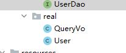

## 一、增

#### 1.UserDao中添加方法

```java
void saveUser(User user);
```

#### 2.UserDao.xml中写入sql语句

```xml
    <insert id="saveUser" parameterType="com.gen.real.User">
        insert into user(username,address,sex,birthday)values(#{userName},#{userAddress},#{userSex},#{userBirthday});
    </insert>
```

#### 3.在测试类中使用

```java
		@After//用于在测试方法执行之后执行
        public void destroy()throws Exception{
            //提交事务
            sqlSession.commit();
            //6.释放资源
            sqlSession.close();
            in.close();
        }
        @Test
        public void testSave(){
            User user = new User();
            user.setMail("2222@163.com");
            //5.执行保存方法
            userDao.saveUser(user);
        }
```

#### 注意！！！

```
在After注释后  新增了sqlSession.commit();
```

这个语句在查询的时候不需要，但是在增删改的时候一定要写，它的作用是把操作commit到数据库，数据库才会发生变化

## 三、删

#### 1.UserDao中添加方法

```
void deleteUser(Integer userId);
```

#### 2.UserDao.xml中写入sql语句

这里的parameterType 可以写int，可用写Integer，可以写INT,可以写INTERGER,也可以写java.lang.Integer

此时只有一个int数 ：id #{uid}里面可以随意写

```xml
    <delete id="deleteUser" parameterType="java.lang.Integer">
        delete from user where id = #{uid}
    </delete>
```

#### 3.在测试类中使用

```java
       @Test
        public void testDelete(){
            userDao.deleteUser(5);
        }
```

## 三、改

#### 1.UserDao中添加方法

```
void updateUser(User user);
```

#### 2.UserDao.xml中写入sql语句

```java
    <update id="updateUser" parameterType="com.gen.real.User">
        update user set mail=#{mail} where id=#{id}
    </update>
```

#### 3.在测试类中使用

```java
        @Test
        public void testUpdate(){
            User user = new User();
            user.setId(4);
            user.setMail("sv766bto@163.com");
            //5.执行保存方法
            userDao.updateUser(user);
        }
```

## 四、查询单个和模糊查询

#### 1.单个查询

###### 1.UserDao中添加方法

```
User findById(Integer userId);
```

###### 2.UserDao.xml中写入sql语句

```java
    <select id="findById" parameterType="INT" resultType="com.gen.real.User">
        select * from user where id = #{uid}
    </select>
```

###### 3.在测试类中使用

```java
        public void testFindOne(){
            //5.执行查询一个方法
            User  user = userDao.findById(1);
            System.out.println(user);
        }
```

#### 2.模糊查询：

###### 1.UserDao中添加方法

```
List<User> findByName(String username);
```

###### 2.UserDao.xml中写入sql语句

```java
    <select id="findByName" parameterType="string" resultType="com.gen.real.User">
        select * from user where mail like #{mail}
        <!-- select * from user where username like '%${value}%'-->
    </select>
```

###### 3.在测试类中使用

```java
        @Test
        public void testFindByName(){
            //5.执行查询一个方法
            List<User> users = userDao.findByName("%t%");
//        List<User> users = userDao.findByName("王");
            for(User user : users){
                System.out.println(user);
            }
        }
```

#### 3.查询总记录

###### 1.UserDao中添加方法

```
int findTotal();
```

###### 2.UserDao.xml中写入sql语句

```java
    <select id="findTotal" resultType="int">
        select count(id) from user;
    </select>
```

###### 3.在测试类中使用

```
        @Test
        public void testFindTotal(){
            //5.执行查询一个方法
            int count = userDao.findTotal();
            System.out.println(count);
        }
```

#### 4查询刚刚插入的数据

###### 1.UserDao中添加方法

```
void saveUser(User user);
```

###### 2.UserDao.xml中写入sql语句

```java
    <insert id="saveUser" parameterType="com.gen.real.User">
--          配置插入操作后，获取插入数据的id
        <selectKey keyProperty="id"  resultType="int" order="AFTER">
            select last_insert_id();
        </selectKey>
        insert into user(mail)values(#{mail});
    </insert>
```

###### 3.在测试类中使用

```java
        @Test
        public void testSave(){
            User user = new User();
            user.setMail("modify User property");
            //5.执行保存方法
            System.out.println("保存前："+user);
            userDao.saveUser(user);
            System.out.println("保存后："+user);
        }
```

```
D:\forLearn。。。
保存前：User{id=null, mail='modify User property'}
保存后：User{id=9, mail='modify User property'}

Process finished with exit code 0
```

#### 5.实体类包装对象进行查询

###### 0.创建User的包装对象



```
public class QueryVo {
    private User user;
    public User getUser() {
        return user;
    }
    public void setUser(User user) {
        this.user = user;
    }
}
```

###### 1.UserDao中添加方法

```
List<User> findUserByVo(QueryVo vo);
```

###### 2.UserDao.xml中写入sql语句

```java
   <select id="findUserByVo" parameterType="com.gen.real.QueryVo" resultType="com.gen.real.User">
        select * from user where mail like #{user.mail}
    </select>
```

###### 3.在测试类中使用

```java
        @Test
        public void testFindByVo(){
            QueryVo vo = new QueryVo();
            User user = new User();
            user.setMail("%t%");
            vo.setUser(user);
            //5.执行查询一个方法
            List<User> users = userDao.findUserByVo(vo);
            for(User u : users){
                System.out.println(u);
            }
        }
```

