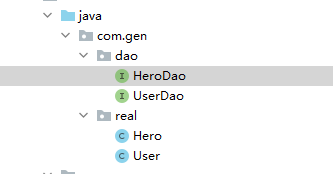

## 一、环境搭建

如01.md ，注意SqlMapConfig.xml和dao（带有注释）使用特别标注的注释开发板，其他环境一样。

测试类的详细用法是03.md

## 二、CRUD

测试类的详细用法是03.增删改查细说md的测试类方法是一样的 

#### 1.增

```java
    @Insert("insert into user(mail)value(#{mail})")
    void saveUser(User user);
```

#### 2.删

```java
    @Delete("delete from user where id=#{id}")
    void deleteUser(Integer userId);
```

#### 3.改

```java
    @Update("update user set mail=#{mail} where id=#{id}")
    void updateUser(User user);
```

#### 4.查

(1)查找一个

```java
   @Select("select*from user where id=#{id}")
    User findById(Integer userId);
```

(2)模糊查询

```java
    @Select("select*from user where mail like #{mail}")
    List<User> findByName(String mail);
```

(3)查询总数

```java
    @Select("select count(*) from user")
    int findTotal();
```

## 三、数据库表和实体类不对应时

#### 1.单个模式

id = true只有id字段才用写

column数据库字段名

property对应的实体类类属性

```java
    @Select("select*from user")
    @Results(value = {
            @Result(id = true,column = "id",property = "userID")
            @Result(column = "mail",property = "userMail")
    })
    List<User> findAll();
```

此时只有findAll()方法能用

#### 2.ResultMap模式

```java
    @Select("select*from user")
    @Results(id="userMap",value = {
            @Result(id = true,column = "id",property = "userID"),
            @Result(column = "mail",property = "userMail")
    })
    List<User> findAll();

    @Insert("insert into user(mail)value(#{mail})")
    @ResultMap("userMap")
    void saveUser(User user);
```

当findAll()定义别名时，给Results一个id属性，那么它就会变成一个ResultMap类

接下来其他的方法@ResultMap指定id就可以引用

## 四、多表查询

建立第二个实例对象和它的dao



hero和dao如下 get  set tostring这里不写  要自动生成

```java
public class Hero {
    private Integer id;
    private Integer uid;
    private String descript;
}
```

```java
package com.gen.dao;

import com.gen.real.Hero;
import org.apache.ibatis.annotations.Select;

import java.util.List;
public interface HeroDao {

    /**
     * 查询所有hero并返回他们的拥有者信息
     * @return
     */
    @Select("select * from hero")
    List<Hero> findAll();
}
```

#### 1.一对一

在hero中加入一个user属性并生成getset方法

```java
public class Hero {
    private Integer id;
    private Integer uid;
    private String descript;
//多对一（一对一）映射   一个hero只属于一个user
    private User user;
}    
```

herodao

```java
   /**
     * 查询所有hero并返回他们的拥有者信息
     * @return
     */
    @Select("select * from hero")
    @Results(id = "heroMap",value = {
            @Result(id = true,column = "id",property = "id"),
            @Result(column = "uid",property = "uid"),
            @Result(column = "descript",property = "descript"),
            @Result(column = "uid",property = "user",one = @One(select = "com.gen.dao.UserDao.findById",fetchType = FetchType.EAGER))
    })
    List<Hero> findAll();
```

one一对一

select另一个表的查询方法

fetchType加载模式：

- 立即加载FetchType.EAGER   多对一的时候立即加载

- 延迟加载FetchType.LAZY  一对多的时候延迟加载

test如下

```java
        public void testFindAll(){
            //5.执行查询所有方法
            List<Hero> heros = heroDao.findAll();
            for(Hero hero : heros){
                System.out.println("------------omx------------");
                System.out.println(hero);
                System.out.println(hero.getUser().toString());
            }
        }
```

#### 2.多对一

user实体类增加属性

```java
public class User implements Serializable {
    private Integer id;
    private String mail;
    //一对多关系映射  一个user可以拥有多个hero
    List<Hero> heroes;
}
```

userdao

```java
 @Select("select*from user")
    @Results(id="userMap",value = {
            @Result(id = true,column = "id",property = "id"),
            @Result(column = "mail",property = "mail"),
            @Result(column = "id",property = "heroes",many = @Many(select = "com.gen.dao.HeroDao.findHeroByUid",fetchType = FetchType.LAZY)),
    })
    List<User> findAll();
```

herodao加入的findHeroByUid

```java
    @Select("select * from hero where uid = #{uid}")
    List<Hero> findHeroByUid(int uid);
```

tset

```java
    @Test
    public void testFindAll(){
        //5.执行查询所有方法
        List<User> users = userDao.findAll();
        for(User user : users){
            System.out.println("------------omx------------");
            System.out.println(user);
            System.out.println(user.getHeroes().toString());
        }
    }
```

## 五、开启二级缓存

无论是不是注释开发，一级缓存都是默认开启，不必过多在意

sqlmapconfig.xml

```
<!--配置二级缓存开启-->
    <settings>
        <setting name = "cacheEnable" value = "true"></setting>
    </settings>
```

settings标签包含在<configuration>标签中


然后，在userDao中  类上注释即可开启二级缓存

```

@CacheNamespace(blocking = true)
public interface UserDao {

```

