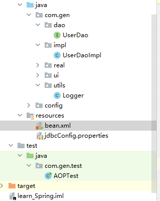

# 基于XML的AOP

目录结构如下，目录没点开的就是没用到的



## 一、依赖配置

pom.xml

```xml
<?xml version="1.0" encoding="UTF-8"?>
<project xmlns="http://maven.apache.org/POM/4.0.0"
         xmlns:xsi="http://www.w3.org/2001/XMLSchema-instance"
         xsi:schemaLocation="http://maven.apache.org/POM/4.0.0 http://maven.apache.org/xsd/maven-4.0.0.xsd">
    <modelVersion>4.0.0</modelVersion>

    <groupId>org.example</groupId>
    <artifactId>learn_Spring</artifactId>
    <version>1.0-SNAPSHOT</version>

<!--    打包-->
    <packaging>jar</packaging>
<!--    依赖-->
    <dependencies>
        <dependency>
            <groupId>org.springframework</groupId>
            <artifactId>spring-context</artifactId>
            <version>5.3.7</version>
        </dependency>
<!--        面相切面编程的依赖-->
        <dependency>
            <groupId>org.aspectj</groupId>
            <artifactId>aspectjweaver</artifactId>
            <version>1.8.7</version>
        </dependency>
    </dependencies>

    <properties>
        <maven.compiler.source>8</maven.compiler.source>
        <maven.compiler.target>8</maven.compiler.target>
    </properties>

</project>
```

## 二、bean.xml配置

#### 1.aop配置bean头+具体步骤+通知类型 完整例子显示如下

```xml
<?xml version="1.0" encoding="UTF-8"?>
<beans xmlns="http://www.springframework.org/schema/beans"
       xmlns:xsi="http://www.w3.org/2001/XMLSchema-instance"
       xmlns:context="http://www.springframework.org/schema/context"
       xmlns:aop="http://www.springframework.org/schema/aop"
       xsi:schemaLocation="http://www.springframework.org/schema/beans
        http://www.springframework.org/schema/beans/spring-beans.xsd
        http://www.springframework.org/schema/context
        http://www.springframework.org/schema/context/spring-context.xsd http://www.springframework.org/schema/aop https://www.springframework.org/schema/aop/spring-aop.xsd">

<!--    1.把通知bean也交给spring管理-->
    <!--配置spring IOC,配置UserDaoImpl 切入点方法在这里面  -->
    <bean id="userDao" class="com.gen.impl.UserDaoImpl"></bean>
<!-- 配置logger  切入之后要怎么做 的方法在这里面 -->
    <bean id="logger" class="com.gen.utils.Logger"></bean>

<!--    开始配置aop-->
<!--    2.aop:config标签表明开始AOP配置-->
    <aop:config>
<!--    3.aop:aspect标签表明配置切面-->
<!--        id 给切面提供唯一标识-->
<!--        ref 是通知类的bean id-->
        <aop:aspect id="logDvice" ref="logger">
<!--        4.在aop:aspect标签内配置通知类型-->
<!--            前置通知  执行方法前通知-->
            <aop:before method="printlog" pointcut="execution(public void com.gen.impl.UserDaoImpl.saveAccount())"></aop:before>
<!--            后置通知 执行方法后通知  它和异常通知永远只能执行一个-->
            <aop:after-returning method="afterPrintlog" pointcut="execution(* com.gen.impl.*.*(..))"></aop:after-returning>
<!--            异常通知，爆出异常的时候通知   它和后置通知永远只能执行一个-->
            <aop:after-throwing method="thowPrintlog" pointcut="execution( * com.gen.impl.*.*(..))"></aop:after-throwing>
<!--            最终通知,不管怎么样都会执行-->
            <aop:after method="lastPrintlog" pointcut-ref="pc1"></aop:after>
<!--            通用切入点表达式  id属性是表达式的唯一标识  espression属性用于指定表达式内容
                   此标签在<aop:aspect 标签内 只能对当前切面使用
                   也可以放在<aop:aspect 标签外面  这时可以对所有切面使用-->
            <aop:pointcut id="pc1" expression="execution( * com.gen.impl.*.*(..))"></aop:pointcut>

<!--            配置环绕通知，具体看logger类中的介绍-->
            <aop:around method="aroundPrintlog" pointcut-ref="pc1"></aop:around>


        </aop:aspect>
    </aop:config>
</beans>
<?xml version="1.0" encoding="UTF-8"?>
<beans xmlns="http://www.springframework.org/schema/beans"
       xmlns:xsi="http://www.w3.org/2001/XMLSchema-instance"
       xmlns:context="http://www.springframework.org/schema/context"
       xmlns:aop="http://www.springframework.org/schema/aop"
       xsi:schemaLocation="http://www.springframework.org/schema/beans
        http://www.springframework.org/schema/beans/spring-beans.xsd
        http://www.springframework.org/schema/context
        http://www.springframework.org/schema/context/spring-context.xsd http://www.springframework.org/schema/aop https://www.springframework.org/schema/aop/spring-aop.xsd">

</beans>
```

#### 2.对 “1”中 第“4”步：切入点表达式的说明（写代码里太长了）

###### 切入点表达式详细说明

- 4.在aop:aspect标签内配置通知类型

  -  aop:before表示配置前置通知

  - method属性表示 Logger类中哪个方法

  - pointcut属性 指定切入点表达式  该表达式的含义是指对业务层的哪些方法增强

    - 关键字：execution(表达式)

      - 表达式：
            访问修饰符  返回值  包名.包名.包名...类名.方法名(参数列表)

      - 标准的表达式写法：

        ```
        public void com.itheima.service.impl.AccountServiceImpl.saveAccount()
        ```

      - 访问修饰符可以省略

        ```
        void com.itheima.service.impl.AccountServiceImpl.saveAccount()
        ```

      - 返回值可以使用通配符，表示任意返回值

        ```
        * com.itheima.service.impl.AccountServiceImpl.saveAccount()
        ```

         - 包名可以使用通配符，表示任意包。但是有几级包，就需要写几个*.

        ```
        *.*.*.*.AccountServiceImpl.saveAccount())
        ```

      - 包名可以使用..表示当前包及其子包

        ```
        * *..AccountServiceImpl.saveAccount()
        ```

      - 类名和方法名都可以使用*来实现通配

        ```
        * *..*.*()
        
        ```

      例子参考“1”中的代码，万变不离其中，都是用.或*代替标准式

      ---

      - 参数列表：

        - 可以直接写数据类型：

        - 基本类型直接写名称           

          - int
          - 引用类型写包名.类名的方式   java.lang.String

        - ​    可以使用通配符表示任意类型，但是必须有参数
          ​    可以使用..表示有无参数均可，有参数可以是任意类型

          - 全通配写法：

          ```
           * *..*.*(..)
          ```

###### 实际开发中一般使用的切入点 表达式

  切到业务层实现类下的所有方法,最万金油

> 提示 需要多少个 *. 就看比较标准式省略了多少个目录或函数名

```
* com.itheima.service.impl.*.*(..)
```

###### spring设置通用切入点表达式

如“1”中的最后部分代码

- 通用切入点表达式  id属性是表达式的唯一标识  espression属性用于指定表达式内容
  - 此标签在<aop:aspect 标签内 只能对当前切面使用
  - 也可以放在<aop:aspect 标签外面  这时可以对所有切面使用

设置通用切入点表达式

```xml
<aop:pointcut id="pc1" expression="execution( * com.gen.impl.*.*(..))"></aop:pointcut>
```

调用通用切入点表达式

```xml
<aop:after method="lastPrintlog" pointcut-ref="pc1"></aop:after>
```

## 三、切入之后要干什么：Logger类（通知，一个例子）

#### 1.Logger类中的各个切入方法例子

```java
package com.gen.utils;

import org.aspectj.lang.ProceedingJoinPoint;

/**
 * 日志
 */
public class Logger {
    /**
     * 打印日志  计划让其在切入点方法执行之前执行  （切入点方法就是业务层方法）
     */
//    前置通知
    public void printlog(){
        System.out.println("前置通知");
    }

//  后置通知
    public void afterPrintlog(){
        System.out.println("后置");
    }

//  异常通知
    public void thowPrintlog(){
        System.out.println("异常");
    }

//    最终通知
    public void lastPrintlog(){
        System.out.println("最终");
    }

//环绕通知
    public Object aroundPrintlog(ProceedingJoinPoint pjp){
        Object rtValue = null;
        try{
            Object[] args = pjp.getArgs();//得到方法执行所需的参数

            System.out.println("Logger类中的aroundPringLog方法开始记录日志了。。。前置");
//          proceed方法有返回值  这里为了写的全面一点  接收了返回值  不返回可以改成 public void aroundPrintlog
            rtValue = pjp.proceed(args);//明确调用业务层方法（切入点方法）

            System.out.println("Logger类中的aroundPringLog方法开始记录日志了。。。后置");

            return rtValue;
//            ！！！！！！！！！这里是Throwable 不是exction
        }catch (Throwable t){
            System.out.println("Logger类中的aroundPringLog方法开始记录日志了。。。异常");
            throw new RuntimeException(t);
        }finally {
            System.out.println("Logger类中的aroundPringLog方法开始记录日志了。。。最终");
        }
    }
}

```

#### 2.对“1”中环绕通知解释

* 环绕通知
  * 问题：
    *      当我们配置了环绕通知之后，切入点方法没有执行，而通知方法执行了。
  * 分析：
    *      通过对比动态代理中的环绕通知代码，发现动态代理的环绕通知有明确的切入点方法调用，而我们的代码中没有。
  * 解决：
    *      Spring框架为我们提供了一个接口：ProceedingJoinPoint。该接口有一个方法proceed()，此方法就相当于明确调用切入点方法。
    *      该接口可以作为环绕通知的方法参数，在程序执行时，spring框架会为我们提供该接口的实现类供我们使用。

* spring中的环绕通知：
  *      它是spring框架为我们提供的一种可以在代码中手动控制增强方法何时执行的方式。

## 四、调用测试主程序

```java
package com.gen.test;

import com.gen.dao.UserDao;
import org.springframework.context.ApplicationContext;
import org.springframework.context.support.ClassPathXmlApplicationContext;

public class AOPTest {

    public static void main(String[] args) {
        //1.获取容器
        ApplicationContext ac = new ClassPathXmlApplicationContext("bean.xml");
        //2.获取对象
        UserDao as = (UserDao)ac.getBean("userDao");
        //3.执行方法
        as.saveAccount();
//        as.updateAccount(1);
//        as.deleAccount();
    }
}

```

