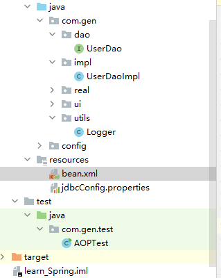
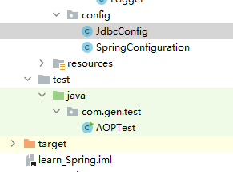

# 注释AOP

目录结构如下 没点开的目录没有用到的文件



## 一、pom依赖

依赖还是跟基于XML的AOP是一样的

```xml
<?xml version="1.0" encoding="UTF-8"?>
<project xmlns="http://maven.apache.org/POM/4.0.0"
         xmlns:xsi="http://www.w3.org/2001/XMLSchema-instance"
         xsi:schemaLocation="http://maven.apache.org/POM/4.0.0 http://maven.apache.org/xsd/maven-4.0.0.xsd">
    <modelVersion>4.0.0</modelVersion>

    <groupId>org.example</groupId>
    <artifactId>learn_Spring</artifactId>
    <version>1.0-SNAPSHOT</version>

<!--    打包-->
    <packaging>jar</packaging>
<!--    依赖-->
    <dependencies>
        <dependency>
            <groupId>org.springframework</groupId>
            <artifactId>spring-context</artifactId>
            <version>5.3.7</version>
        </dependency>
<!--        面相切面编程的依赖-->
        <dependency>
            <groupId>org.aspectj</groupId>
            <artifactId>aspectjweaver</artifactId>
            <version>1.8.7</version>
        </dependency>
    </dependencies>

    <properties>
        <maven.compiler.source>8</maven.compiler.source>
        <maven.compiler.target>8</maven.compiler.target>
    </properties>

</project>
```

## 二、bean的配置

bean其实也可以完全放弃，完全使用注释，请看后面

```xml
<?xml version="1.0" encoding="UTF-8"?>
<beans xmlns="http://www.springframework.org/schema/beans"
       xmlns:xsi="http://www.w3.org/2001/XMLSchema-instance"
       xmlns:aop="http://www.springframework.org/schema/aop"
       xmlns:context="http://www.springframework.org/schema/context"
       xsi:schemaLocation="http://www.springframework.org/schema/beans
        http://www.springframework.org/schema/beans/spring-beans.xsd
        http://www.springframework.org/schema/aop
        http://www.springframework.org/schema/aop/spring-aop.xsd
        http://www.springframework.org/schema/context
        http://www.springframework.org/schema/context/spring-context.xsd">

<!--    1.配置spring扫描的包-->
    <context:component-scan base-package="com.gen"></context:component-scan>
<!--    2.配置启动 带注释的aop-->
    <aop:aspectj-autoproxy></aop:aspectj-autoproxy>
</beans>

```

## 三、切入点类的配置

就是跟前面IOC一样，把类交给spring  的bean来创建，用来供后面AOP使用

``` java
package com.gen.impl;

import com.gen.dao.UserDao;
import org.springframework.stereotype.Service;


@Service("userDao")
public class UserDaoImpl implements UserDao {
    @Override
    public void saveAccount() {
        System.out.println("保存");
    }

    @Override
    public void updateAccount(int i) {
        System.out.println("更新"+i);
    }

    @Override
    public int deleAccount() {
        System.out.println("删除");
        return 0;
    }
}
```

## 四、AOP设置（通知类例子）

@Aspect//表示当前类是  一个切面类

定义切面表达式：（不会切面表达式看上一篇：基于XML的AOP）

```java
@Pointcut("execution(* com.gen.impl.*.*(..))")
    private void pt(){};
```

调用以及全部例子：

```java
package com.gen.utils;

import org.aspectj.lang.ProceedingJoinPoint;
import org.aspectj.lang.annotation.*;
import org.springframework.stereotype.Component;

/**
 * 日志
 */
@Component("logger")
@Aspect//表示当前类是  一个切面类
public class Logger {
    /**
     * 打印日志  计划让其在切入点方法执行之前执行  （切入点方法就是业务层方法）
     */
    @Pointcut("execution(* com.gen.impl.*.*(..))")
    private void pt(){};
//    前置通知
    @Before("pt()")
    public void printlog(){
        System.out.println("前置通知");
    }

//  后置通知
    @AfterReturning("pt()")
    public void afterPrintlog(){
        System.out.println("后置");
    }

//  异常通知
    @AfterThrowing("pt()")
    public void thowPrintlog(){
        System.out.println("异常");
    }

//    最终通知
    @After("pt()")
    public void lastPrintlog(){
        System.out.println("最终");
    }

//环绕通知
//    @Around("pt()")
    public Object aroundPrintlog(ProceedingJoinPoint pjp){
        Object rtValue = null;
        try{
            Object[] args = pjp.getArgs();//得到方法执行所需的参数

            System.out.println("Logger类中的aroundPringLog方法开始记录日志了。。。前置");
//          proceed方法有返回值  这里为了写的全面一点  接收了返回值  不返回可以改成 public void aroundPrintlog
            rtValue = pjp.proceed(args);//明确调用业务层方法（切入点方法）

            System.out.println("Logger类中的aroundPringLog方法开始记录日志了。。。后置");

            return rtValue;
//            ！！！！！！！！！这里是Throwable 不是exction
        }catch (Throwable t){
            System.out.println("Logger类中的aroundPringLog方法开始记录日志了。。。异常");
            throw new RuntimeException(t);
        }finally {
            System.out.println("Logger类中的aroundPringLog方法开始记录日志了。。。最终");
        }
    }

}

```

## 五、测试类

```java
package com.gen.test;

import com.gen.dao.UserDao;
import org.springframework.context.ApplicationContext;
import org.springframework.context.support.ClassPathXmlApplicationContext;

public class AOPTest {

    public static void main(String[] args) {
        //1.获取容器
        ApplicationContext ac = new ClassPathXmlApplicationContext("bean.xml");
        //2.获取对象
        UserDao as = (UserDao)ac.getBean("userDao");
        //3.执行方法
        as.saveAccount();
//        as.updateAccount(1);
//        as.deleAccount();
    }
}
```

## 六、关于完全不使用bean（完全使用注释）的方法



#### 1.创建设置类SpringConfiguration

```java
package config;

import org.springframework.context.annotation.*;

@Configuration
@ComponentScan("com.gen")
@EnableAspectJAutoProxy//表示开启aop注释
public class SpringConfiguration {

}
```

#### 2.修改测试类中的代码，把bean源改成设置类

```java
package com.gen.test;

import com.gen.dao.UserDao;
import config.SpringConfiguration;
import org.springframework.context.ApplicationContext;
import org.springframework.context.annotation.AnnotationConfigApplicationContext;

public class AOPTest {

    public static void main(String[] args) {
        //1.获取容器
        ApplicationContext ac = new AnnotationConfigApplicationContext(SpringConfiguration.class);
        //2.获取对象
        UserDao as = (UserDao)ac.getBean("userDao");
        //3.执行方法
        as.saveAccount();
//        as.updateAccount(1);
//        as.deleAccount();
    }
}
```

其他内容和上面一样