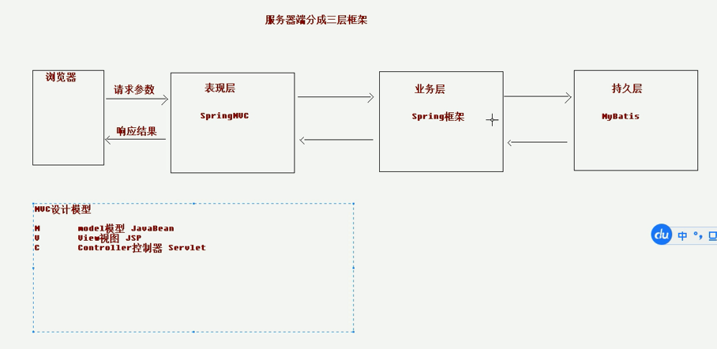

# 架构

#### 1.C/S 架构

C/S 架构是一种典型的两层架构，其全称是Client/Server，即客户端服务器端架构，其客户端包含一个或多个在用户的电脑上运行的程序，而服务器端有两种，一种是数据库服务器端，客户端通过数据库连接访问服务器端的数据；另一种是Socket服务器端，服务器端的程序通过Socket与客户端的程序通信。

C/S 架构也可以看做是胖客户端架构。因为客户端需要实现绝大多数的业务逻辑和界面展示。这种架构中，作为客户端的部分需要承受很大的压力，因为显示逻辑和事务处理都包含在其中，通过与数据库的交互（通常是SQL或存储过程的实现）来达到持久化数据，以此满足实际项目的需要。

- 优点：
  - C/S架构的界面和操作可以很丰富。
  - 安全性能可以很容易保证，实现多层认证也不难。
  - 由于只有一层交互，因此响应速度较快。

- 缺点：
  - 适用面窄，通常用于局域网中。
  - 用户群固定。由于程序需要安装才可使用，因此不适合面向一些不可知的用户。
  - 维护成本高，发生一次升级，则所有客户端的程序都需要改变。

#### 2.B/S架构

B/S架构的全称为Browser/Server，即浏览器/服务器结构。Browser指的是Web浏览器，极少数事务逻辑在前端实现，但主要事务逻辑在服务器端实现，Browser客户端，WebApp服务器端和DB端构成所谓的三层架构。B/S架构的系统无须特别安装，只有Web浏览器即可。

B/S架构中，显示逻辑交给了Web浏览器，事务处理逻辑在放在了WebApp上，这样就避免了庞大的胖客户端，减少了客户端的压力。因为客户端包含的逻辑很少，因此也被成为瘦客户端。

- 优点：
  - 客户端无需安装，有Web浏览器即可。
  - BS架构可以直接放在广域网上，通过一定的权限控制实现多客户访问的目的，交互性较强。
  - BS架构无需升级多个客户端，升级服务器即可。

- 缺点：
  - 在跨浏览器上，BS架构不尽如人意。
  - 表现要达到CS程序的程度需要花费不少精力。
  - 在速度和安全性上需要花费巨大的设计成本，这是BS架构的最大问题。
  - 客户端服务器端的交互是请求-响应模式，通常需要刷新页面，这并不是客户乐意看到的。

## 一、三层架构和MVC模型

三层架构+MVC是B/S架构类型

- MVC和三层架构关系
  - 他们并不是一一对应的
  - 但也不是没有关系
  - 我感觉就是对web开发的两种描述，都是描述web开发，但是角度有不同，所以有的内容不同，有的内容相同。
  - 但他们可以同时使用

|      三层架构       |        MVC         |         描述         |
| :-----------------: | :----------------: | :------------------: |
|       表现层        |        View        | 这两个还是很有关系的 |
| 业务层（Service层） | Controller(控制器) |    这两个也对得上    |
|     持久层(Dao)     |                    |   数据库相关的操作   |
|                     |    Moudle(Bean)    |     就是模型对应     |

