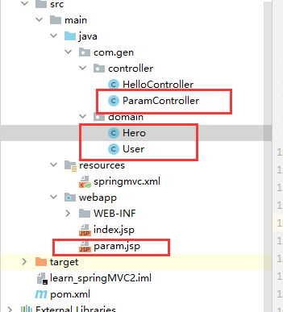

# 请求参数绑定+中文乱码过滤器

这个东西，其实就是

web端传递过来的参数，可以直接让controller中的方法当做是方法的参数来接收

在【入门环境】下新建这文件



user

```java
public class User implements Serializable {
    private String username;
    private String mail;
    private int lev;
}
```

hero

```java
public class Hero implements Serializable {
    private String heroname;
    private String star;
}
```

## 一、简单的参数绑定

#### 1.param.jsp

```xml
<%@ page contentType="text/html;charset=UTF-8" language="java" %>
<html>
<head>
    <title>param</title>
</head>
<body>
    <%--在这里直接传递参数--%>
    <a href="param/testParam?username=ohhyee">comeon</a>
</body>
</html>
```

###### maven项目浏览器地址

webapp目录下，http://localhost:8080/learn_springMVC2_war/param.jsp，可以直接访问到。

#### 2.ParamController

```java
@Controller
@RequestMapping("/param")
public class ParamController {

    @RequestMapping("/testParam")
    public String testParam(String username){
        System.out.println("username"+username);
        return "secessin";
    }
}
```

## 二、拿实体类当做参数

###### △重点

最重要的是web端提交的 参数名称 要和实体类中的属性一一对应，一毛一样

###### △清除idea缓存不管用

把target目录直接删掉

#### 1.param.jsp

```jsp
<%@ page contentType="text/html;charset=UTF-8" language="java" %>
<html>
<head>
    <title>param</title>
</head>
<body>
    <form action="param/saveUser" method="post">
        <%--name属性就是类的属性，一定要对应！！！！！！！--%>
        用户名：<input type="text" name="username"><br>
        邮箱：<input type="text" name="mail"><br>
        等级：<input type="text" name="lev"><br>
        <input type="submit" value="提交"><br>
    </form>
</body>
</html>
```

#### 2.ParamController

```java
@Controller
@RequestMapping("/param")
public class ParamController {

    /**
     * 把数据封装打javabean的类中
     * @param user
     * @return
     */
    @RequestMapping("/saveUser")
    //    传递参数user
    public String testParam(User user){
        System.out.println(user);
        return "secessin";
    }
}
```

## 三、单实体类中有另一个实体类时

#### 1.User类

```java
public class User implements Serializable {
    private String username;
    private String mail;
    private int lev;

    private Hero hero;
}
```

#### 2.param.jsp

```jsp
<%@ page contentType="text/html;charset=UTF-8" language="java" %>
<html>
<head>
    <title>param</title>
</head>
<body>
    <form action="param/saveUser" method="post">
        <%--name属性就是类的属性，一定要对应！！！！！！！--%>
        用户名：<input type="text" name="username"><br>
        邮箱：<input type="text" name="mail"><br>
        等级：<input type="text" name="lev"><br>
        角色名：<input type="text" name="hero.heroname"><br>
        星级：<input type="text" name="hero.star"><br>
        <input type="submit" value="提交"><br>
    </form>
</body>
</html>
```

#### 3.ParamController

```java
@Controller
@RequestMapping("/param")
public class ParamController {

    /**
     * 把数据封装打javabean的类中
     * @param user
     * @return
     */
    @RequestMapping("/saveUser")
//    传递参数user
    public String testParam(User user){
        System.out.println(user);
        return "secessin";
    }
}
```

## 四、中文乱码过滤器

在【三】和【二】中，如果提交的表单中有中文的属性，传到后端显示出来的是？？？？之类的乱码，为了解决这个问题。。。。

给web.xml加上下面的

```xml
<web-app>
  <display-name>Archetype Created Web Application</display-name>

  <!--配置前端控制器-->
  <servlet>
    <servlet-name>dispatcherServlet</servlet-name>
    <servlet-class>org.springframework.web.servlet.DispatcherServlet</servlet-class>
    <!--设置调用的spring配置-->
    <init-param>
      <param-name>contextConfigLocation</param-name>
      <param-value>classpath:springmvc.xml</param-value>
    </init-param>
    <!--表示第一次发请求时创建ioc bean-->
    <load-on-startup>1</load-on-startup>
  </servlet>

  <servlet-mapping>
    <servlet-name>dispatcherServlet</servlet-name>
    <!--"/"代表发任意请求都发到这里-->
    <url-pattern>/</url-pattern>
  </servlet-mapping>

  <!--配置防止中文乱码的过滤器-->
  <filter>
    <filter-name>characterEncodingFilter</filter-name>
    <filter-class>org.springframework.web.filter.CharacterEncodingFilter</filter-class>
    <init-param>
      <param-name>encoding</param-name>
      <param-value>UTF-8</param-value>
    </init-param>
  </filter>
  <filter-mapping>
    <filter-name>characterEncodingFilter</filter-name>
    <url-pattern>/*</url-pattern>
  </filter-mapping>

</web-app>
```

## 五、实体类中有list和map集合

#### 1.User类

```java
public class User implements Serializable {
    private String username;
    private String mail;
    private int lev;

    private List<Hero> heros;
    private Map<String,Hero> heroMap;
}
```

#### 2.param.jsp

```jsp
<%@ page contentType="text/html;charset=UTF-8" language="java" %>
<html>
<head>
    <title>param</title>
</head>
<body>
    <form action="param/saveUser" method="post">
        <%--name属性就是类的属性，一定要对应！！！！！！！--%>
        用户名：<input type="text" name="username"><br>
        邮箱：<input type="text" name="mail"><br>
        等级：<input type="text" name="lev"><br>

        角色名：<input type="text" name="heros[0].heroname"><br>
        星级：<input type="text" name="heros[0].star"><br>

        角色名：<input type="text" name="heroMap['one'].heroname"><br>
        星级：<input type="text" name="heroMap['one'].star"><br>
        <input type="submit" value="提交"><br>
    </form>
</body>
</html>
```

#### 3.ParamController

```java
@Controller
@RequestMapping("/param")
public class ParamController {

    /**
     * 把数据封装打javabean的类中
     * @param user
     * @return
     */
    @RequestMapping("/saveUser")
//    传递参数user
    public String testParam(User user){
        System.out.println(user);
        return "secessin";
    }
}
```

