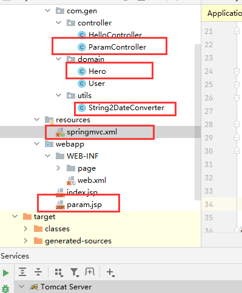

## 一、自定义类型转换器

#### 1.类型转换器

- 从03.请求参数绑定中会发现，User的lve属性是int类型，网页输入文本时肯定是string类型，但是确能正常的封装到User类中，这就是spring的类型转换器在起作用
- 但是，日期类型。如果输入2021/6/20,spring也可以正确的封装到某个有data属性的类中。但输入2021-6-20，网页和后台都会爆出错误。
- 这个时候就需要自定义类型转换器

#### 2.文件目录

这次要用到的东西



###### 1.hero类

```java
public class Hero implements Serializable {
    private String heroname;
    private String star;

    private Date date;
```

###### 2.ParamController

```java
@Controller
@RequestMapping("/param")
public class ParamController {

    /**
     * 自定义类型转换
     * @param hero
     * @return
     */
    @RequestMapping("/saveHero")
//    传递参数user
    public String testParam(Hero hero){
        System.out.println(hero);
        return "secessin";
    }
}
```

###### 3.param.jsp

```jsp
<%@ page contentType="text/html;charset=UTF-8" language="java" %>
<html>
<head>
    <title>param</title>
</head>
<body>
    <form action="param/saveHero" method="post">
        角色名：<input type="text" name="heroname"><br>
        星级：<input type="text" name="star"><br>
        角色生日：<input type="text" name="date"><br>
    </form>
</body>
</html>
```

#### 3.第一步Converter

创建一个类，实现Converter接口

```java
import org.springframework.core.convert.converter.Converter;
```

String2DateConverter类

```java
/**
 * 把字符串转换成日期
 */
public class String2DateConverter implements Converter<String,Date> {

    @Override
    public Date convert(String source) {
        if (source == null){
            throw new RuntimeException("请传入日期");
        }
        DateFormat df = new SimpleDateFormat("yyyy-MM-dd");
        try {
            return df.parse(source);
        } catch (Exception e) {
            throw new RuntimeException("数据不对");
        }
    }
}
```

#### 4.第二步xml配置

在spring的配置文件中配置Converter

在spring的配置文件总声明Converter

```xml
<?xml version="1.0" encoding="UTF-8"?>
<beans xmlns="http://www.springframework.org/schema/beans"
       xmlns:context="http://www.springframework.org/schema/context"
       xmlns:mvc="http://www.springframework.org/schema/mvc"
       xmlns:xsi="http://www.w3.org/2001/XMLSchema-instance"
       xsi:schemaLocation="http://www.springframework.org/schema/beans
        http://www.springframework.org/schema/beans/spring-beans.xsd
        http://www.springframework.org/schema/mvc
        http://www.springframework.org/schema/mvc/spring-mvc.xsd
        http://www.springframework.org/schema/context
        http://www.springframework.org/schema/context/spring-context.xsd">

    <!--告知spring在创建容器时要扫描的包，配置所需要的标签不是在beans的约束中，而是一个名称为
    context名称空间和约束中-->
    <context:component-scan base-package="com.gen"></context:component-scan>

    <!--配置返回的jsp目录-->
    <bean id="internalResourceViewResolver" class="org.springframework.web.servlet.view.InternalResourceViewResolver">
        <property name="prefix" value="/WEB-INF/page/"> </property>
        <property name="suffix" value=".jsp"></property>
    </bean>

    <!--配置自定义类型转换器-->
    <bean id="myConversionService" class="org.springframework.context.support.ConversionServiceFactoryBean">
        <property name="converters">
            <set>
                <bean class="com.gen.utils.String2DateConverter"></bean>
            </set>
        </property>
    </bean>


    <!--开启SpringMVC注解支持-->
    <!--配置开启自定义类型转换器-->
    <mvc:annotation-driven  conversion-service="myConversionService"/>
</beans>
```

## 二、获取原生severlet api

只用到param.jsp和ParamController

#### 1.param.jsp

```jsp
<%@ page contentType="text/html;charset=UTF-8" language="java" %>
<html>
<head>
    <title>param</title>
</head>
<body>
    <a href="param/testServerlet">api</a>
</body>
</html>
```

#### 2.ParamController

```java
@Controller
@RequestMapping("/param")
public class ParamController {

    @RequestMapping("/testServerlet")
    public String testParam(HttpServletRequest request, HttpServletResponse response){
        System.out.println(request);
        HttpSession session = request.getSession();
        System.out.println(session);
        ServletContext servletContext = session.getServletContext();
        System.out.println(servletContext);
        System.out.println(response);
        return "secessin";
    }
}

```

