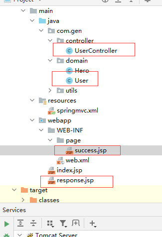

## 一、环境

和入门案例一样， 在那个基础上改



response.jsp

```jsp
<%@ page contentType="text/html;charset=UTF-8" language="java" %>
<html>
<head>
    <title>响应</title>
</head>
<body>
    <a href="user/testResponse">hhhh</a>
</body>
</html>
```

user类

```java
public class User implements Serializable {
    private String username;
    private String mail;
    private int lev;
}
```

## 二、返回值是string类型 

#### 1.UserController

```java
@Controller
@RequestMapping("/user")
public class UserController {

    @RequestMapping("/testResponse")
    public  String testResponse(Model model){
//        模拟从数据库取出user
        User user = new User();
        user.setUsername("牛逼");
        user.setMail("1001086");
        user.setLev(2);
        //放到request中
        model.addAttribute("user",user);

        return "success";
    }
}
```

#### 2.success.jsp

```jsp
<%--isELIgnored="false"表示打开对象获取功能--%>
<%@ page contentType="text/html;charset=UTF-8" language="java" isELIgnored="false" %>
<html>
<head>
    <title>成功啦</title>
</head>
<body>
    <h3>ohhhhhhhhhhhhhhhhhhhh</h3><br>
    ${user.username}<br>
    ${user.mail}<br>
    ${user.lev}
</body>
</html>
```

## 二、返回viod

#### 1.controller

注释 1 2 3 三件事选一个来干就能返回页面

```java
@Controller
@RequestMapping("/user")
public class UserController {

    @RequestMapping("/testResponse")
    public  void testResponse(HttpServletRequest servletRequest, HttpServletResponse servletResponse) throws ServletException, IOException {
//        1.编写请求转发程序
//        servletRequest.getRequestDispatcher("/WEB-INF/page/success.jsp").forward(servletRequest,servletResponse);

//        2.重定向
//        servletResponse.sendRedirect(servletRequest.getContextPath()+"/WEB-INF/page/success.jsp");

//        3.直接响应
//        设置中文乱码
        servletResponse.setCharacterEncoding("UTF-8");
        servletResponse.setContentType("text/html;charset=UTF-8");
        servletResponse.getWriter().println("你好");
        return;
    }
}
```

## 三、ModelAndView 

ModelAndView 是 SpringMVC 为我们提供的一个对象

- 作用：
  - 调用视图解析器返回jsp给前端
  - 把对象传到request域中

#### 1.controller

```java
@Controller
@RequestMapping("/user")
public class UserController {

    @RequestMapping("/testResponse")
    public ModelAndView testResponse() {
        //        模拟从数据库取出user
        User user = new User();
        user.setUsername("牛逼");
        user.setMail("1001086");
        user.setLev(2);

//        创建ModelAndView 对象
        ModelAndView mv = new ModelAndView();
//        存对象到request域
        mv.addObject("user",user);
//        跳转到哪个页面
        mv.setViewName("success");
        return mv;
    }
}
```

#### 2.success.jsp

和【一】一样

## 四、forward 转发Redirect 重定向

#### 1.controller

```java
@Controller
@RequestMapping("/user")
public class UserController {

    @RequestMapping("/testResponse")
    public String testResponse() {

//        转发固定写法
//        return "forward:/WEB-INF/page/success.jsp";

        //        重定向固定写法
//          本来重定向必须要加项目名称链接才找得到
//        底层已经帮写加上了项目名servletRequest.getContextPath()+"/index.jsp
//        但是"redirect:/WEB-INF/page/success.jsp“还是啥也找不到hhh
        return "redirect:/indexjsp";
    }
}

```

## 五、静态资源过滤器

#### 1.spring.xml配置过滤器

```xml
<?xml version="1.0" encoding="UTF-8"?>
<beans xmlns="http://www.springframework.org/schema/beans"
       xmlns:context="http://www.springframework.org/schema/context"
       xmlns:mvc="http://www.springframework.org/schema/mvc"
       xmlns:xsi="http://www.w3.org/2001/XMLSchema-instance"
       xsi:schemaLocation="http://www.springframework.org/schema/beans
        http://www.springframework.org/schema/beans/spring-beans.xsd
        http://www.springframework.org/schema/mvc
        http://www.springframework.org/schema/mvc/spring-mvc.xsd
        http://www.springframework.org/schema/context
        http://www.springframework.org/schema/context/spring-context.xsd">

    <!--告知spring在创建容器时要扫描的包，配置所需要的标签不是在beans的约束中，而是一个名称为
    context名称空间和约束中-->
    <context:component-scan base-package="com.gen"></context:component-scan>

    <!--配置返回的jsp目录-->
    <bean id="internalResourceViewResolver" class="org.springframework.web.servlet.view.InternalResourceViewResolver">
        <property name="prefix" value="/WEB-INF/page/"> </property>
        <property name="suffix" value=".jsp"></property>
    </bean>

    <!--告诉前端控制器，哪些东西不拦截-->
    <mvc:resources mapping="/js/" location="/js/**"/>
    
    <!--开启SpringMVC注解支持-->
    <mvc:annotation-driven/>
</beans>
```

不想写了，前面的都写了，从这里开始不写了，先学boot了，顶不住了