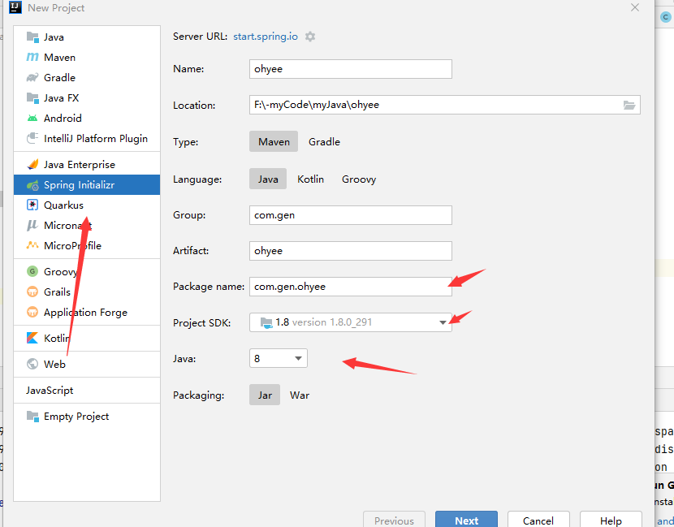

更快创建：



## 一、meven配置


```xml
<mirrors>
    <!--阿里云镜像-->
      <mirror>
        <id>nexus-aliyun</id>
        <mirrorOf>central</mirrorOf>
        <name>Nexus aliyun</name>
        <url>http://maven.aliyun.com/nexus/content/groups/public</url>
      </mirror>
  </mirrors>
 
  <profiles>
         <profile>
              <id>jdk-1.8</id>
              <activation>
                <activeByDefault>true</activeByDefault>
                <jdk>1.8</jdk>
              </activation>
              <properties>
                <maven.compiler.source>1.8</maven.compiler.source>
                <maven.compiler.target>1.8</maven.compiler.target>
                <maven.compiler.compilerVersion>1.8</maven.compiler.compilerVersion>
              </properties>
         </profile>
  </profiles>
```


## 二、导入依赖pom.xml

```xml
<!-- 表示使用springboot-->
    <parent>
        <groupId>org.springframework.boot</groupId>
        <artifactId>spring-boot-starter-parent</artifactId>
        <version>2.5.0</version>
    </parent>

<!--    web场景的依赖-->
    <dependencies>
        <dependency>
            <groupId>org.springframework.boot</groupId>
            <artifactId>spring-boot-starter-web</artifactId>
        </dependency>

    </dependencies>

    <properties>
        <maven.compiler.source>8</maven.compiler.source>
        <maven.compiler.target>8</maven.compiler.target>
    </properties>

<!--    打包jar运行的插件-->
    <build>
        <plugins>
            <plugin>
                <groupId>org.springframework.boot</groupId>
                <artifactId>spring-boot-maven-plugin</artifactId>
                <version>2.5.0</version>
            </plugin>
        </plugins>
    </build>

```

## 三、目录结构


## 四、主程序MainApplication

```java
package com.gen.boot;


import org.springframework.boot.SpringApplication;
import org.springframework.boot.autoconfigure.SpringBootApplication;

/**
 * 告诉springboot这是一个springboot应用
 */

@SpringBootApplication
public class MainApplication {

    public static void main(String[] args) {
        SpringApplication.run(MainApplication.class,args);
    }
}
```

## 五、controller

#### 注意：

controller文件夹必须和主程序在同级目录，才能使用

```java
package com.gen.boot.controller;

import org.springframework.stereotype.Controller;
import org.springframework.web.bind.annotation.RequestMapping;
import org.springframework.web.bind.annotation.ResponseBody;

@Controller
@ResponseBody
public class HelloController {

    @RequestMapping("/hello")
    public String sayHello(){
        return "oh";
    }
}

```

## 六、springboot配置文件

也不需要在哪绑定，只要resources文件夹里面有这个，idea能自动补全，然后使用

application.properties

```properties
server.port=2635
```

参数大全，请看官网

```
https://docs.spring.io/spring-boot/docs/current/reference/html/index.html
```


## 七、发布

#### 1.在pom.xml中导入插件

```xml
<build>    <plugins>        <plugin>            <groupId>org.springframework.boot</groupId>            <artifactId>spring-boot-maven-plugin</artifactId>        </plugin>    </plugins> </build>
```

这个是官方文档的，我们正常使用可能会找不到，这个时候要加上版本号，具体看【二】

#### 2. 生成jar包


导入插件后，双击package即可自动生成包

生成的jar包在target目录下

#### 3.cdm运行

win10进入target目录，在目录栏（点击默认全选当前绝对路径）输入cmd覆盖当前目录即可打开cmd窗口

输入命令(输入开头字母按tab键自动补全)

```
java -jar learn_springBoot-1.0-SNAPSHOT.jar  
```

官方文档的发布方法：

```
https://docs.spring.io/spring-boot/docs/current/reference/html/getting-started.html#getting-started.first-application.executable-jar
```

