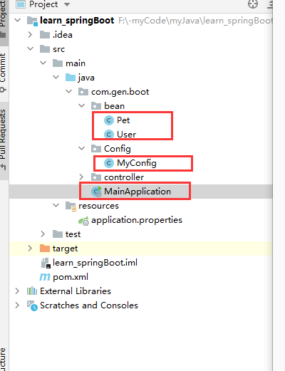

# 底层注释

## 一、目录结构

入门程序的基础上用到了这些



User类

```java
public class User {
    String username;
    String mail;
    Integer lev;

    Pet pet;
}
```

Pet类

```java
public class Pet {
    String petname;
    Integer age;
}
```

## 二、@Configuration

#### 1.简单使用

###### (1)注册组件

```java
package com.gen.boot.Config;


import com.gen.boot.bean.Pet;
import com.gen.boot.bean.User;
import org.springframework.context.annotation.Bean;
import org.springframework.context.annotation.Configuration;

@Configuration   //告诉SpringBoot这是一个配置类 == 配置文件
public class MyConfig {

    @Bean
    public User getUser(){
        return new User("nb人");
    }

    @Bean
    public Pet getPet(){
        return  new Pet("我的狗子");
    }

}
```

###### (2)主程序测试

其实所有的功能springboot都放到了容器里，这个方法可以看到容器里所有的bean

```java
@SpringBootApplication
public class MainApplication {

    public static void main(String[] args) {
//        返回IOC容器
        ConfigurableApplicationContext run = SpringApplication.run(MainApplication.class, args);
//      获得bean的名字
        String[] names = run.getBeanDefinitionNames();

        for (String name : names) {
            System.out.println(name);
        }
    }
}
```

结果：

```
myConfig
helloController
getUser
getPet
...........
```

可以看到IOC容器中的bean 默认名字就是类名

###### (3)改名

想要改名的话，在注册组件时  这样

```java
    @Bean("myDog")
    public Pet getPet(){
        return  new Pet("我的狗子");
    }
```

###### (4)获取对象

主程序看(2),在主程序最后加上这个

```java
User user = run.getBean("getUser",User.class);
Pet pet = run.getBean("myDog",Pet.class);
```

#### 2.proxyBeanMethods属性

###### (1)默认是true使用代理

- 直接从IOC容器之中取得对象,所有获取的对象和IOC容器中的对象是同一个对象，也就是说是单例模式

- 适用于配置类组件之间有依赖关系，方法会被调用得到之前单实例组件，用Full模式。
- 启动不快，因为有很多的判断，确定类在IOC容器中

例子：

主程序中获取两次对象，打印地址会发现他们是同一个对象：

```java
User user = run.getBean("getUser",User.class);
User user2 = run.getBean("getUser",User.class);
```

主程序获取配置类(配置类本身也是一个组件)

```java
//        获取配置类
MyConfig myConfig = run.getBean(MyConfig.class);

User user = myConfig.getUser();
User user2 = myConfig.getUser();
System.out.println(user == user2);
```

结果显示也一样

###### (2)不适用代理

- 意思就是不代理bean，每次调用的时候都会新建一个该类的对象，也可以拿当做 是多例模式吧

- 适用于配置 类组件之间无依赖关系用Lite模式加速容器启动过程，减少判断

设置不代理(配置类中)：

```java
@Configuration(proxyBeanMethods = false)
public class MyConfig {
}
```

###### (3)上面两点说的依赖关系

配置类中：

```java
@Configuration(proxyBeanMethods = true)   //告诉SpringBoot这是一个配置类 == 配置文件
public class MyConfig {

    @Bean   //注册组件，方法名是组件的id，返回值是组件的类型
    public User getUser(){
        User user = new User("nb人");
        user.setPet(getPet());
        return user;
    }

    @Bean("myDog")
    public Pet getPet(){
        return  new Pet("我的狗子");
    }
}
```

## 三、spring注释

这些都是可以用的

@Bean、@Component、@Controller、@Service、@Repository

## 四@Import

#### 1.导入普通类

新建一个TestA

```java
public class TestA {

    public void fun(String str) {
        System.out.println(str);
    }

    public void printName() {
        System.out.println("类名 ：" + Thread.currentThread().getStackTrace()[1].getClassName());
    }
}
```

新建一个ImportConfig,在类上面加上@Configuration，加上@Configuration是为了能让Spring 扫描到这个类，并且直接通过@Import引入TestA类

测试结果
TestA 是一个普通的类，现在可以被@Autowired注释然后调用，就直接说明已经被Spring 注入并管理了，普通的类都是需要先实例化

```java
@RunWith(SpringJUnit4ClassRunner.class)
@SpringBootTest(classes = ApplicationMain.class)
public class ImportAnnotionTest {

    @Autowired
    TestA testA;

    @Test
    public void TestA() {
        testA.printName();
    }
}
```

打印：

```
类名 ：com.test.importdemo.TestA
```

#### 2.导入带有@Configuration的配置类

新建TestB

```java
@Configuration
public class TestB {
    public void fun(String str) {
        System.out.println(str);
    }

    public void printName() {
        System.out.println("类名 ：" + Thread.currentThread().getStackTrace()[1].getClassName());
    }
}
```

在ImportConfig.class里面直接引入TestB

```java
@Import({TestA.class,TestB.class})
@Configuration
public class ImportConfig {
}
```

打印：

```
ImportAnnotionTest in 8.149 seconds (JVM running for 10.104)
类名 ：com.test.importdemo.TestB
2019-01-31 14:12:05.737  INFO 23760 --- [       Thread-2]
```

## 五、@Conditional

这个注释是个大家族，有很多分类

那个@ConditionalOnBean举例子，意义是 ，当IOC容器中包含某个组件时，再创建该组件

#### 1.配置类的方法中

表示只有当getUser  存在IOC容器中才创建mydog

```java
@Configuration()
public class MyConfig {

    @Bean   //注册组件，方法名是组件的id，返回值是组件的类型
    public User getUser(){
        User user = new User("nb人");
        user.setPet(getPet());
        return user;
    }

    @ConditionalOnBean(name = "getUser")
    @Bean("myDog")
    public Pet getPet(){
        return  new Pet("我的狗子");
    }
}
```

#### 2.写在配置类上

表示当myDog类存在IOC 容器中，才创建这个类中 一大堆的bean

```java
@ConditionalOnBean(name = "myDog")
@Configuration()
public class MyConfig {
......
}
```

其他还有一堆@ConditionalOn**

@ConditionalNo**

条件不同罢了

## 六、@ImportResource

如果想像之前spring一样用xml配置IOC

配置类中：

```
@Configuration()
@ImportResource("classpath:bean.xml")
public class MyConfig {
........
}
```

## 七、@ConfigurationProperties

#### 1.把类加到IOC并加上该注解

```java
@Component  //让它加入容器中
@ConfigurationProperties("mydog")
public class Pet {
    String petname;
    Integer age;

    public Pet() {
    }
    .....
}
```

#### 2.properties写属性

```properties
server.port=2635

mydog.name="狗子"
mydog.age=2
```

#### 4.自动注入+使用

```java
@Controller
@ResponseBody
public class HelloController {

    @RequestMapping("/hello")
    public String sayHello(){
        return "oh";
    }

//    自动注入
    @Autowired
    public Pet pet;

    @RequestMapping("/car")
    public Pet getCar(){
        return pet;
    }
}
```