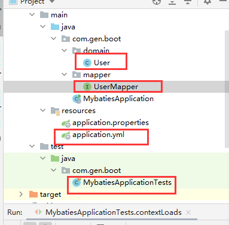

## 一、快速配置

勾选mybatis和mysql



#### 1.配置

```yaml
#配置数据库源
spring:
  datasource:
    url: jdbc:mysql:///gen  #连接本地数据库 ///  可以省略ip和端口
    username: root
    password: 1001086
    driver-class-name: com.mysql.cj.jdbc.Driver

```

如果想用xml

```yaml
mybatis:
  mapper-locations: claspath/mapper/*Mapper.xml
```

#### 2.实体类

```java
public class User {
    private String mail;
}
```

#### 3.mapper

```java
@Mapper//告诉springboot是一个mapper
public interface UserMapper {
    @Select("select * from user")
    public List<User> findAll();
}
```

####  4.测试

```java
@SpringBootTest
class MybatiesApplicationTests {

    @Autowired
    private UserMapper userMapper;

    @Test
    void contextLoads() {
        List<User> users = userMapper.findAll();
        for (User user : users) {
            System.out.println(user);
        }
    }
}
```

