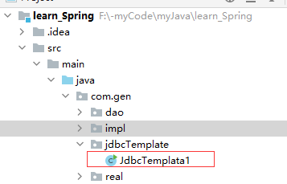

# jdbctemplate

## 一、入门基本使用

#### 1.pom.xml依赖坐标

```xml
<?xml version="1.0" encoding="UTF-8"?>
<project xmlns="http://maven.apache.org/POM/4.0.0"
         xmlns:xsi="http://www.w3.org/2001/XMLSchema-instance"
         xsi:schemaLocation="http://maven.apache.org/POM/4.0.0 http://maven.apache.org/xsd/maven-4.0.0.xsd">
    <modelVersion>4.0.0</modelVersion>

    <groupId>org.example</groupId>
    <artifactId>learn_Spring</artifactId>
    <version>1.0-SNAPSHOT</version>

<!--    打包方式-->
    <packaging>jar</packaging>
<!--    springIOC依赖-->
    <dependencies>
        <dependency>
            <groupId>org.springframework</groupId>
            <artifactId>spring-context</artifactId>
            <version>5.3.7</version>
        </dependency>

        <dependency>
            <groupId>org.springframework</groupId>
            <artifactId>spring-jdbc</artifactId>
            <version>5.3.6</version>
        </dependency>

        <dependency>
            <groupId>org.springframework</groupId>
            <artifactId>spring-tx</artifactId>
            <version>5.3.7</version>
        </dependency>

        <dependency>
            <groupId>mysql</groupId>
            <artifactId>mysql-connector-java</artifactId>
            <version>8.0.24</version>
        </dependency>

    </dependencies>

    <properties>
        <maven.compiler.source>8</maven.compiler.source>
        <maven.compiler.target>8</maven.compiler.target>
    </properties>

</project>
```

#### 2.基本使用

只有一个java文件



```java
package com.gen.jdbcTemplate;

import org.springframework.jdbc.core.JdbcTemplate;
import org.springframework.jdbc.datasource.DriverManagerDataSource;

/**
 * jdbcTemplate 最基本用法
 */
public class JdbcTemplata1 {
    public static void main(String[] args) {
//        0.准备数据源：spring的内置数据源
        DriverManagerDataSource dmd = new DriverManagerDataSource();
        dmd.setDriverClassName("com.mysql.cj.jdbc.Driver");
        dmd.setUrl("jdbc:mysql://localhost:3306/gen");
        dmd.setUsername("root");
        dmd.setPassword("1001086");
//        1.创建JdbcTemplate 对象
        JdbcTemplate jt = new JdbcTemplate();
//        2.给jt设置数据源
        jt.setDataSource(dmd);
//        2.执行操作
        jt.execute("insert into user(mail)value ('fuck@163')");
    }
}
```

## 二、在Dao层中基于IOC的XML使用


#### 1.pom.xml依赖坐标和【一】一样

#### 2.bean.xml

```xml
<?xml version="1.0" encoding="UTF-8"?>
<beans xmlns="http://www.springframework.org/schema/beans"
       xmlns:xsi="http://www.w3.org/2001/XMLSchema-instance"
       xsi:schemaLocation="http://www.springframework.org/schema/beans
        http://www.springframework.org/schema/beans/spring-beans.xsd">


    <!-- 配置账户的持久层-->
    <bean id="userDao" class="com.gen.impl.UserDaoImpl">
        <property name="jt" ref="jdbcTemplate"></property>
<!--        <property name="dataSource" ref="dataSource"></property>-->
    </bean>

    <!--配置JdbcTemplate-->
    <bean id="jdbcTemplate" class="org.springframework.jdbc.core.JdbcTemplate">
        <property name="dataSource" ref="dataSource"></property>
    </bean>

    <!-- 配置数据源-->
    <bean id="dataSource" class="org.springframework.jdbc.datasource.DriverManagerDataSource">
        <property name="driverClassName" value="com.mysql.cj.jdbc.Driver"></property>
        <property name="url" value="jdbc:mysql://localhost:3306/gen"></property>
        <property name="username" value="root"></property>
        <property name="password" value="1001086"></property>
    </bean>
</beans>
```

#### 3.UserDaoImpl.java调用

userdao自己写。。。

```java
package com.gen.impl;

import com.gen.dao.UserDao;
import com.gen.real.User;
import org.springframework.jdbc.core.BeanPropertyRowMapper;
import org.springframework.jdbc.core.JdbcTemplate;

import java.util.List;


public class UserDaoImpl implements UserDao {

    private JdbcTemplate jt ;

    public JdbcTemplate getJt() {
        return jt;
    }

    public void setJt(JdbcTemplate jt) {
        this.jt = jt;
    }

    public UserDaoImpl() {
        System.out.println("yeeee");
    }

    @Override
    public User findUserByID(Integer userID) {
        List<User> users = jt.query("select * from user where id=?",new BeanPropertyRowMapper<User>(User.class),userID);
        return users.isEmpty()?null:users.get(0);
    }

    @Override
    public User findUserByName(String userName) {
        List<User> users = jt.query("select * from user where id=?",new BeanPropertyRowMapper<User>(User.class),userName);
        if(users.isEmpty()){
            return null;
        }
        if (users.size()>1){
            throw  new RuntimeException("结果不唯一");
        }
        return users.get(0);
    }

    @Override
    public void updateUser(User user) {
        jt.update("update user set mail=? where id=?",user.getId());

    }

    @Override
    public int deleUser(User user) {
        return 0;
    }
}

```

#### 4.JdbcTemplata1调用

```java
package com.gen.jdbcTemplate;

import com.gen.dao.UserDao;
import com.gen.real.User;
import org.springframework.context.ApplicationContext;
import org.springframework.context.support.ClassPathXmlApplicationContext;

/**
 * jdbcTemplate 最基本用法
 */
public class JdbcTemplata1 {
    public static void main(String[] args) {
//        1.获取容器
        ApplicationContext ac = new ClassPathXmlApplicationContext("bean.xml");
//        2.获取对象
        UserDao ud = ac.getBean("userDao",UserDao.class);
//        3.执行查询
        User user = ud.findUserByID(1);
        System.out.println(user);
    }
}

```

## 三、CRUD

#### 1.其他和【二】一样

#### 2.jdbctemplate如下

```java
package com.itheima.jdbctemplate;

import com.itheima.domain.Account;
import org.springframework.context.ApplicationContext;
import org.springframework.context.support.ClassPathXmlApplicationContext;
import org.springframework.jdbc.core.JdbcTemplate;
import org.springframework.jdbc.core.RowMapper;

import java.sql.ResultSet;
import java.sql.SQLException;

/**
 * JdbcTemplate的CRUD操作
 */
public class JdbcTemplateDemo3 {

    public static void main(String[] args) {
        //1.获取容器
        ApplicationContext ac = new ClassPathXmlApplicationContext("bean.xml");
        //2.获取对象
        JdbcTemplate jt = ac.getBean("jdbcTemplate",JdbcTemplate.class);
        //3.执行操作
        //保存
//        jt.update("insert into account(name,money)values(?,?)","eee",3333f);
        //更新
//        jt.update("update account set name=?,money=? where id=?","test",4567,7);
        //删除
//        jt.update("delete from account where id=?",8);
        //查询所有
//        List<Account> accounts = jt.query("select * from account where money > ?",new AccountRowMapper(),1000f);
//        List<Account> accounts = jt.query("select * from account where money > ?",new BeanPropertyRowMapper<Account>(Account.class),1000f);
//        for(Account account : accounts){
//            System.out.println(account);
//        }
        //查询一个
//        List<Account> accounts = jt.query("select * from account where id = ?",new BeanPropertyRowMapper<Account>(Account.class),1);
//        System.out.println(accounts.isEmpty()?"没有内容":accounts.get(0));

        //查询返回一行一列（使用聚合函数，但不加group by子句）
        Long count = jt.queryForObject("select count(*) from account where money > ?",Long.class,1000f);
        System.out.println(count);


    }
}

/**
 * 定义Account的封装策略
 */
class AccountRowMapper implements RowMapper<Account>{
    /**
     * 把结果集中的数据封装到Account中，然后由spring把每个Account加到集合中
     * @param rs
     * @param rowNum
     * @return
     * @throws SQLException
     */
    @Override
    public Account mapRow(ResultSet rs, int rowNum) throws SQLException {
        Account account = new Account();
        account.setId(rs.getInt("id"));
        account.setName(rs.getString("name"));
        account.setMoney(rs.getFloat("money"));
        return account;
    }
}
```

## 四jdbcDaoSupport简介
JdbcDaoSupport是JDBC数据访问对象的超类。它与特定的数据源相关联。spring Inversion of Control （IOC）容器或BeanFactory负责获得相应数据源的配置详细信息，并将其与JdbcDaoSupport相关联。这个类最重要的功能就是使子类可以使用JdbcTemplate对象。
JdbcTemplate是Spring JDBC框架中最重要的类。引用文献中的话：“它简化了JDBC的使用，有助于避免常见的错误。它执行核心JDBC工作流，保留应用代码以提供SQL和提取结果。”这个类通过执行下面的样板任务来帮助分离JDBC DAO代码的静态部分：

◆从数据源检索连接。
◆准备合适的声明对象。
◆执行SQL CRUD操作。
◆遍历结果集，然后将结果填入标准的collection对象。
◆处理SQLException异常并将其转换成更加特定于错误的异常层次结构。

#### 1、写一个jdbc.properties数据连接池

```xml
jdbc.driverClassName=com.mysql.jdbc.Driver
jdbc.url=jdbc\:mysql\://localhost\:3306/test
jdbc.username=root
jdbc.password=123456
```


#### 2、写一个PersonDao类继承JdbcDaoSupport
```JAVA
import org.springframework.jdbc.core.support.JdbcDaoSupport;

public class PersonDao extends JdbcDaoSupport {
    public void savePerson(String sql)
    {
        this.getJdbcTemplate().execute(sql);
    }

}
```

#### 3、写applicationContext.xml配置文件

```xml
 <bean class="org.springframework.beans.factory.config.PropertyPlaceholderConfigurer"> 
         <property name="locations">
           <value>classpath:jdbc.properties</value>
         </property>
     </bean>
     <bean id="datasource" destroy-method="close" class="org.apache.commons.dbcp.BasicDataSource">
        <property name="driverClassName" value="${jdbc.driverClassName}"></property>
        <property name="url" value="${jdbc.url}" />
        <property name="username" value="${jdbc.username}" />
        <property name="password" value="${jdbc.password}" />
     </bean>
     <bean id="persondao1" class="com.zhiyou.dao.PersonDao">
        <property name="dataSource">
           <ref bean="datasource"/>
        </property>
     </bean>
```


#### 4、写一个PersonDaoTest的测试类

```java
import org.junit.Test;
import org.springframework.context.ApplicationContext;
import org.springframework.context.support.ClassPathXmlApplicationContext;

public class PersonDaoTest {
    @Test
    public void test1()
    {
        ApplicationContext context=new ClassPathXmlApplicationContext("applicationContext.xml");
        PersonDao personDao=(PersonDao)context.getBean("persondao1");
        personDao.savePerson("insert into persons (pid,pname,pdesc) values ('007','wmy','123456') ");
        //personDao.savePerson("insert into person(name,description) values('aa','aa')");
    }

}
```


最后就可以插入数据了


