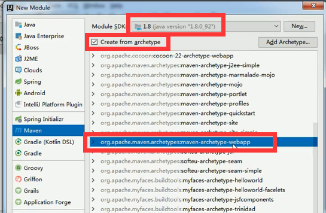
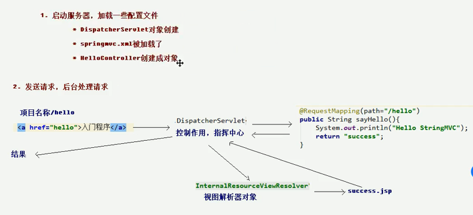

## 一、创建项目



#### 1.Maven项目

#### 2.勾选Create from archetype

#### 3. 选择那个webapp结尾的东西

#### △解决IDEA maven项目创建过慢的问题

idea在创建maven项目的时候，会下载一堆乱七八糟的插件，有的时候其实并不需要

解决方法：

```
archetypeCatalog

internal
```


## 二、目录结构创建

如图，却啥自己创建


然后，右键java文件夹，mark directory as->sources root

resources文件夹  mark directory as->resources root，如下图

## 三、依赖导入

pom.xml文件,创建项目的时候回自动生成很多东西，我们挑里面的properties和dependencies像下面那样改

```xml
<!--  版本特性-->
  <properties>
    <project.build.sourceEncoding>UTF-8</project.build.sourceEncoding>
    <maven.compiler.source>1.8</maven.compiler.source>
    <maven.compiler.target>1.8</maven.compiler.target>
    <!--版本锁定，接下来在dependencies里面调用改版本-->
    <spring.version>5.0.2.RELEASE</spring.version>
  </properties>

<!--  导入依赖-->
  <dependencies>
    <!--IOC容器的依赖-->
    <dependency>
      <groupId>org.springframework</groupId>
      <artifactId>spring-context</artifactId>
      <!--调用在properties中设置的版本-->
      <version>${spring.version}</version>
    </dependency>

    <!--web依赖-->
    <dependency>
      <groupId>org.springframework</groupId>
      <artifactId>spring-web</artifactId>
      <version>${spring.version}</version>
    </dependency>

    <!--webmvc依赖 -->
    <dependency>
      <groupId>org.springframework</groupId>
      <artifactId>spring-webmvc</artifactId>
      <version>${spring.version}</version>
    </dependency>

    <dependency>
      <groupId>javax.servlet</groupId>
      <artifactId>servlet-api</artifactId>
      <version>2.5</version>
      <scope>provided</scope>
    </dependency>

    <dependency>
      <groupId>javax.servlet.jsp</groupId>
      <artifactId>jsp-api</artifactId>
      <version>2.0</version>
      <scope>provided</scope>
    </dependency>

    <dependency>
      <groupId>junit</groupId>
      <artifactId>junit</artifactId>
      <version>4.11</version>
      <scope>test</scope>
    </dependency>
  </dependencies>
```

## 四、JSP和service文件准备


#### 1.index.jsp

这个是系统自带的页面，默认打开网站地址就是它

也不知道 在哪设置默认界面的，想要更改默认百度的方法都是改这个jsp，让这个jsp跳转到别的页面

刚刚创建meven项目的时候idea就创建这个jsp了，一创建就能运行起来

```jsp
<%--开头的配置，让你中文不乱码--%>
<%@ page contentType="text/html; charset=UTF-8"  language="java" %>
<html>
<head>
    <title>comeonbaby</title>
</head>
<body>
<h2>ohhhhhhhhhh</h2>
    <%--href写控制器里面的方法名称--%>
    <a href="fuckme">oyeee</a>
</body>
</html>
```

#### 2.控制器

```java
@Controller
public class HelloController {
    
//   和index.jsp 的链接的href对应的方法
    @RequestMapping(path="/fuckme")
    public String sayHello(){
        System.out.println("fuckeme");
//        如果返回一个普通的字符串的字符串，网页就会显示那个字符串
//        如果返回一个JSP的名字,就会返回那个JSP
        return "secessin";
    }
}
```

#### 3.返回的界面

```jsp
<%@ page contentType="text/html;charset=UTF-8" language="java" %>
<html>
<head>
    <title>ohye</title>
</head>
<body>
    <h3>yesok</h3>
</body>
</html>
```

## 五、spring的配置文件

其实也就是之前bean.xml，其实正常并不是直接叫bean的，之前只是刚刚学习方便理解。bean只是spring中ioc的功能，整个bean.xml其实是spring的配置文件。


```xml
<?xml version="1.0" encoding="UTF-8"?>
<beans xmlns="http://www.springframework.org/schema/beans"
       xmlns:context="http://www.springframework.org/schema/context"
       xmlns:mvc="http://www.springframework.org/schema/mvc"
       xmlns:xsi="http://www.w3.org/2001/XMLSchema-instance"
       xsi:schemaLocation="http://www.springframework.org/schema/beans
        http://www.springframework.org/schema/beans/spring-beans.xsd
        http://www.springframework.org/schema/mvc
        http://www.springframework.org/schema/mvc/spring-mvc.xsd
        http://www.springframework.org/schema/context
        http://www.springframework.org/schema/context/spring-context.xsd">

    <!--告知spring在创建容器时要扫描的包，配置所需要的标签不是在beans的约束中，而是一个名称为
    context名称空间和约束中-->
    <context:component-scan base-package="com.gen"></context:component-scan>

    <bean id="internalResourceViewResolver" class="org.springframework.web.servlet.view.InternalResourceViewResolver">
        <property name="prefix" value="/WEB-INF/page/"> </property>
        <property name="suffix" value=".jsp"></property>
    </bean>

<!--    开启SpringMVC注解支持-->
    <mvc:annotation-driven></mvc:annotation-driven>
</beans>
```

## 六、前端控制器配置

这个文件,很多东西也是生成好，我们在web-app标签中写东西


```xml
<web-app>
  <display-name>Archetype Created Web Application</display-name>

  <servlet>
    <servlet-name>dispatcherServlet</servlet-name>
    <servlet-class>org.springframework.web.servlet.DispatcherServlet</servlet-class>
    <!--设置调用的spring配置-->
    <init-param>
      <param-name>contextConfigLocation</param-name>
      <param-value>classpath:springmvc.xml</param-value>
    </init-param>
    <!--表示第一次发请求时创建ioc bean-->
    <load-on-startup>1</load-on-startup>
  </servlet>

  <servlet-mapping>
    <servlet-name>dispatcherServlet</servlet-name>
    <!--"/"代表发任意请求都发到这里-->
    <url-pattern>/</url-pattern>
  </servlet-mapping>
</web-app>
```

## 七、总结一览



- 加载顺序
  - 项目启动
  - web.xml
    - dispatcherServlet
      - 控制接收什么链接的请求
      - 控制加载哪个spring的配置文件
  - 加载spring的配置文件
    - 控制器bean的创建
    - 其他jsp的位置目录设置
  - 访问控制器
  - 访问控制器给的jps或者响应

- 访问顺序
  - index.jsp
  - 点击链接的地址到相应的控制器
  - 控制器给一个新的jsp或者响应

