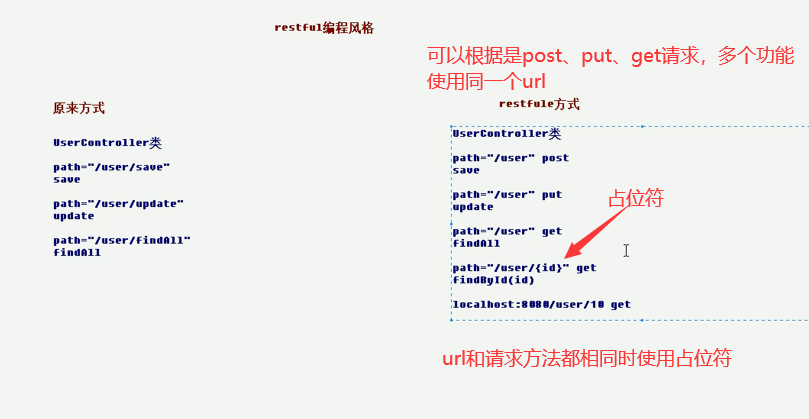

在入门案例的基础上，加上这两个文件，目录结构如下


## 一、RequestMapping

## 二、 RequestParam

#### 1.参数传递名字必须相同

jsp

```jsp
<%@ page contentType="text/html;charset=UTF-8" language="java" %>
<html>
<head>
    <title>常用注释</title>
</head>
<body>
    <a href="anno/testAnno?username=牛逼">requestparam</a>
</body>
</html>
```

controller

```java
@Controller
@RequestMapping("/anno")
public class AnnoController {
    @RequestMapping("/testAnno")
    public String testAnno(String username){
        System.out.println(username);
        return "secessin";
    }
}
```

此时可以接收到参数，传递的参数名和controller的接收参数名相同

如果

jsp

```jsp
<a href="anno/testAnno?name=牛逼">requestparam</a>
```

controller

```java
    public String testAnno(String username){
```

不会报错，但是后台会得到null值的username

#### 2.RequestParam的使用

```jsp
<%@ page contentType="text/html;charset=UTF-8" language="java" %>
<html>
<head>
    <title>常用注释</title>
</head>
<body>
    <a href="anno/testAnno?name=牛逼">requestparam</a>
</body>
</html>
```

controller

```java
@Controller
@RequestMapping("/anno")
public class AnnoController {

    @RequestMapping("/testAnno")
    public String testAnno(@RequestParam(value="name",defaultValue = "yes") String username){
        System.out.println(username);
        return "secessin";
    }
}
```

###### RequestParam详解

```java
public String testAnno(@RequestParam(name="name",defaultValue = "yes") String username
```

- 这个注释的作用对象是右边的方法参数string username

源码：

```java
@Target({ElementType.PARAMETER})
@Retention(RetentionPolicy.RUNTIME)
@Documented
public @interface RequestParam {
    @AliasFor("name")
    String value() default "";

    @AliasFor("value")
    String name() default "";

    boolean required() default true;

    String defaultValue() default "\n\t\t\n\t\t\n\ue000\ue001\ue002\n\t\t\t\t\n";
}
```

- name属性就是value 属性，value属性就是name属性
  - name="name"意思就是，前端传来的参数“name”传给该方法的username
- defaultValue=“yeeee”就是前端没有参数传过来的时候默认值
- required（必要性），默认值是true
  - 看【1】中的例子，前端传来没有参数是不会报错的，后端得到的username值是null，可以正常打印出了
  - 但是设置了required=true后，前端没有参数传来，并且没有默认值，就会报错

## 三、RequestBody

作用：

主要用来接收前端传递给后端的json字符串中的数据的(请求体中的数据的)；得到的数据格式

```
username=niuba&lev=22
```

使用：

jsp

```jsp
<%@ page contentType="text/html;charset=UTF-8" language="java" %>
<html>
<head>
    <title>常用注释</title>
</head>
<body>
    <form action="anno/testAnno" method="post">
        用户名：<input type="text" name="username">
        等级：<input type="text" name="lev">
        <input type="submit" value="提交">
    </form>
</body>
</html>
```

controller

```java
@Controller
@RequestMapping("/anno")
public class AnnoController {

    @RequestMapping("/testAnno")
    public String testAnno(@RequestBody String body){
        System.out.println(body);
        return "secessin";
    }
}
```

## 四、PathVaribale

- 作用： 
  - 用于绑定 url 中的占位符。
    - 例如：请求 url 中 /delete/{id}，这个{id}就是 url 占位符。
    - url 支持占位符是 spring3.0 之后加入的。
    - 是 springmvc 支持 rest 风格 URL 的一个重要标志。 

- 属性： 
  - value：用于指定 url 中占位符名称。 name就是value，value就是name
  - required：是否必须提供占位符。

> - 什么是 rest：
>   -  REST（英文：Representational State Transfer，简称 REST）描述了一个架构样式的网络系统， 比如 web 应用程序。它首次出现在 2000 年 Roy Fielding 的博士论文中，他是 HTTP 规范的主要编写者之 一。在目前主流的三种 Web 服务交互方案中，REST 相比于 SOAP（Simple Object Access protocol，简单 对象访问协议）以及 XML-RPC 更加简单明了，无论是对 URL 的处理还是对 Payload 的编码，REST 都倾向于用更 加简单轻量的方法设计和实现。值得注意的是 REST 并没有一个明确的标准，而更像是一种设计的风格。 它本身并没有什么实用性，其核心价值在于如何设计出符合 REST 风格的网络接口。
> - restful 的优点
>   - 它结构清晰、符合标准、易于理解、扩展方便，所以正得到越来越多网站的采用
> - restful 的特性：
>   - 它结构清晰、符合标准、易于理解、扩展方便，所以正得到越来越多网站的采用
> - restful 的特性：
>   - 资源（Resources）：网络上的一个实体，或者说是网络上的一个具体信息。
>     - 它可以是一段文本、一张图片、一首歌曲、一种服务，总之就是一个具体的存在。可以用一个 URI（统一 资源定位符）指向它，每种资源对应一个特定的 URI 。要 获取这个资源，访问它的 URI 就可以，因此 URI 即为每一个资源的独一无二的识别符。
>   - 表现层（Representation）：把资源具体呈现出来的形式，叫做它的表现层 （Representation）。
>     - 比如，文本可以用 txt 格式表现，也可以用 HTML 格式、XML 格式、JSON 格式表现，甚至可以采用二 进制格式。
>   - 状态转化（State Transfer）：每 发出一个请求，就代表了客户端和服务器的一次交互过程。
>     - HTTP 协议，是一个无状态协议，即所有的状态都保存在服务器端。因此，如果客户端想要操作服务器， 必须通过某种手段，让服务器端发生“状态转化”（State Transfer）。而这种转化是建立在表现层之上的，所以 就是 “表现层状态转化”。具体说，就是 HTTP 协议里面，四个表示操作方式的动词：GET 、POST 、PUT、 DELETE。它们分别对应四种基本操作：GET 用来获取资源，POST 用来新建资源，PUT 用来更新资源，DELETE 用来 删除资源。 



###### 使用PathVaribale

jsp

```jsp
<%@ page contentType="text/html;charset=UTF-8" language="java" %>
<html>
<head>
    <title>常用注释</title>
</head>
<body>
    <a href="anno/testAnno/10">ohmy</a>
</body>
</html>
```

controller

```java
@Controller
@RequestMapping("/anno")
public class AnnoController {

    @RequestMapping("/testAnno/{id}")
    public String testAnno(@PathVariable(name="id") String id){
        System.out.println(id);
        return "secessin";
    }
}
```

## 五、HiddentHttpMethodFilter过滤器

- 作用：
  - 由于浏览器 form 表单只支持 GET 与 POST 请求，而 DELETE、PUT 等 method 并不支持，Spring3.0 添 加了一个过滤器，可以将浏览器请求改为指定的请求方式，发送给我们的控制器方法，使得支持 GET、POST、PUT 与 DELETE 请求。

#### 1.在web.xml中配置过滤器

```xml
<!-- 配置HiddentHttpMethodFilter过滤器，修改浏览器请求为指定方式 -->
  <filter>
    <filter-name>httpMethodFilter</filter-name>
    <filter-class>org.springframework.web.filter.HiddenHttpMethodFilter</filter-class>
  </filter>
 
  <filter-mapping>
    <filter-name>httpMethodFilter</filter-name>
    <url-pattern>/*</url-pattern>
  </filter-mapping>
```

#### 2.jsp

```jsp
<form action="springmvc/testRestPUT/1" method="post">
用户名称：<input type="text" name="username"><br/>
<input type="hidden" name="_method" value="PUT">
<input type="submit" value="更新">
</form>
```

```
<input type="hidden" name="_method" value="PUT">
```

- hidden隐藏属性
- 一定要name="_method"，这个是固定的
- 请求方式必须使用 post 请求。
- value="PUT“也可以是GET POST

```
<form action="springmvc/testRestPUT/1" method="post">
```

#### 3.controller

````java
@RequestMapping(value="/testRestPUT/{id}",method=RequestMethod.PUT)
public String testRestfulURLPUT(@PathVariable("id")Integer id,User user){
System.out.println("rest put "+id+","+user);
r
````

## 六、RequestHeader

- 作用： 用于获取请求消息头。
  -  属性： value：
  - 提供消息头名称 required：是否必须有此消息头 
  - 注： 在实际开发中一般不怎么用。

```jsp
<%@ page contentType="text/html;charset=UTF-8" language="java" %>
<html>
<head>
    <title>常用注释</title>
</head>
<body>
    <a href="anno/testAnno">ohmy</a>
</body>
</html>
```

controller

```java
@Controller
@RequestMapping("/anno")
public class AnnoController {

    @RequestMapping("/testAnno")
    public String testAnno(@RequestHeader(value = "Accept") String id){
        System.out.println(id);
        return "secessin";
    }
}
```

```
打印结果text/html,application/xhtml+xml,application/xml;q=0.9,image/avif,image/webp,image/apng,*/*;q=0.8,application/signed-exchange;v=b3;q=0.9
```

value = "Accept"  请求头有很多参数，Accept是其中之一

## 七、CookieValue

- 作用：
  -  用于把指定 cookie 名称的值传入控制器方法参数。 
- 属性： 
  - value：指定 cookie 的名称。 
  - required：是否必须有此 cookie。

#### 1.jsp和【六】一样

#### 2.controller

```JAVA
@Controller
@RequestMapping("/anno")
public class AnnoController {

    @RequestMapping("/testAnno")
    public String testAnno(@CookieValue(value = "JSESSIONID") String cookie){
        System.out.println(cookie);
        return "secessin";
    }
}
```

value = "JSESSIONID"  cookie有很多参数，JSESSIONID是其中之一

## 八、ModelAttribute

- 作用： 
  - 该注解是 SpringMVC4.3 版本以后新加入的。它可以用于修饰方法和参数。 出现在方法上，表示当前方法会在控制器的方法执行之前，先执行。它可以修饰没有返回值的方法，也可 以修饰有具体返回值的方法。 出现在参数上，获取指定的数据给参数赋值。

- 属性： 
  - value：用于获取数据的 key。key 可以是 POJO 的属性名称，也可以是 map 结构的 key。 
- 应用场景： 
  - 当表单提交数据不是完整的实体类数据时，保证没有提交数据的字段使用数据库对象原来的数据。 例如： 我们在编辑一个用户时，用户有一个创建信息字段，该字段的值是不允许被修改的。在提交表单数 据是肯定没有此字段的内容，一旦更新会把该字段内容置为 null，此时就可以使用此注解解决问题。

#### 1.jsp

```jsp
<%@ page contentType="text/html;charset=UTF-8" language="java" %>
<html>
<head>
    <title>常用注释</title>
</head>
<body>
    <form action="anno/testAnno">
        角色名：<input type="text" name="heroname">
        <input type="submit" value="提交">
    </form>
</body>
</html>

```

#### 2.hero类

故意让jsp中提交的数据属性不完整，只有username是使用前端传递的，其他数据从数据库查询

```java
public class Hero implements Serializable {
    private String heroname;
    private String star;

    private Date date;
```

#### 3.controller

第一种用法  有返回值的

```java
@Controller
@RequestMapping("/anno")
public class AnnoController {

    @RequestMapping("/testAnno")
    public String testAnno(Hero hero){
        System.out.println(hero);
        return "secessin";
    }

    /**
     * 这个方法会在这个testAnno方法之前执行
     */
    @ModelAttribute
    public Hero showHero(String heroname){
//        从数据库查询这个hero的其他信息(模拟)
        Hero hero = new Hero();
        hero.setHeroname(heroname);
        hero.setStar("1");
        hero.setDate(new Date());
        return hero;
    }
}
```

第二种写法map传递

```java
@Controller
@RequestMapping("/anno")
public class AnnoController {

    @RequestMapping("/testAnno")
    public String testAnno(@ModelAttribute(name = "ohye") Hero hero){
        System.out.println(hero);
        return "secessin";
    }

    /**
     * 这个方法会在这个testAnno方法之前执行
     */
    @ModelAttribute
    public void showHero(String heroname,Map<String,Hero> map){
//        从数据库查询这个hero的其他信息(模拟)
        Hero hero = new Hero();
        hero.setHeroname(heroname);
        hero.setStar("1");
        hero.setDate(new Date());
        map.put("ohye",hero);
    }
}
```

## 九、SessionAttribute

- 作用：
  -  用于多次执行控制器方法间的参数共享。 
- 属性：
  -  value：用于指定存入的属性名称 type：用于指定存入的数据类型。

#### 1.jsp

```jsp
<%@ page contentType="text/html;charset=UTF-8" language="java" %>
<html>
<head>
    <title>常用注释</title>
</head>
<body>
    <a href="anno/testAnno">ohye</a>
</body>
</html>
```

#### 2.存到request域

controller

```java
@Controller
@RequestMapping("/anno")
public class AnnoController {

    @RequestMapping("/testAnno")
    public String testAnno(Model model){
//        底层会存到request域对象中
        model.addAttribute("msg","ohno");
        return "secessin";
    }

}
```

前端页面

```jsp
<%--isELIgnored="false"打开解析参数--%>
<%@ page contentType="text/html;charset=UTF-8" language="java" isELIgnored="false" %>
<html>
<head>
    <title>ohye</title>
</head>
<body>
    <h3>yesok</h3>
    ${requestScope.msg}
</body>
</html>
```

#### 3.存到session域

controller

```java
@Controller
@RequestMapping("/anno")
@SessionAttributes(value = {"msg"})
public class AnnoController {

    @RequestMapping("/testAnno")
    public String testAnno(Model model){
//        底层会存到request域对象中
        model.addAttribute("msg","ohno");
        return "secessin";
    }

}
```

前端返回页面

```jsp
<%--isELIgnored="false"打开解析参数--%>
<%@ page contentType="text/html;charset=UTF-8" language="java" isELIgnored="false" %>
<html>
<head>
    <title>ohye</title>
</head>
<body>
    <h3>yesok</h3>
    ${sessionScope.msg}
</body>
</html>
```

#### 4.从session域中取出来

#### 1.jsp

```jsp
<%@ page contentType="text/html;charset=UTF-8" language="java" %>
<html>
<head>
    <title>常用注释</title>
</head>
<body>
    <a href="anno/testAnno">ohye</a>
    <a href="anno/gettestAnno">ohyehhhhh</a>
</body>
</html>

```

#### 2.controller

```java
@Controller
@RequestMapping("/anno")
@SessionAttributes(value = {"msg"})
public class AnnoController {

    @RequestMapping("/testAnno")
    public String testAnno(Model model){
//        底层会存到request域对象中
        model.addAttribute("msg","ohno");
        return "secessin";
    }

    @RequestMapping("/gettestAnno")
    public String gettestAnno(ModelMap modelMap){
        String msg = (String) modelMap.get("msg");
        System.out.println(msg);
        return "secessin";
    }
}

```

