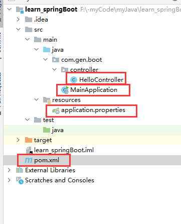
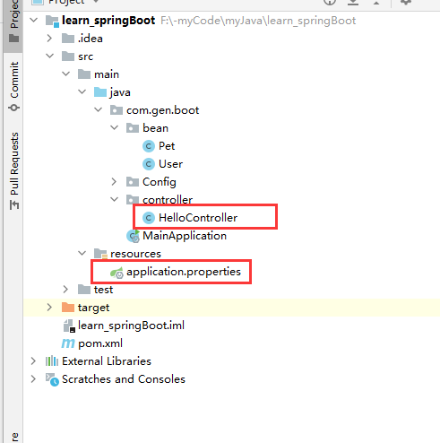
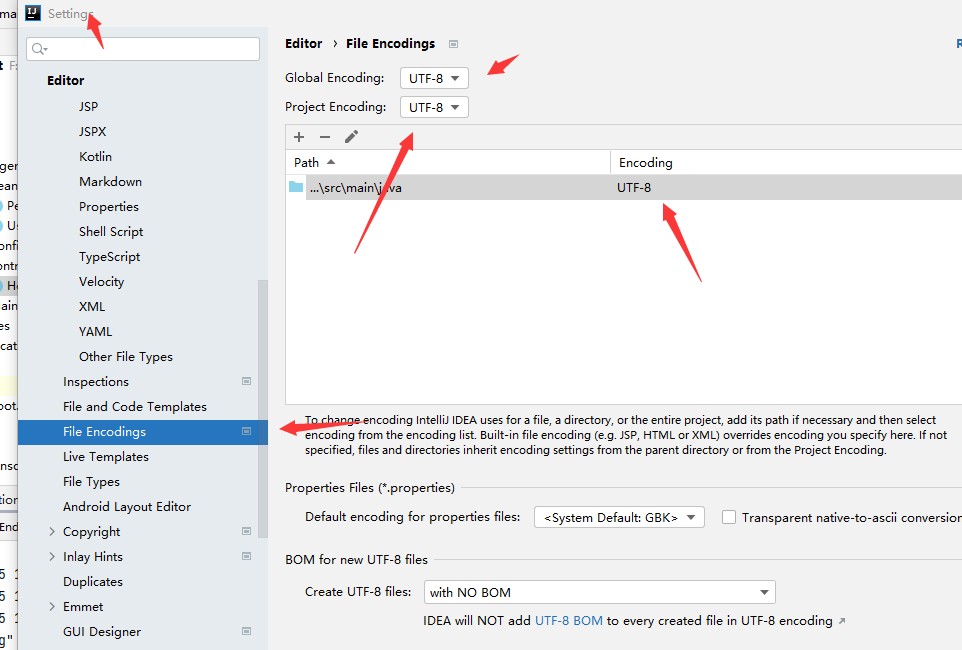
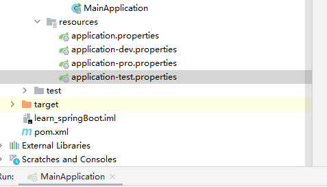
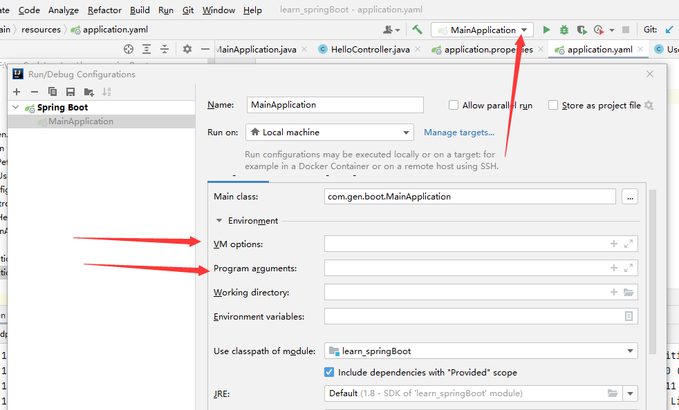

## 一、配置文件分类

- springboot是基于约定的，很多配置都有默认值。
- 如果想使用自己的配置，就要设置配置文件
- 目前的配置文件有两种
  - application.properties
  - application.yml(application.yaml)
- 注意：名字必须这样，然后在resources文件夹下才能生效



配置有哪些参数能用，请看官网：

```
https://docs.spring.io/spring-boot/docs/current/reference/html/index.html
```

## 二、读取配置

测试环境：入门案例的基础上使用这些东西



#### 1.@Value+中文乱码解决

###### 演示

配置文件:

```properties
server.port=2635

dog = "狗子"

pet.dog = "狗子"

add[] = yes,no
```

controller

```java
@Controller
@ResponseBody
public class HelloController {

    //$里面的才是判断依据
    @Value("${dog}")
    public String mydog;
    
    //$获得对象的属性也行
    @Value("${pet.dog}")
    public String mydog2;
    
    //数组也可以
    @Value("${add[0]}")
    public String mydog;


    @RequestMapping("/dog")
    public String getCar(){
        return mydog;
    }
}
```

结果显示中文乱码,

###### 解决  

数据编码从iso8859-1转为utf-8才可正常使用。

```java
@Controller
@ResponseBody
public class HelloController {

    @Value("${dog}")
    public String mydog;


    @RequestMapping("/dog")
    public String getCar() throws UnsupportedEncodingException {
        System.out.println(mydog);
        System.out.println(new String(mydog.getBytes("iso8859-1")));
        System.out.println(new String(mydog.getBytes("iso8859-1"), "utf-8"));
        return new String(mydog.getBytes("iso8859-1"));
    }
}
```

输出结果

```
"??????
"鐙楀瓙
"狗子
```

当



结果打印

```
"??????""
"狗子"
"狗子"
```

#### 2.Environment

###### 演示

配置文件：

```properties
server.port=2635

dog = tom

pet.dog = fuckingdog

add[] = yes,no
```

controller

```java
@Controller
@ResponseBody
public class HelloController {

//    定义一个environmernt对象并自动封装
    @Autowired
    private Environment env;

    @RequestMapping("/dog")
    public String getCar() throws UnsupportedEncodingException {
        System.out.println(env.getProperty("dog"));
        System.out.println(env.getProperty("pet.dog"));
        System.out.println(env.getProperty("add[0]"));
        return "ohye";
    }
}
```

#### 3.@ConfigurationProperties

###### 演示

配置文件:

```properties
server.port=2635

pet.petname = fuckingdog
pet.age = 2
```

类

```java
@Component  //让它加入容器中
@ConfigurationProperties("pet") //前缀，判断依据
public class Pet {
    //属性名必须跟配置文件中的属性名一模一样
    String petname;
    Integer age;
}
```

controller

```java
@Controller
@ResponseBody
public class HelloController {

    @Autowired
    private Pet pet;

    @RequestMapping("/dog")
    public String getCar()  {
        System.out.println(pet.getAge());
        System.out.println(pet.getPetname());
        return "ohye";
    }
}
```

###### 官方插件

导入依赖，即可在编辑配置文件时自动弹出类的属性信息提示

```
<dependency>
    <groupId>org.springframework.boot</groupId>
    <artifactId>spring-boot-configuration-processor</artifactId>
    <optional>true</optional>
</dependency>
```

## 三、profile

开发时，不同的环境要不同的配置，如数据库地址、服务器端口等。每次打包，都要修改配置文件。profile的作用就是动态切换配置。

#### 1.profile配置方式



###### 规则

命名如图，格式固定，内容不固定

意思就是application-xxx.properties格式是固定的

如dev pro test之类的名字是可以随便写的

###### 演示

在dev pro test中分别写以下配置

```properties
server.port=8081
```

```properties
server.port=8082
```

```properties
server.port=8083
```

###### yaml方式

三个---分开表示是这是三个分类，分类的命如下

```yaml
server:
  port: 8080

spring:
  config:
    activate:
      on-profile: dev
---
server:
  port: 8081

spring:
  config:
    activate:
      on-profile: pro
---
server:
  port: 8082

spring:
  config:
    activate:
      on-profile: test
---
```

#### 2.profile激活方式

###### properties方式

在application.properties中编写

```properties
spring.profiles.active=dev
```

意思是启动application-dev.properties中的配置

###### yaml方式

看最下面的那个分类

```yaml
server:
  port: 8080

spring:
  config:
    activate:
      on-profile: dev
---
server:
  port: 8081

spring:
  config:
    activate:
      on-profile: pro
---
server:
  port: 8082

spring:
  config:
    activate:
      on-profile: test
---
spring:
  profiles:
    active: dev
```

###### 虚拟机参数方式



```
-Dspring.profiles.active=dev
```

填这个代码到VM option那里 确定

###### 命令行参数方式

```
--spring.profiles.active=test
```

填这个代码到下面点的框那里 确定

## 四、加载顺序

#### 1.内部配置

 springboot启动会扫描以下位置的application.properties或者application.yml作为默认的配置文件

```
工程根目录:./config/
工程根目录：./
classpath:/config/
classpath:/
(classpath打包好就是resources文件夹)
```

加载的优先级顺序是从上向下加载，并且所有的文件都会被加载，高优先级的内容会覆盖底优先级的内容，形成互补配置

#### 2.外部配置

命令行启动时设置配置

```
java -jar xxxx.jar --server.port=0888
```

命令行启动时导入外部配置文件

```
java -jar xxxx.jar --spring.config.location=D:/kawa/application.yml来加载外部的配置
```
