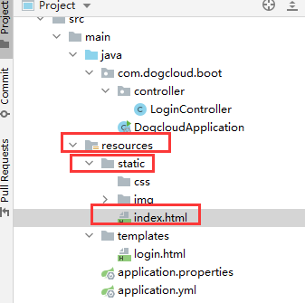
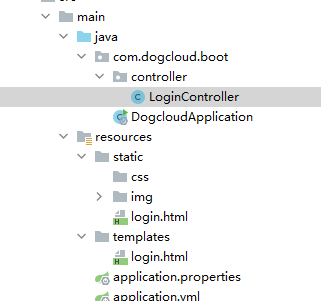
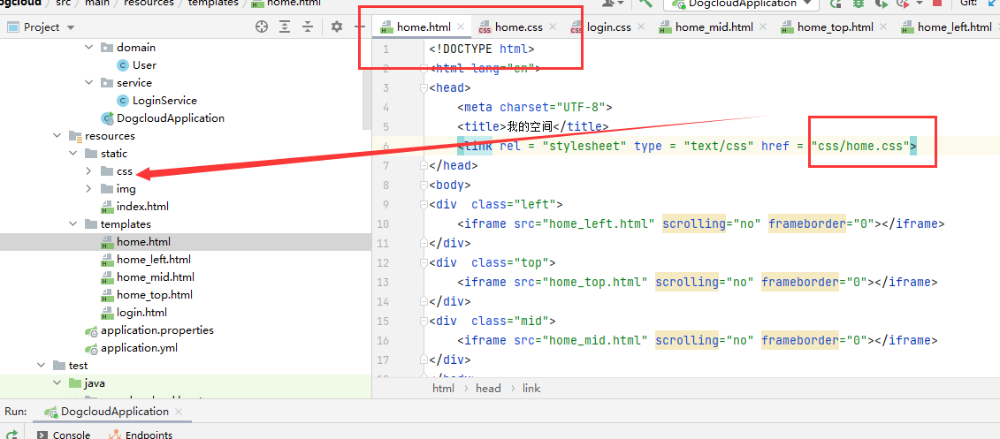

# 返回页面

## 零、注意事项和遇到的坑

- 原本无页面的浏览器，给他返回一个页面可以
  - 但是原本有网页的浏览器，如输入账号密码登陆的页面
  - 登陆成功后直接返回一个新页面是不正确的会报错
  - 这个时候只能  重定向！！！！
- 第一点补充：
  - 是post页面不能返回静态文件，只能返回jsp
  - 如果要post请求返回静态页面得使用模板引擎


## 一、直接返回字符串

```java
@Controller
@ResponseBody
public class LoginController {

    @RequestMapping("/")
    public String index(){
        System.out.println("yeee");
        return "onye";
    }
}
```

## 二、能直接返回的目录



resources下的static目录，可以直接得到文件

！！！这个目录下的index.html文件是默认初始页面

```
http://localhost:2635/
```

就会跳转到这里

以下两种方式也可以看这个目录下别的文件

- 网址访问

```
http://localhost:2635/index.html
```

- controller返回

```java
@Controller
public class LoginController {

    @RequestMapping("/")
    public String index(){
        System.out.println("yeee");
        return "index.html";
    }
}
```

## 三、不使用模板引擎

看【零】不用模板会有错误，建议在【三】的基础上使用模板

配置

```yaml
  #springmvc页面位置定义
  mvc:
    view:
      prefix: /
      suffix: .html
```

默认目录是resources下的static目录，templates目录不知道怎么使用

```java
@Controller
public class LoginController {

    @RequestMapping("/")
    public String index(){
        System.out.println("yeee");
        return "login";
    }

}
```



```html
<!DOCTYPE html>
<html lang="en">
<head>
    <meta charset="UTF-8">
    <title>狗子云笔记-登陆</title>
</head>
<body>
    
yee
</body>
</html>
```

## 四、thymeleaf模板引擎

在【三基础上】

#### 1.pom依赖

```
    <!--引入thymeleaf依赖-->
        <dependency>
            <groupId>org.springframework.boot</groupId>
            <artifactId>spring-boot-starter-thymeleaf</artifactId>
        </dependency>
```

#### 2.html引入依赖

在templates下新建index.html,内容如下：

```
<!doctype html>

<!--注意：引入thymeleaf的名称空间-->
<html lang="en" xmlns:th="http://www.thymeleaf.org">
<head>
    <meta charset="UTF-8">
    <meta name="viewport"
          content="width=device-width, user-scalable=no, initial-scale=1.0, maximum-scale=1.0, minimum-scale=1.0">
    <meta http-equiv="X-UA-Compatible" content="ie=edge">
    <title>Document</title>
</head>
<body>
    <p th:text="'hello SpringBoot'">hello thymeleaf</p>
</body>
</html>
```

#### 3.springboot全局配置

```yaml
spring:
  thymeleaf:
    enabled: true  #开启thymeleaf视图解析
    encoding: utf-8  #编码
    prefix: classpath:/templates/  #前缀
    cache: false  #是否使用缓存
    mode: HTML  #严格的HTML语法模式
    suffix: .html  #后缀名
```

#### 4.最终目录结构



- static是静态文件目录
  - 这个目录下的index还是项目默认访问地址
  - 静态文件地址不变，如图中css的位置 ，" 获得css直接css/home.css"就能访问静态文件目录
- 改变的是模板目录，放在templates文件夹，controller也能直接访问到
- 注意：<iframe src="home_mid.html" scrolling="no" frameborder="0"></iframe>
  - 上面这个404，直接写的地址是static目录下的，所以模板们无法直接调用tamplates目录下的其他模板兄弟（虽然自己也在这里）
  - 解决办法就是写个controller，反正页面以后也得写

#### 5.意外情况

出现问题，本来很正常的，突然开始解析不出模板。

这个时候把依赖删了，更新meven

把依赖加回去  更新meven

其他的都和springmvc一样  回去看

传输局到前端之类的方法

重定向和转发

