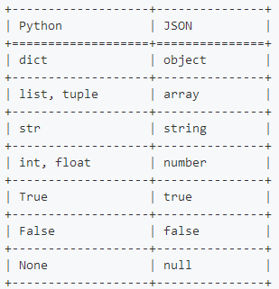

# json简介：

定义：JSON(JavaScript Object Notation, JS 对象简谱) 是一种轻量级的数据交换格式。  
特点：简洁和清晰的层次结构使得 JSON 成为理想的数据交换语言。 易于人阅读和编写，同时也易于机器解析和生成，并有效地提升网络传输效率。

在 JS 语言中，一切都是对象。因此，任何支持的类型都可以通过 JSON 来表示，例如字符串、数字、对象、数组等。但是对象和数组是比较特殊且常用的两种类型：  
　　对象表示为键值对  
　　数据由逗号分隔  
　　花括号保存对象  
　　方括号保存数组  
序列化简单定义：变成json格式。定义：变成json格式。  
反序列化简单定义： json格式变其它  

## 2、注意点

注意点：  
两种语言之间数据类型的差异，用json交换。  
外层必须是字典或列表这两个容器类数据类型。  
必须是双引号（因为java等其它语言有使用双引号表示字符串，单引号不表示字符串）  
json是字符串  
json中不存在元组。序列化元组之后元组变列表；不能是集合，序列化集合报错。序列化支持类型可以进Python官方文件介绍里面有介绍。  
以后传值就是传一个也要用字典或列表

```py
 import json
tup=(1,2,3)
a=json.dumps(tup) #json中不存在元组。序列化元组之后元组变列表
print(a)
print(json.loads(a)) --------------结果：
[1, 2, 3]
[1, 2, 3]
import json
mset={1,2,3} #不能是集合，序列化集合报错。
print(json.dumps(mset)) -------------结果；
 o.__class__.__name__)
TypeError: Object of type 'set' is not JSON serializable
```


字典格式与json格式对比：  
字典格式：

```py
d = { 'a': 123, 'b': { 'x': ['A', 'B', 'C']
}
}
```

json格式

```py
{ "a": 123, "b": { #必须是双引号（因为java等其它语言有使用双引号表示字符串，单引号不表示字符串） "x": ["A", "B", "C"]
}
}
```

可以看到, Dictionary和JSON非常接近, 而Python中的json库提供的主要功能, 也是两者之间的转换.

## 3、json使用(常用)：

JSON(JavaScript Object Notation, JS 对象标记) 是一种轻量级的数据交换格式。JSON的数据格式其实就是python里面的字典格式，里面可以包含方括号括起来的数组，也就是python里面的列表。  
在python中，有专门处理json格式的模块—— json 和 picle模块  
　　Json 模块提供了四个方法： dumps、dump、loads、load  
　　pickle 模块也提供了四个功能：dumps、dump、loads、load  
序列化：将python的值转换为json格式的字符串。  
反序列化：将json格式的字符串转换成python的数据类型


1）# 序列化，将python的值转换为json格式的字符串。序列化json.dumps() True变true了。序列化 

```py
import json
v = [12,3,4,{'k1':'v1'},True,'asdf']
v1 = json.dumps(v)
print(v1,type(v1)) --------------结果；
[12, 3, 4, {"k1": "v1"}, true, "asdf"] <class 'str'>
```

2）反序列化json.load（），将json格式的字符串转换成python的数据类型

```py
import json
v2 = '["mcw",123]' print(type(v2))
v3 = json.loads(v2)
print(v3,type(v3)) -----------------结果； <class 'str'> ['mcw', 123] <class 'list
```



如下验证：dumps可以格式化大部分的基本数据类型为字符串

1）字典序列化：

```py
import json
dic={"name":"mcw","age":18}
xu=json.dumps(dic)
print(xu,type(xu),type(dic)) --------------结果：
{"name": "mcw", "age": 18} <class 'str'> <class 'dict'> ）列表序列化与反序列化：
import json
li=[1,2]
xu=json.dumps(li)
print(xu,type(xu),type(li))
fx=json.loads(xu)
print(fx,type(fx)) ------------结果：
[1, 2] <class 'str'> <class 'list'> [1, 2] <class 'list'>
```

3）字符串序列化与反序列化:

```py
import json
mcwstr="xiaoma" xu=json.dumps(mcwstr)
print(xu,type(xu),type(mcwstr))
fx=json.loads(xu)
print(fx,type(fx)) ---------------结果； "xiaoma" <class 'str'> <class 'str'> xiaoma <class 'str'>
```

4）整型序列化与反序列化

```py
import json
mcwint=2 xu=json.dumps(mcwint)
print(xu,type(xu),type(mcwint))
fx=json.loads(xu)
print(fx,type(fx)) ---------------结果： 2 <class 'str'> <class 'int'>
2 <class 'int'>
```

5）浮点型序列化与反序列化

```py
import json
mcwfloat=2.03 xu=json.dumps(mcwfloat)
print(xu,type(xu),type(mcwfloat))
fx=json.loads(xu)
print(fx,type(fx)) --------------------结果： 2.03 <class 'str'> <class 'float'>
2.03 <class 'float'>
```

6）布尔型序列化与反序列化：

```py
import json
mcwbool=True
xu=json.dumps(mcwbool)
print(xu,type(xu),type(mcwbool))
fx=json.loads(xu)
print(fx,type(fx)) ------------------结果： true <class 'str'> <class 'bool'> True <class 'bool'>
```

7）None序列化与反序列化

```py
import json
mcwnone=None
xu=json.dumps(mcwnone)
print(xu,type(xu),type(mcwnone))
fx=json.loads(xu)
print(fx,type(fx)) ---------------结果； null <class 'str'> <class 'NoneType'> None <class 'NoneType'>
```


## 4、json序列化过程中的中文显示

```py
import json
v = {'k1':'alex','k2':'魔降风云变'}
print(json.dumps(v))
val = json.dumps(v,ensure_ascii=False)
print(val) --------------------结果：
{"k1": "alex", "k2": "\u9b54\u964d\u98ce\u4e91\u53d8"}
{"k1": "alex", "k2": "魔降风云变"}
```


## 5、json.dump 和json.load（不常用）

 

```py
序列化：  
import json
v = {'k1':'yh','k2':'小马过河'}
f = open('xiaoma.txt',mode='w',encoding='utf-8') #文件不存在就会生成
val = json.dump(v,f)
print(val)
f.close() ----------------结果：
None
#dump将内容序列化，并写入打开的文件中。
```

```py
反序列化：  
import json
f = open('xiaoma.txt',mode='r',encoding='utf-8')
data = json.load(f)
f.close()
print(data,type(data))  
---------------结果:  
{'k1': 'yh', 'k2': '小马过河'} <class 'dict'>
```


