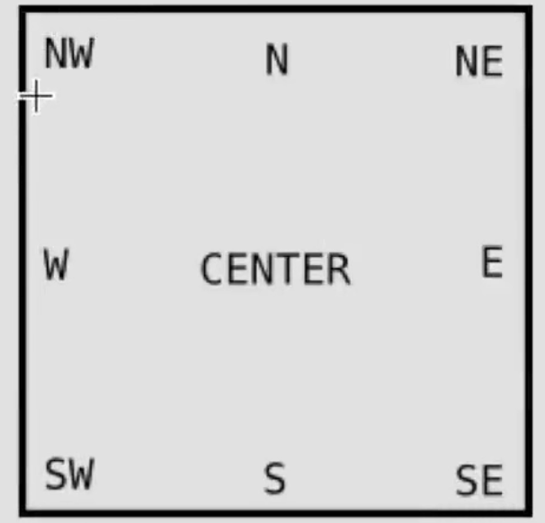

# 流程

```python
import tkinter as tk

if __name__ == '__main__':
    window = tk.Tk()
    window.title("窗口标题")
    window.geometry('400x100') #宽x高

    #width数字代表n个字符的宽度，高同理
    lable = tk.Label(window,text='标签内容',bg='green',font=('宋体',12),width=15,height=2)

    lable.pack() #设置布局

    window.mainloop() #循环监听
```

# 事件

## 事件入口

### command参数

通过command参数给元素设定事件处理函数，这个参数的设置不需要**引号！！！**

```python
import tkinter as tk

def make_me():
    print('fuck')

if __name__ == '__main__':
    window = tk.Tk()
    window.title("窗口标题")
    window.geometry('400x100')

    button = tk.Button(window,command=make_me,text='make me')
    button.pack()

    window.mainloop() #循环监听
```

## 操作元素

### StringVar

通过tkinter自带的StringVar特殊字符串当做元素的textvariable参数，改变这个StringVar就能实时改变显示的字符串。

```python
import tkinter as tk

def make_me():
    varS.set('oh good')

if __name__ == '__main__':
    window = tk.Tk()
    window.title("窗口标题")
    window.geometry('400x100')

    varS = tk.StringVar()
    varS.set('hello')
    lable = tk.Label(window,textvariable=varS)
    lable.pack()

    button = tk.Button(window,command=make_me,text='make me')
    button.pack()

    window.mainloop() #循环监听
```

### config

不用textvariable，对于普通的text，字体、宽、高之列的参数，都可以通过这个方法重新设置。

```python
label.config(text='新的内容')
```


窗口

布局

# 组件

## Lable

## Button

## Entry

- 单行文本框，处理简单的文本

### 常用

```python
import tkinter as tk
from tkinter import END

def make_me():
    # entry.insert(0,'ee')   #指定位置插入
    # entry.insert(END,'ee')   #结尾插入位置插入 END需要import
    # entry.insert('insert','ee')   #光标位置插入
    
    # entry.delete(0,END)   #删除全部1   删除0-end
    # entry.delete(0,'end')   #删除全部2  删除0-end
    # entry.delete(0,'insert')   #"insert"：对应插入光标的当前位置  删除0-insert
    text = entry.get() #获取内容
    print(text)

if __name__ == '__main__':
    window = tk.Tk()
    window.title("窗口标题")
    window.geometry('400x100')

    v = tk.StringVar()
    v.set('灌灌灌灌')
    entry = tk.Entry(window,show='*',textvariable=v)  #show=None则不隐藏
    entry.pack()

    button = tk.Button(window,command=make_me,text='make me')
    button.pack()

    window.mainloop() #循环监听
```

### 注意

- 这个东西没有text参数，只能用textvariable设置默认值，这是个StringVar对象

### 参数

| 1    | **bg**输入框背景颜色                                         |
| ---- | ------------------------------------------------------------ |
| 2    | **bd**边框的大小，默认为 2 个像素                            |
| 3    | **cursor**光标的形状设定，如arrow, circle, cross, plus 等    |
| 4    | **font**文本字体                                             |
| 5    | **exportselection**默认情况下，你如果在输入框中选中文本，默认会复制到粘贴板，如果要忽略这个功能刻工艺设置 exportselection=0。 |
| 6    | **fg**文字颜色。值为颜色或为颜色代码，如：'red','#ff0000'    |
| 7    | **highlightcolor**文本框高亮边框颜色，当文本框获取焦点时显示 |
| 8    | **justify**显示多行文本的时候,设置不同行之间的对齐方式，可选项包括LEFT, RIGHT, CENTER |
| 9    | **relief**边框样式，设置控件3D效果，可选的有：FLAT、SUNKEN、RAISED、GROOVE、RIDGE。默认为 FLAT。 |
| 10   | **selectbackground**选中文字的背景颜色                       |
| 11   | **selectborderwidth**选中文字的背景边框宽度                  |
| 12   | **selectforeground**选中文字的颜色                           |
| 13   | **show**指定文本框内容显示为字符，值随意，满足字符即可。如密码可以将值设为 show="*" |
| 14   | **state**默认为 state=NORMAL, 文框状态，分为只读和可写，值为：normal/disabled |
| 15   | **textvariable**文本框的值，是一个StringVar()对象            |
| 16   | **width**文本框宽度                                          |
| 17   | **xscrollcommand**设置水平方向滚动条，一般在用户输入的文本框内容宽度大于文本框显示的宽度时使用。 |

### 方法

| 1    | **delete ( first, last=None )**删除文本框里直接位置值        |
| ---- | ------------------------------------------------------------ |
| 2    | **get()**获取文件框的值                                      |
| 3    | **icursor ( index )**将光标移动到指定索引位置，只有当文框获取焦点后成立 |
| 4    | **index ( index )**返回指定的索引值                          |
| 5    | **insert ( index, s )**向文本框中插入值，index：插入位置，s：插入值 |
| 6    | **select_adjust ( index )**选中指定索引和光标所在位置之前的值 |
| 7    | **select_clear()**清空文本框                                 |
| 8    | **select_from ( index )**设置光标的位置，通过索引值 index 来设置 |
| 9    | **select_present()**如果有选中，返回 true，否则返回 false。  |
| 10   | **select_range ( start, end )**选中指定索引位置的值，start(包含) 为开始位置，end(不包含) 为结束位置start必须比end小 |
| 11   | **select_to ( index )**选中指定索引与光标之间的值            |
| 12   | **xview ( index )**该方法在文本框链接到水平滚动条上很有用。  |
| 13   | **xview_scroll ( number, what )**用于水平滚动文本框。 what 参数可以是 UNITS, 按字符宽度滚动，或者可以是 PAGES, 按文本框组件块滚动。 number 参数，正数为由左到右滚动，负数为由右到左滚动。 |

## Text

- 多行文本框，用于显示多行文本
- 操作方法和Entry差不多

## Listbox

- 元素列表

### 常用

```python
import tkinter as tk
from tkinter import END

def make_me():
    value = listbox.get(listbox.curselection())  #拿到当前光标指向的元素的值
    print(value)

if __name__ == '__main__':
    window = tk.Tk()
    window.title("窗口标题")
    window.geometry('400x300')

    v = tk.StringVar()
    v.set((11,2,33,4))
    listbox = tk.Listbox(window,listvariable=v)  #初始化方法1  给列表设置4个元素

    nuns = [444,55,66]
    for i in nuns:
        listbox.insert('end',i)  #初始化方法2  给列表再追加3个元素到末尾

    listbox.insert(1,'hhh')   #给列表1号位置【前面】插入元素，也就是1号位置变成插入的值，其他元素后移

    listbox.delete(2)  #删除2号元素
    listbox.pack()

    button = tk.Button(window,command=make_me,text='make me')
    button.pack()

    window.mainloop() #循环监听
```

### 注意

- Listbox初始化元素的参数是listvariable，这是个StringVar元组

## Radiobutton

- 单选框

### 常用

给每个 RadioButton设置同一个variable，但是每个RadioButton有各自的value，被选择时讲自己的value赋值给公共的variable达到选择的目的

```python
import tkinter as tk

def make_me():
    print('你选择'+v.get())

if __name__ == '__main__':
    window = tk.Tk()
    window.title("窗口标题")
    window.geometry('400x300')

    v = tk.StringVar()
    radiobut1 = tk.Radiobutton(window,text='选项A',variable=v,value='A',command=make_me)
    radiobut2 = tk.Radiobutton(window,text='选项B',variable=v,value='B',command=make_me)
    radiobut3 = tk.Radiobutton(window,text='选项C',variable=v,value='C',command=make_me)

    radiobut1.pack()
    radiobut2.pack()
    radiobut3.pack()

    window.mainloop() #循环监听
```

### 注意

- Radiobutton的参数是variable，代表那个公共字符串，而不是textvariable，这是个StringVar对象

## Scale

- 滚动条滑轮

### 常用

```python
import tkinter as tk

def make_me(text):    #scale调用方法会自动把结果给出，这是【普通字符串】不是StringVar
    print('你选择'+text)

if __name__ == '__main__':
    window = tk.Tk()
    window.title("窗口标题")
    window.geometry('400x300')

    scale = tk.Scale(window,label='横条',
                     from_=5,to=11,      #取值范围[5,11]
                     orient=tk.HORIZONTAL,   #横的还是竖的  HORIZONTAL横的
                     length=200,             #长度 单位：像素
                     showvalue=0,           #是否在滑轮旁边显示选中的值
                     tickinterval=3,        #刻度，没3个单位显示一个刻度
                     resolution=0.01,       #小数，滑轮保留2位小数    0.1一位小数  1保留整数
                     command=make_me)

    scale.pack()

    window.mainloop() #循环监听
```

### 注意

- Scale的返回值是【普通字符串】不是StringVar

## Checkbutton

- 复选框

### 常用

通过每个Checkbutton都有一个各自的variable=IntVar，框被选择时这个值=1，否则=0

```python
import tkinter as tk

def make_me():   
    if v1.get()==0:
        print('没选1')
    if v1.get()==1:
        print('选了1')
    if v2.get()==0:
        print('没选2')
    if v2.get()==1:
        print('选了2')

if __name__ == '__main__':
    window = tk.Tk()
    window.title("窗口标题")
    window.geometry('400x300')

    v1 = tk.IntVar()
    v2 = tk.IntVar()
    check1 = tk.Checkbutton(window,text='选项1',variable=v1,command=make_me)
    check2 = tk.Checkbutton(window,text='选项2',variable=v2,command=make_me)

    check1.pack()
    check2.pack()

    window.mainloop() 
```

### 注意

- Checkbuttons设置值的参数是variable，这是个IntVar对象


## Canvas

- 画布

### 常用

```python
import tkinter as tk

if __name__ == '__main__':
    window = tk.Tk()
    window.title("窗口标题")
    window.geometry('400x300')

    canvas = tk.Canvas(window,bg='blue',height=100,width=400)
    # img_file =tk.PhotoImage(file='./guanshanyu.jpg')  #加载图片(该方法只支持gif图片，不推荐使用)
    # img = canvas.create_image(10,10,              #图片在画布中的位置
    #                           anchor='nw',          #图片的铆钉点
    #                           image='img_file')

    x0,y0,x1,y1 = 50,50,80,80     #画线
    line = canvas.create_line(x0,y0,x1,y1)  #两点确定一条直线

    oval = canvas.create_oval(x0,y0,x1,y1, #两点确定一个矩形，在那个矩形里面画圆
                              fill='red')  #给圆填充红色

    arc = canvas.create_arc(x0+30,y0+30,x1+30,y1+30, #两点确定一个矩形，在那个矩形里面画扇形
                            start=90,extent=180)  #开始的支教坐标系和结束的坐标0-360
    canvas.pack()

    window.mainloop()
```

## 插入图片

使用PIL库和label标签能随意的插入图片

### 安装PIL

pil库的安装包补叫pil，叫pillow

```
pip install Pillow
```

### 常用

```python
from PIL import Image,ImageTk
import tkinter as tk

if __name__ == '__main__':
    window = tk.Tk()
    window.title("窗口标题")
    window.geometry('400x300')

    img_file = Image.open("guanshanyu.jpg")  #打开图片文件
    img_p = ImageTk.PhotoImage(img_file)   #用这个处理图片
    imLabel = tk.Label(window, image=img_p) #处理后的图片给label标签，label标签能识别 

    imLabel.pack()
    window.mainloop()
```

## Menubar

### 常用

```python
from PIL import Image,ImageTk
import tkinter as tk

def make_me():
    print('make me')

if __name__ == '__main__':
    window = tk.Tk()
    window.title("窗口标题")
    window.geometry('400x300')

    menubar = tk.Menu(window)

    first_menu = tk.Menu(menubar,   #父元素
                         tearoff=0)   #不可分开
    menubar.add_cascade(label='first',menu=first_menu)    #设置第一个菜单
    first_menu.add_command(label='方法1',command=make_me)
    first_menu.add_command(label='方法2',command=make_me)
    first_menu.add_command(label='方法3',command=make_me)

    second_menu = tk.Menu(menubar,  # 父元素
                         tearoff=0)  # 不可分开
    menubar.add_cascade(label='second', menu=second_menu)  # 设置第二个菜单
    second_menu.add_command(label='方法4', command=make_me)
    second_menu.add_command(label='方法5', command=make_me)
    second_menu.add_command(label='方法6', command=make_me)

    window.config(menu=menubar)
    window.mainloop()
```


# 窗口

## Frame

### 常用

```python
import tkinter as tk

if __name__ == '__main__':
    window = tk.Tk()
    window.title("窗口标题")
    window.geometry('400x300')

    frame = tk.Frame(window)
    frame.pack()

    frame_left = tk.Frame(frame)
    frame_left.pack(side='left')
    frame_right = tk.Frame(frame)
    frame_right.pack(side='right')

    tk.Label(frame_left,text='我在左边fram').pack()
    tk.Label(frame_right,text='我在右边fram').pack()
    tk.Label(frame_left,text='我在左边fram').pack()

    window.mainloop()
```

## messagebox

### 常用

```python
import tkinter as tk
from tkinter import messagebox

def make_me():
    # messagebox.showinfo(title='消息弹窗',message='hello')
    # messagebox.showwarning(title='警告弹窗',message='hello')
    # messagebox.showerror(title='错误弹窗',message='hello')

    # return yes no字符串    蓝色问号图标  是/否 按钮
    # chose = messagebox.askquestion(title='询问弹窗',message='hello')
    # return True False bool   蓝色问号图标 是/否 按钮
    # chose = messagebox.askyesno(title='询问弹窗',message='hello')
    # return True False bool  黄色感叹号图标  重试/取消 按钮
    # chose = messagebox.askretrycancel(title='询问弹窗',message='hello')
    # return True False bool   蓝色问号图标 确定/取消 按钮
    # chose = messagebox.askokcancel(title='询问弹窗',message='hello')
    # return True False Node bool   蓝色问号图标 是/否/取消 按钮
    chose = messagebox.askyesnocancel(title='询问弹窗',message='hello')

    print(chose)

if __name__ == '__main__':
    window = tk.Tk()
    window.title("窗口标题")
    window.geometry('400x300')

    button = tk.Button(window, command=make_me, text='make me')
    button.pack()

    window.mainloop()
```

# 布局样式

## 注意

一个程序最好只使用一种布局方式，否则会出现乱七芭蕉的事情

## pack

- 放置

### 常用

在上下左右各个地方放置元素

```python
import tkinter as tk

if __name__ == '__main__':
    window = tk.Tk()
    window.title("窗口标题")
    window.geometry('400x300')

    tk.Label(window,text=1).pack(side='top')
    tk.Label(window,text=1).pack(side='bottom')
    tk.Label(window,text=1).pack(side='left')
    tk.Label(window,text=1).pack(side='right')

    window.mainloop()
    window.mainloop()
```

## place

- 绝对布局

### 注意

- 不管是x，y还是relx，rely，位置都跟【父元素无关】，是整个window的绝对位置
- 覆盖关系：新place的元素必定在最上边

### 常用

```python
import tkinter as tk

if __name__ == '__main__':
    window = tk.Tk()
    window.title("窗口标题")
    window.geometry('400x300')

    tk.Label(window,text=1).place(x=10,y=100,  #坐标位置
                                  anchor='nw')  #铆钉点
    tk.Label(frame2, text=2).place(relx=0.1, rely=0)   #百分比位置，只能用0-1的值

    window.mainloop()
```

### 铆钉点

锚点常用代码如图



## grid

- 网格布局

### 常用

不经常用，用到的时候再写，我估计这辈子我都用不上

```python
```

