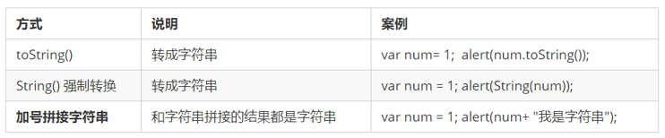

# 变量

 ---

## 一、声明、赋值、初始化

### 1.声明

```javascript
//  声明变量  
var age; //  声明一个 名称为age 的变量     
```

### 2 .赋值

```javascript
age = 10; // 给 age  这个变量赋值为 10          
```

### 3.初始化

```js
var age  = 18;  // 声明变量同时赋值为 18
// 声明一个变量并赋值， 我们称之为变量的初始化。
```

### 4.同时声明多个变量

```js
var age = 10,  name = 'zs', sex = 2;       
```

- 声明变量特殊情况
  
  | 情况                           | 说明           | 结果        |
  | ---------------------------- | ------------ | --------- |
  | var age ; console.log (age); | 只声明 不赋值      | undefined |
  | console.log(age)             | 不声明 不赋值 直接使用 | 报错        |
  | age = 10; console.log (age); | 不声明 只赋值      | 10        |

### 5. 变量命名规范

规则：

- 由字母(A-Za-z)、数字(0-9)、下划线(_)、美元符号( $ )组成，如：usrAge, num01, _name
- 严格区分大小写。var app; 和 var App; 是两个变量
- 不能 以数字开头。 18age 是错误的
- 不能 是关键字、保留字。例如：var、for、while
- 变量名必须有意义。 MMD BBD nl → age
- 遵守驼峰命名法。首字母小写，后面单词的首字母需要大写。myFirstName

---

## 二、数据类型

### 1.万能的类型var

    var age = 10;        // 这是一个数字型
    var areYouOk = '是的';   // 这是一个字符串  

```js
var x = 6;           // x 为数字
var x = "Bill";      // x 为字符串    数据类型的分类
```

### 2.JS 把数据类型分为两类：

- 简单数据类型 （Number,String,Boolean,Undefined,Null）

- 复杂数据类型 （object)

### 3.简单数据类型

简单数据类型（基本数据类型）

JavaScript 中的简单数据类型及其说明如下：


- 数字型 Number
  
  ​ JavaScript 数字类型既可以保存整数，也可以保存小数(浮点数）。
  
  ```js
  var age = 21;       // 整数
  var Age = 21.3747;  // 小数     
  ```
  
  1. 数字型进制
     
     最常见的进制有二进制、八进制、十进制、十六进制。
     
     ```js
     // 1.八进制数字序列范围：0~7
     var num1 = 07;   // 对应十进制的7
     var num2 = 019;  // 对应十进制的19
     var num3 = 08;   // 对应十进制的8
     // 2.十六进制数字序列范围：0~9以及A~F
     var num = 0xA;   
     ```
     
     现阶段我们只需要记住，在JS中八进制前面加0，十六进制前面加 0x
  
  2. 数字型范围
     
     JavaScript中数值的最大和最小值
     
     - 最大值：Number.MAX_VALUE，这个值为： 1.7976931348623157e+308
     
     - 最小值：Number.MIN_VALUE，这个值为：5e-32
3. 数字型三个特殊值
   
   - Infinity ，代表无穷大，大于任何数值
   
   - -Infinity ，代表无穷小，小于任何数值
   
   - NaN ，Not a number，代表一个非数值

4. isNaN
   
   用来判断一个变量是否为非数字的类型，返回 true 或者 false

```js
    var usrAge = 21;
  var isOk = isNaN(userAge);
    console.log(isNum);          // false ，21 不是一个非数字
  var usrName = "andy";
    console.log(isNaN(userName));// true ，"andy"是一个非数字
```

- 字符串型 String
  
  ​ 字符串型可以是引号中的任意文本，其语法为 双引号 "" 和 单引号''
  
  ```js
  var strMsg = "我爱北京天安门~";  // 使用双引号表示字符串
  var strMsg2 = '我爱吃猪蹄~';    // 使用单引号表示字符串
  // 常见错误
  var strMsg3 = 我爱大肘子;       // 报错，没使用引号，会被认为是js代码，但js没有这些语法
  ```
  
  **​ 因为 HTML 标签里面的属性使用的是双引号，JS 这里我们更推荐使用单引号。**
  
  1. 字符串引号嵌套
     
     ​ JS 可以用单引号嵌套双引号 ，或者用双引号嵌套单引号 (外双内单，外单内双)
     
     ```js
     var strMsg = '我是"高帅富"程序猿';   // 可以用''包含""
     var strMsg2 = "我是'高帅富'程序猿";  // 也可以用"" 包含''
     //  常见错误
     var badQuotes = 'What on earth?"; // 报错，不能 单双引号搭配
     ```
  
  2. 字符串转义符
     
     ​ 类似HTML里面的特殊字符，字符串中也有特殊字符，我们称之为转义符。
     
     ​ 转义符都是 \ 开头的，常用的转义符及其说明如下：
     
     | 转义符 | 解释说明                |
     | --- | ------------------- |
     | \n  | 换行符，n 是 newline 的意思 |
     | \ \ | 斜杠 \                |
     | '   | ' 单引号               |
     | "   | ”双引号                |
     | \t  | tab 缩进              |
     | \b  | 空格 ，b 是 blank 的意思   |
  
  3. 字符串长度
     
     ```js
     var strMsg = "我是帅气多金的程序猿！";
     alert(strMsg.length); // 显示 11
     ```
  
  4. 字符串拼接
     
     - 多个字符串之间可以使用 + 进行拼接，其拼接方式为 字符串 + 任何类型 = 拼接之后的新字符串
     
     - 拼接前会把与字符串相加的任何类型转成字符串，再拼接成一个新的字符串
       
       ```js
       //1.1 字符串 "相加"
       alert('hello' + ' ' + 'world'); // hello world
       //1.2 数值字符串 "相加"
       alert('100' + '100'); // 100100
       //1.3 数值字符串 + 数值
       alert('11' + 12);     // 1112 
       ```
       
       - ***+ 号总结口诀：数值相加 ，字符相连***
  
  5. 字符串拼接加强
     
     ```js
     console.log('pink老师' + 18);        // 只要有字符就会相连 
     var age = 18;
     console.log('pink老师age岁啦');      // 这样不行哦
     console.log('pink老师' + age);         // pink老师18
     console.log('pink老师' + age + '岁啦'); // pink老师18岁啦
     ```

- 布尔型Boolean
  
  ​ 布尔类型有两个值：true 和 false ，其中 true 表示真（对），而 false 表示假（错）。
  
  ​ 布尔型和数字型相加的时候， true 的值为 1 ，false 的值为 0。
  
  ```js
  console.log(true + 1);  // 2
  console.log(false + 1); // 1
  ```

- Undefined和 Null
  
  ​ 一个声明后没有被赋值的变量会有一个默认值undefined ( 如果进行相连或者相加时，注意结果）
  
  ```js
  var variable;
  console.log(variable);           // undefined
  console.log('你好' + variable);  // 你好undefined
  console.log(11 + variable);     // NaN
  console.log(true + variable);   //  NaN
  ```
  
  ​ 一个声明变量给 null 值，里面存的值为空（学习对象时，我们继续研究null)
  
  ```js
  var vari = null;
  console.log('你好' + vari);  // 你好null
  console.log(11 + vari);     // 11
  console.log(true + vari);   //  1
  ```

### 4. 获取变量数据类型

- 获取检测变量的数据类型
  
  ​ typeof 可用来获取检测变量的数据类型
  
  ```js
  var num = 18;
  console.log(typeof num) // 结果 number      
  ```
  
  ​ 不同类型的返回值
  
  

- 字面量
  
  ​ 字面量是在源代码中一个固定值的表示法，通俗来说，就是字面量表示如何表达这个值。
  
  - 数字字面量：8, 9, 10
  - 字符串字面量：'黑马程序员', "大前端"
  - 布尔字面量：true，false

### 5.数据类型转换

- 转换为字符串
  
  
  
  - toString() 和 String() 使用方式不一样。
  - 三种转换方式，更多第三种加号拼接字符串转换方式， 这一种方式也称之为隐式转换。

- 转换为数字型（重点）
  
  
  
  - 注意 parseInt 和 parseFloat 单词的大小写，这2个是重点
  - 隐式转换是我们在进行算数运算的时候，JS 自动转换了数据类型

- 转换为布尔型
  
  - 代表空、否定的值会被转换为 false ，如 ''、0、NaN、null、undefined
  
  - 其余值都会被转换为 true
    
    ```js
    console.log(Boolean('')); // false
    console.log(Boolean(0)); // false
    console.log(Boolean(NaN)); // false
    console.log(Boolean(null)); // false
    console.log(Boolean(undefined)); // false
    console.log(Boolean('小白')); // true
    console.log(Boolean(12)); // true
    ```

# 
