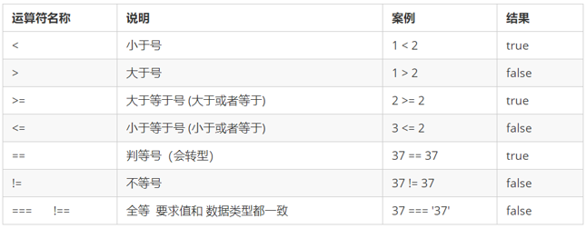

# 运算符（操作符）

运算符的分类

> **运算符**（operator）也被称为操作符，是用于实现赋值、比较和执行算数运算等功能的符号。

JavaScript中常用的运算符有：

- 算数运算符
- 递增和递减运算符
- 比较运算符
- 逻辑运算符
- 赋值运算符

---

## 一、算数运算符


## 1.浮点数的精度问题

浮点数值的最高精度是 17 位小数，但在进行算术计算时其精确度远远不如整数。

```js
var result = 0.1 + 0.2;    // 结果不是 0.3，而是：0.30000000000000004
console.log(0.07 * 100);   // 结果不是 7，  而是：7.000000000000001
```

所以：不要直接判断两个浮点数是否相等 !

---

## 二、递增运算符(++  以下说法--也试用)

## 1.前置递增运算符

++num 前置递增，就是自加1，类似于 num = num + 1，但是 ++num 写起来更简单。

使用口诀：先自加，后返回值

```js
var  num = 10;
alert(++num + 10);   // 21
```

## 2.后置递增运算符

num++ 后置递增，就是自加1，类似于 num = num + 1 ，但是 num++ 写起来更简单。

使用口诀：先返回原值，后自加

```js
var  num = 10;
alert(10 + num++);  // 20
```

---

## 三、比较运算符



等号的差异


---

## 四、逻辑运算符


### 1.短路运算（逻辑中断）

短路运算的原理：当有多个表达式（值）时,左边的表达式值可以确定结果时,就不再继续运算右边的表达式的值;

- 逻辑与
  
  语法： 表达式1 && 表达式2
  
  ```
    - 如果第一个表达式的值为真，则返回表达式2
  
    - 如果第一个表达式的值为假，则返回表达式1
  ```
  
  ```js
    console.log( 123 && 456 );        // 456
    console.log( 0 && 456 );          // 0
    console.log( 123 && 456&& 789 );  // 789
  ```

- 逻辑或
  
  语法： 表达式1 || 表达式2
  
  ```
   - 如果第一个表达式的值为真，则返回表达式1
  
   - 如果第一个表达式的值为假，则返回表达式2
  ```
  
  ```js
    console.log( 123 || 456 );         //  123
    console.log( 0 ||  456 );          //  456
    console.log( 123 || 456 || 789 );  //  123
  ```

---

## 五、赋值运算符


```js
var age = 10;
age += 5;  // 相当于 age = age + 5;
age -= 5;  // 相当于 age = age - 5;
age *= 10; // 相当于 age = age * 10;
```

---

## 六、运算符优先级


- 一元运算符里面的逻辑非优先级很高
- 逻辑与比逻辑或优先级高
