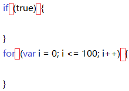

# 分支循环

---

## 一、if else

### 1.if 语句

```js
// 条件成立执行代码，否则什么也不做
if (条件表达式) {
    // 条件成立执行的代码语句
}
```

### 2.if else语句（双分支语句）

```js
// 条件成立  执行 if 里面代码，否则执行else 里面的代码
if (条件表达式) {
    // [如果] 条件成立执行的代码
} else {
    // [否则] 执行的代码
}
```

### 3.if else if 语句(多分支语句)

```js
// 适合于检查多重条件。
if (条件表达式1) {
    语句1；
} else if (条件表达式2)  {
    语句2；
} else if (条件表达式3)  {
   语句3；
 ....
} else {
    // 上述条件都不成立执行此处代码
}
```

---

## 二、三元表达式switch

```js
switch( 表达式 ){ 
    case value1:
        // 表达式 等于 value1 时要执行的代码
        break;
    case value2:
        // 表达式 等于 value2 时要执行的代码
        break;
    default:
        // 表达式 不等于任何一个 value 时要执行的代码
}
```

- switch ：开关 转换 ， case ：小例子 选项

- 关键字 switch 后面括号内可以是表达式或值， 通常是一个变量

- 关键字 case , 后跟一个选项的表达式或值，后面跟一个冒号

- switch 表达式的值会与结构中的 case 的值做比较

- 如果存在匹配全等(===) ，则与该 case 关联的代码块会被执行，并在遇到 break 时停止，整个 switch 语句代码执行结束

- 如果所有的 case 的值都和表达式的值不匹配，则执行 default 里的代码
  
  **注意： 执行case 里面的语句时，如果没有break，则继续执行下一个case里面的语句！！！！！！！！！！！！！！！！！！！！！**

---

## 三、循环

### 1.for

- ```js
  for(初始化变量; 条件表达式; 操作表达式 ){
      //循环体
  }
  ```
  
  | 名称    | 作用                                                 |
  | ----- | -------------------------------------------------- |
  | 初始化变量 | 通常被用于初始化一个计数器，该表达式可以使用 var 关键字声明新的变量，这个变量帮我们来记录次数。 |
  | 条件表达式 | 用于确定每一次循环是否能被执行。如果结果是 true 就继续循环，否则退出循环。           |
  | 操作表达式 | 用于确定每一次循环是否能被执行。如果结果是 true 就继续循环，否则退出循环。           |
  
  执行过程：
  
  1. 初始化变量，初始化操作在整个 for 循环只会执行一次。执行条件表达式，如果为true，则执行循环体语句，否则退出循环，循环结束。
  
  2. 执行操作表达式，此时第一轮结束。
  
  3. 第二轮开始，直接去执行条件表达式（不再初始化变量），如果为 true ，则去执行循环体语句，否则退出循环。
  
  4. 继续执行操作表达式，第二轮结束。
  
  5. 后续跟第二轮一致，直至条件表达式为假，结束整个 for 循环。

### 2.while

1. ```js
   while (条件表达式) {
    // 循环体代码 
   }
   ```

2. 

```js
do {
    // 循环体代码 - 条件表达式为 true 时重复执行循环体代码
} while(条件表达式);
```

执行思路

- 1 先执行一次循环体代码

- 2 再执行条件表达式，如果结果为 true，则继续执行循环体代码，如果为 false，则退出循环，继续执行后面代码
  
  注意：先再执行循环体，再判断，do…while循环语句至少会执行一次循环体代码
3. continue、break

### 3.代码规范

1. 标识符命名规范
- 变量、函数的命名必须要有意义
- 变量的名称一般用名词
- 函数的名称一般用动词
2. 操作符规范

```js
// 操作符的左右两侧各保留一个空格
for (var i = 1; i <= 5; i++) {
   if (i == 3) {
       break; // 直接退出整个 for 循环，跳到整个for循环下面的语句
   }
   console.log('我正在吃第' + i + '个包子呢');
}
```

3. 单行注释规范

```js
for (var i = 1; i <= 5; i++) {
   if (i == 3) {
       break; // 单行注释前面注意有个空格
   }
   console.log('我正在吃第' + i + '个包子呢');
}
```

4. 其他规范

```
关键词、操作符之间后加空格
```


