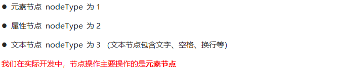

# 操作节点

> 节点概述
> 
> ​ 网页中的所有内容都是节点（标签、属性、文本、注释等），在DOM 中，节点使用 node 来表示。
> 
> ​ HTML DOM 树中的所有节点均可通过 JavaScript 进行访问，所有 HTML 元素（节点）均可被修改，也可以创建或删除。

一般地，节点至少拥有nodeType（节点类型）、nodeName（节点名称）和nodeValue（节点值）这三个基本属性。



---

## 一、节点关系

利用 DOM 树可以把节点划分为不同的层级关系，常见的是**父子兄层级关系**。


### 1.父子节点

#### (1)父节点

.png)

        <div class="demo">
            <div class="box">
                <span class="erweima">×</span>
            </div>
        </div>
        <script>
            // 1. 父节点 parentNode
            var erweima = document.querySelector('.erweima');
            // var box = document.querySelector('.box');
            // 得到的是离元素最近的父级节点(亲爸爸) 如果找不到父节点就返回为 null
            console.log(erweima.parentNode);
        </script>

#### (2)子节点

所有子节点

.png)

子元素节点

.png)

```js
    <ul>
        <li>我是li</li>
        <li>我是li</li>
        <li>我是li</li>
        <li>我是li</li>
    </ul>
    <script>
        // DOM 提供的方法（API）获取
        var ul = document.querySelector('ul');
        var lis = ul.querySelectorAll('li');
        // 1. 子节点  childNodes 所有的子节点 包含 元素节点 文本节点等等
        console.log(ul.childNodes);
        console.log(ul.childNodes[0].nodeType);
        console.log(ul.childNodes[1].nodeType);
        // 2. children 获取所有的子元素节点 也是我们实际开发常用的
        console.log(ul.children);
    </script>
```

第一个子节点

.png)

最后一个子节点

.png)

第一个子元素节点

.png)

最后一个子元素节点

.png)

实际开发中，firstChild 和 lastChild 包含其他节点，操作不方便，而 firstElementChild 和 lastElementChild 又有兼容性问题，那么我们如何获取第一个子元素节点或最后一个子元素节点呢？

.png)

```js
    <ol>
        <li>我是li1</li>
        <li>我是li2</li>
        <li>我是li3</li>
        <li>我是li4</li>
        <li>我是li5</li>
    </ol>
    <script>
        var ol = document.querySelector('ol');
        // 1. firstChild 第一个子节点 不管是文本节点还是元素节点
        console.log(ol.firstChild);
        console.log(ol.lastChild);
        // 2. firstElementChild 返回第一个子元素节点 ie9才支持
        console.log(ol.firstElementChild);
        console.log(ol.lastElementChild);
        // 3. 实际开发的写法  既没有兼容性问题又返回第一个子元素
        console.log(ol.children[0]);
        console.log(ol.children[ol.children.length - 1]);
    </script>
```

### 2.兄弟节点

下一个兄弟节点

.png)

上一个兄弟节点

.png)

```js
    <div>我是div</div>
    <span>我是span</span>
    <script>
        var div = document.querySelector('div');
        // 1.nextSibling 下一个兄弟节点 包含元素节点或者 文本节点等等
        console.log(div.nextSibling);
        console.log(div.previousSibling);
        // 2. nextElementSibling 得到下一个兄弟元素节点
        console.log(div.nextElementSibling);
        console.log(div.previousElementSibling);
    </script>
```

下一个兄弟元素节点（有兼容性问题）

.png)

上一个兄弟元素节点（有兼容性问题）

.png)
.png)
.png)

---

## 二、节点   增

### 1.创建节点


### 2.添加节点


```js
    <ul>
        <li>123</li>
    </ul>
    <script>
        // 1. 创建节点元素节点
        var li = document.createElement('li');
        // 2. 添加节点 node.appendChild(child)  node 父级  child 是子级 后面追加元素
        var ul = document.querySelector('ul');
        ul.appendChild(li);
        // 3. 添加节点 node.insertBefore(child, 指定元素);
        var lili = document.createElement('li');
        ul.insertBefore(lili, ul.children[0]);
        // 4. 我们想要页面添加一个新的元素 ： 1. 创建元素 2. 添加元素
    </script>
```

### 3.复制（克隆）节点


```js
    <ul>
        <li>1111</li>
        <li>2</li>
        <li>3</li>
    </ul>
    <script>
        var ul = document.querySelector('ul');
        // 1. node.cloneNode(); 括号为空或者里面是false 浅拷贝 只复制标签不复制里面的内容
        // 2. node.cloneNode(true); 括号为true 深拷贝 复制标签复制里面的内容
        var lili = ul.children[0].cloneNode(true);
        ul.appendChild(lili);
    </script>
```

---

## 三、节点 删除


node.removeChild() 方法从 node节点中删除一个子节点，返回删除的节点。

```js
    <button>删除</button>
    <ul>
        <li>熊大</li>
        <li>熊二</li>
        <li>光头强</li>
    </ul>
    <script>
        // 1.获取元素
        var ul = document.querySelector('ul');
        var btn = document.querySelector('button');
        // 2. 删除元素  node.removeChild(child)
        // ul.removeChild(ul.children[0]);
        // 3. 点击按钮依次删除里面的孩子
        btn.onclick = function() {
            if (ul.children.length == 0) {
                this.disabled = true;
            } else {
                ul.removeChild(ul.children[0]);
            }
        }
    </script>
```
