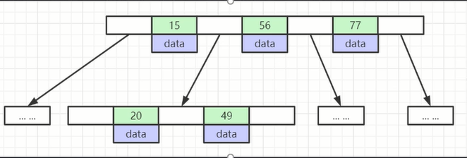
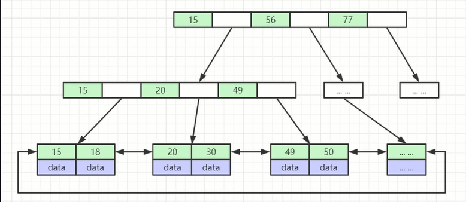
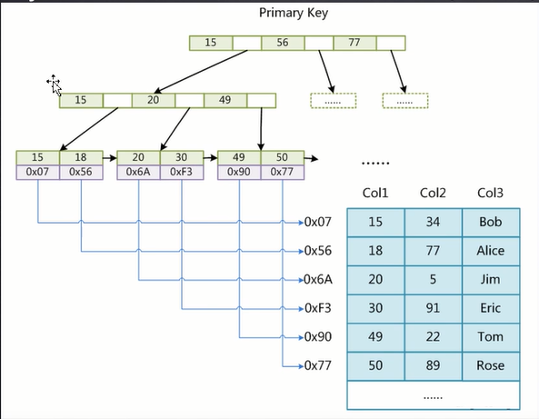
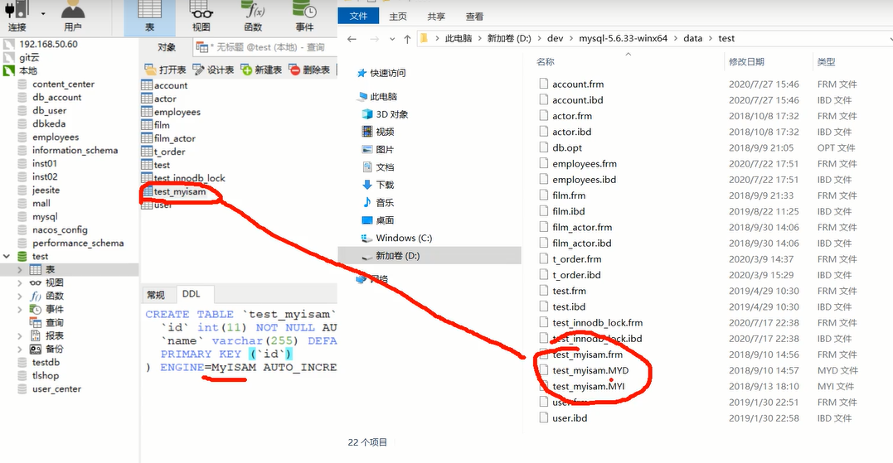
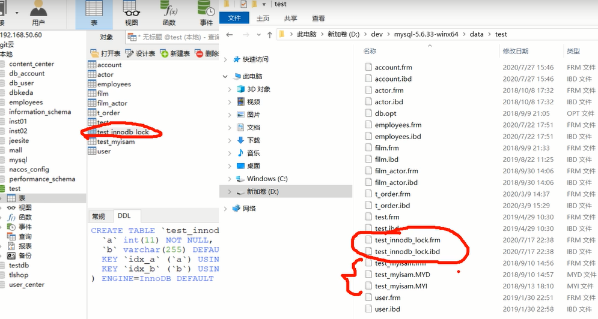

## 一、各种数据结构

#### 1.链表和数组查询慢就不说了

#### 2.二叉搜索树

- 当数据连续的时候二叉树会退化成链表

#### 3.红黑树

- 有自动平衡功能
- 但是只平衡有一侧的高度

#### 4.b-Tree

- 叶子节点有相同的深度，叶子节点的指针为空
- 所有索引元素不重复
- 节点中的数据索引从左到右递增

#### 5.b+Tree（mysql使用）

- 只有叶子节点储存data，其他节点储存索引（冗余），可以放更多的索引
- 叶子节点包含所有索引字段
- 叶子节点之间使用指针连接，提高区间访问性

#### 二、储存引擎

！！！！！！！！！！！！！！！！！

储存引擎是用来形容数据库表的，不是形容数据库的

#### 1.MyISAM  

- 索引文件和数据文件是分离的（非聚集）

可以看到MyISAM引擎储存的文件有三个本地磁盘文件

- 数据的索引储存在MYI文件中
- MYI文件中使用B+Tree储存
- MYD中储存数据

#### 2.InnoDB

- 聚集

- 表数据文件本身就是B+Tree组织的一个索引结构文件

- 聚集索引-叶子节点包含了完整的数据记录

- 为什么建议InnoDB必须建主键，并且推荐使用整型的自增主键

  - Mysql底层的b+Tree结构决定了它一定要有一个索引结构来建立b+Tree，索引是唯一的

  - 如果没有主键的话，mysql会一列一列搜索，看有没有哪列的数据是唯一的，有的话就偷偷拿这列来当索引（类似主键）

  - 如果搜不到这样唯一的一列的话，mysql就会偷偷创建一列主键，来当索引结构来构建b+Tree

  - 不帮他建主键反而让他干了更加麻烦的事情

  - ---

  - 整形，构建b+Tree要比较大小，如果不是整形是字符串的话，还要把字符串编程acsll码比较大小，然后再构建

  - 不递增的话还要排序

- 为什么非主键索引结构叶子节点储存的是主键值
  - 一致性和节省储存空间

这种引擎的表在本地磁盘中有2个文件

视频P6还没到一半

