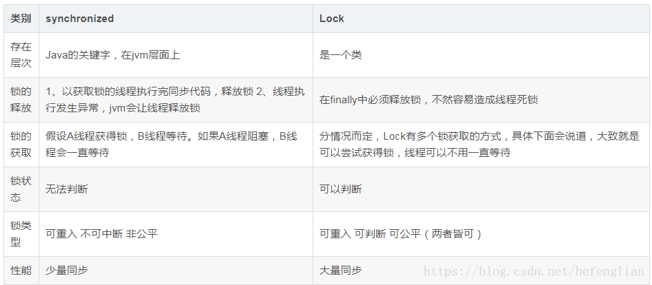

# 介绍

## 自己介绍

目前熟悉和使用的是J2EE架构。在学校从java基础、并发、到 JDBC  、SSM到今年springboot+redis，写了很多大大小小的项目，这些都非常熟悉。最近的项目如简历。认识到项目经验的不足找实习  给机会感谢


为了找到一份正式的工作，熟悉企业正真模式，实习转正

# Java

## 并发

### 创建线程

继承Thread和实现Runnable接口

区别  Thread方法  会把继承Thread的类的变量给每个线程一份

实现Runnable接口类的变量是每个线程的共享资源

### 锁

#### synchronized关键字

- 同步方法 

  - ```
    synchronized public void xxx(){}
    ```

  - 不是锁方法  而是锁当前类的对象

  - java中只有锁对象，没有锁方法这讲法

  - 哪个线程拿到对象锁就可以执行这个对象中的synchronized方法

- 锁重入
  - 同一个对象里可能有多个synchronized修饰的方法
  - 锁重入指一个线程拿到了这个对象的锁，在还没释放的时候，可以一直继续获取这个对象的锁，调用这个类里面其他synchronized修饰的方法。
  
- 锁重入支持继承
  - 父类有一个synchronized修饰的方法
  - 子类继承后跟就像自己定义的方法一样能 用 锁重入
  
- 锁重入不支持重写
  - 子类重写父类synchronized修饰的方法
  - 如果重写的时候不自己加上synchronized，是没有用的，这个方法就跟自己创建的方法不加synchronized一样
  
- 同步代码块

  - ```
    synchronized(this){
    	代码块
    }
    ```

  - 线程有时候会执行耗时任务，这个时候可以只同步调用共享资源的语句块

  - ```
    synchronized(annything){
    	代码块
    }
    ```

  - 可以将任意对象作为锁,不同的锁是异步的

- 同步静态方法

  - 一个*.java文件对应的Class类的实例都是一个，在内存中是单例

  - ```
    synchronized public static void xxx(){}
    ```

  - 在这个时候，锁是该静态方法所在类对应class类的的单例对象

  - 这个类所有实例对象的所有synchronized修饰的【静态方法】都是同一个锁

  - 普通方法的锁还是对象

- 同步代码块中用class来当锁

  - ```
    synchronized(xxx.class){
    	代码块
    }
    ```

  - 效果和同步静态方法一样

#### 锁升级

- synchronized底层原理

  - 已知对象是存放在堆内存中的，对象大致可以分为三个部分
    - 对象头
      - Mark Word  对象hashcode和锁信息
      - Class Metadata Address 对象类型
      - Array lenth 数组长度（如果对象是数组）
    - 实例变量
    - 填充字节
  - Mark Word 里面
    - 锁状态
    - 对象的hashcode
    - 对象分代的年龄
  - 锁状态
    - 轻量级锁     指向栈中锁状态的指针     是否是偏向锁
    - 重量级锁   指向互斥量(重量级锁)的指针‘    是否是偏向锁
    - GC标记         空     是否是偏向锁
    - 偏向锁    线程ID epoch  对像分代年龄  是否是偏向锁

- 锁升级

  - javaSE6中     级别从低到高

    - 无锁状态
    - 偏向锁状态
    - 轻量级锁状态
    - 重量级锁状态

  - 锁状态随着竞争情况逐渐升级

    - 锁只能升级不能降级

  - 锁升级：----------------------------------------------------------

  - 偏向锁

    - ---

    - 加锁

    - 大多数情况，锁总是一个线程多次获得

    - 为了让线程获得锁的代价更低

    - 在对象头和栈帧中锁记录里存偏向线程ID，以后该线程不需要CAS操作来加锁和解锁，只需要简单测试对象头markword是否有指向当前线程的偏向。

    - 如果没有，测试【是否是偏向锁】位是否为1，，如果 没有设置，使用CAS竞争锁。如果设置了，尝试使用CAS将对象头中的偏向锁指向当前线程。

    - ---

    - 撤销锁

    - 其他线程竞争偏向锁时才会撤销

      - 等待全局安全点(这个时间点上没有执行的字节码)
      - 暂停拥有偏向锁的线程
      - 检测持有偏向锁的线程是否存活  
        - 不存活将对象头设为无锁状态
        - 存活 遍历对象偏向锁记录，要么偏向别的锁，要么回复无锁状态或者标记当前对象不适合作为偏向锁
      - 唤醒暂停的线程

    - ---

    - 关闭锁、

    - java6、java7默认启用偏向锁

      - 在应用程序启动几秒后才激活
      - JVM参数关闭延迟
        - -XX:BiasedLockingStartupDelay=0
      - 不启用偏向锁
        - -XX:-UseBiasedLocking 
        - 默认进入轻量级锁状态
      - 启用偏向锁
        - -XX:+UseBiasedLocking 

  - 轻量级锁

    - ---

    - 加锁

    - JVM在当前线程栈帧中创建用于储存锁记录的空间

    - 将对象头中的markword复制到锁记录  官方叫displaced mark word

    - 线程尝试使用CAS将对象头重的mark word替换成指向锁记录的指针

    - 成功则线程获得锁

    - 失败则表示其他线程竞争锁，当前线程【自旋】来获取锁

    - ---

    - 解锁

    - 原子的CAS将displaced mark word替换回对象头

      - 成功表示没有竞争
      - 失败表示存在竞争，膨胀成重量级锁

  - 重量级锁

    - 轻量级锁会自旋，消耗cpu资源，所以所不会降级
    - 这个状态，其他线程获取锁时会阻塞，持有锁的线程释放

#### Lock对象

#### synchronized和lock对比

- 公平锁/非公平锁
  - 先到先得，获取锁前要加入等待队列
  - 能插队，线程尝试获取锁，获取成功了句插队成功，获取失败才跑到等待队列



### 线程通讯

#### volatile

- 线程死循环解决

  - ```
    while(ifrun == true){}
    ```

  - 可以从外部改变ifrun的值来让线程跳出死循环

  - 但是这个方法不一定可靠

  - JVM中外界设置的变量ifrun在公共堆栈中，改变了ifrun=false，但是线程从私有堆栈中取，一直是ifrun = true

- volatile

  - ```
    volatile private boolen ifrun = true
    ```

  - 当线程访问这个变量时，强制从公共堆栈取

- synchronized增强可见性

  - ```
    while(ifrun == true){
    	synchronized(anything){}
    }
    ```

  - 这个时候，即使不用volatile，synchronized会使得公共内存变量与线程私有变量同步

#### wait() /notify()

- ```java
  private Object lock;
  -------。。。。。。
  synchronized(lock){
  	lock.wait(); //进入等待
  }
  线程2
  synchronized(lock){
  	lock.notify(); //唤醒wait 的线程
  }
  ```

- wait()会【立刻】释放锁

- lock.sleep()不会释放锁

- notify() 不立即释放锁，执行完所在的synchronized模块后才释放

#### join()

- 当前线程x，启动了子线程 y，y.join(),x线程会进入阻塞等待y执行完毕
- join(long) 等待xxx时间，就算子线程没结束也退出了

#### ThreadLocal

用完记得remove，否则一直在线程的map里面

### 线程池

- 向线程池提交一个任务

  - 判断核心线程池里的线程是否在执行任务	(少于corePoolSize）
    - 不都在   创建新的线程来执行任务
    - 都在  下一步
  - 判断工作队列是否已满   (BlockingQueue)
    - 没满   新任务储存到这个工作队列中
    - 满了   下一步
  - 判断线程池的线程是否都在工作  (少于maximumPoolSize)
    - 不是    创建新的线程执行任务
    - 满了    交给饱和策略

- 以上步骤只要需要创建新线程，都需要获取全局锁

- 要尽可能的避免全局锁

- 当线程数大于corePoolSize，大多数线程都会进入步骤二，因为步骤二不需要获取全局锁

- ---

#### 创建线程池

```java
public ThreadPoolExecutor(int corePoolSize, int maximumPoolSize,long keepAliveTime,TimeUnit unit,BlockingQueue workQueue,ThreadFactory threadFactory,RejectedExecutionHandler handler) ;
```

- **corePoolSize**：核心池的大小

- **BlockingQueue workQueue**：一个阻塞队列，用来存储等待执行的任务，这里的阻塞队列有以下几种选择：

  - ```
    ArrayBlockingQueue
    LinkedBlockingQueue
    SynchronousQueue
    PriorityBlockingQueue
    ```

  - 一般使用LinkedBlockingQueue和SynchronousQueue

- **maximumPoolSize**：线程池最大线程数，这个参数也是一个非常重要的参数，它表示在线程池中最多能创建多少个线程；

- **threadFactory**：用于设置创建线程的工厂，可以通过线程工厂给每个创建出来的线程做些更有意义的事情，比如设置daemon和优先级等等

- **RejectedExecutionHandler handler **饱和策略 有以下四种取值：

- ```java
  1、AbortPolicy：直接抛出异常。
  2、CallerRunsPolicy：只用调用者所在线程来运行任务。
  3、DiscardOldestPolicy：丢弃队列里最近的一个任务，并执行当前任务。
  4、DiscardPolicy：不处理，丢弃掉。
  5、也可以根据应用场景需要来实现RejectedExecutionHandler接口自定义策略。如记录日志或持久化不能处理的任务。
  ```

- **keepAliveTime**：表示线程没有任务执行时最多保持多久时间会终止。默认情况下，只有当线程池中的线程数大于corePoolSize时，keepAliveTime才会起作用，直到线程池中的线程数不大于corePoolSize，即当线程池中的线程数大于corePoolSize时，如果一个线程空闲的时间达到keepAliveTime，则会终止，直到线程池中的线程数不超过corePoolSize。但是如果调用了allowCoreThreadTimeOut(boolean)方法，在线程池中的线程数不大于corePoolSize时，keepAliveTime参数也会起作用，直到线程池中的线程数为0；

  - **TimeUnit unit**：参数keepAliveTime的时间单位，有7种取值，在TimeUnit类中有7种静态属性：

  - ```
    TimeUnit.DAYS;               //天
    TimeUnit.HOURS;             //小时
    TimeUnit.MINUTES;           //分钟
    TimeUnit.SECONDS;           //秒
    TimeUnit.MILLISECONDS;      //毫秒
    TimeUnit.MICROSECONDS;      //微妙
    TimeUnit.NANOSECONDS;       //纳秒
    ```

#### 提交任务

execute和submit的区别

- execute只能提交Runnable类型的任务，无返回值。submit既可以提交Runnable类型的任务，也可以提交Callable类型的任务，会有一个类型为Future的返回值，但当任务类型为Runnable时，返回值为null。
- execute在执行任务时，如果遇到异常会直接抛出，而submit不会直接抛出，只有在使用Future的get方法获取返回值时，才会抛出异常。
- 　future的get方法在未获得返回值之前会一直阻塞，我们可以使用future的isDone方法判断任务是否执行完成，然后再决定是否get，
- 　future.get(long timeout,TimeUnit unit)设置时间

```java
public class TestThreadPoolBegin {

    public static void main(String[] args) throws Exception{
        ExecutorService es = Executors.newSingleThreadExecutor();
        Runnable runnable = new Runnable() {
            @Override
            public void run() {
                System.out.println("Runnable线程处理开始...");
                int a = 0;
                int b = 3;
                System.out.println("除以0的结果为：" + b/a);
                System.out.println("Runnable线程处理结束...");
            }
        };
        es.execute(runnable);
        es.shutdown();
    }
}
```

 submit

```java
public class TestThreadPoolBegin {

    public static void main(String[] args) throws Exception{
        ExecutorService es = Executors.newSingleThreadExecutor();
        Runnable runnable = new Runnable() {
            @Override
            public void run() {
                System.out.println("Runnable线程处理开始...");
                int a = 0;
                int b = 3;
                System.out.println("除以0的结果为：" + b/a);
                System.out.println("Runnable线程处理结束...");
            }
        };
        es.submit(runnable);
        es.shutdown();
    }
}
```

#### 关闭线程池

- shutdownNow
  - 线程池拒接收新提交的任务，同时立马关闭线程池，线程池里的任务不再执行。
  - 先将线程池设为STOP状态，然后停止所有正在执行任务或者暂停的线程

- shutdown
  - 线程池拒接收新提交的任务，同时等待线程池里的任务执行完毕后关闭线程池。
  - 先将线程池状态设为SHUTDOWN状态，然后停止暂停的线程

- 两个方法都是逐个调用线程的interrupt方法来中断线程，所以无法中断的任务可能永远无法终止
- 两个方法调用后isShutdown返回都true
- 当所有线程结束时  isTerminaed返回true

## JVM

##  内存模型

# git


# 设计模式

## 单例

- 最重要的一点  构造器私有化，别人就没没办法new这个对象了

### 饿汉单例

```java
public class Hungry{
    
    //私有化构造器
    private Hungry(){
        
    }
    //静态单例变量
    private static final Hungry HUNGRY = new Hungry();
    //静态获得方法 立即返回
    public static Hungry getInstance(){
        return HUNGRY;
    }
}
```

- 如果这个类的属性不像例子那么简单，而是有非常复杂的数据属性
- 立刻创建会浪费空间，解决：
  - 在使用的时候才创建对象

### 懒汉单例

残缺版：

```java
public class Lazy{
    //私有化构造器
    private Lasy(){
        
    }
    //静态单例变量
    private static Lazy LASY;
    //静态方法  当有人要使用才创建
    public static getInstance(){
        if(LAZY == null) LASY = new Lazy();
        return LAZY;
    }
    
    
}
```

- 单线程是对的(饿汉单例)，但是多线程会出问题
- 解决：加锁

```java
    //双重锁的懒汉单例   懒汉式DCL
    public static getInstance(){
        if(LAZY == null){
            synchronized(Lasy.calss){
               if(LAZY == null) LASY = new Lazy();
            }       	
        }
        return LAZY;
    }
```

- 问题：LASY = new Lazy();不是原子性操作

  - 1.分配内存空间
  - 2.执行构造方法，初始化对象
  - 3.把对象指向这个空间
  - 这三个步骤在cpu里可能是123，也可能是132
  - 如果线程A先执行132，此时线程B到来，判断LASY已经不等于null了，就return，然鹅，LASY里面还没有初始化对象

- 解决

  - ```java
        //静态单例变量
        private volatile static Lazy LASY;
    ```


```
select u.rowNo from (
select id,(@rowNum:=@rowNum+1) as rowNo
from t_user,
(select (@rowNum :=0) ) b
order by t_user.maxScore desc ) u where u.id="2015091810371700001";
```


# 操作系统

## 锁

### 死锁

#### 死锁产生的4个必要条件？
- 互斥条件：进程要求对所分配的资源进行排它性控制，即在一段时间内某资源仅为一进程所占用。
- 请求和保持条件：当进程因请求资源而阻塞时，对已获得的资源保持不放。
- 非抢占：进程已获得的资源在未使用完之前，不能剥夺，只能在使用完时由自己释放。
- 循环等待等待条件：在发生死锁时，必然存在一个进程--资源的环形链。

#### 解决死锁

##### 避免死锁

避免死锁就是要破坏那4个必要条件

- 银行家算法
  - 允许进程动态地申请资源，系统在每次实施资源分配之前，先计算资源分配的安全性，若此次资源分配安全（即资源分配后，系统能按某种顺序来为每个进程分配其所需的资源，直至最大需求，使每个进程都可以顺利地完成），便将资源分配给进程，否则不分配资源，让进程等待。
- 超时放弃(占有等待)

##### 检测死锁

- 首先为每个进程和每个资源指定一个唯一的号码；
- 然后建立资源分配表和进程等待表。

##### 解除死锁

当发现有进程死锁后，便应立即把它从死锁状态中解脱出来，常采用的方法有：

- 剥夺资源：从其它进程剥夺足够数量的资源给死锁进程，以解除死锁状态；
- 撤消进程：可以直接撤消死锁进程或撤消代价最小的进程，直至有足够的资源可用，死锁状态.消除为止；所谓代价是指优先级、运行代价、进程的重要性和价值等。

# 数据库

## Mysql

### 事务隔离级别

| 事务隔离级别                    | 脏读 | 不可重复读 | 幻读 |
| ------------------------------- | ---- | ---------- | ---- |
| 读未提交（read-uncommitted）    | 是   | 是         | 是   |
| 不可重复读（read-committed）    | 否   | 是         | 是   |
| 可重复读（repeatable-read）默认 | 否   | 否         | 是   |
| 串行化（serializable）          | 否   | 否         | 否   |

### 查询慢优化

# Linux

服务

```
service iptables status  --查看iptables服务的状态
service iptables start  --开启iptables服务
service iptables stop  --停止iptables服务
service iptables restart  --重启iptables服务
 
chkconfig iptables off  --关闭iptables服务的开机自启动
chkconfig iptables on  --开启iptables服务的开机自启动
```

IP地址

```
[root@node1 ~]# vi /etc/sysconfig/network-scripts/ifcfg-eth0
```

- pwd   查看当前目录路径

- ps -ef   查看所有正在运行的进程

- kill pid 或者 kill -9 pid(强制杀死进程)      pid:进程号

- ifconfig 或 ifconfig | more 

- netstat -an

- ```
      　Ubuntu　　
      #查看防火墙状态
    　　sudo ufw status
    　　#开启防火墙
    　　sudo ufw enable
    　　#关闭防火墙
    　　sudo ufw disabl
  ```

- service iptables status 查看防火墙状态

- service iptables start 开启防火墙（即时生效，重启后失效）： 

- chkconfig iptables off 关闭防火墙 （即时生效，重启后失效）： 

- ```
   iptables -L;
   iptables -F;
   service iptables stop
  ```

## 文件命令

```
ls　　        显示文件或目录

     -l           列出文件详细信息l(list)

     -a          列出当前目录下所有文件及目录，包括隐藏的a(all)

mkdir         创建目录

     -p           创建目录，若无父目录，则创建p(parent)

cd               切换目录

touch          创建空文件

echo            创建带有内容的文件。

cat              查看文件内容

cp                拷贝

mv               移动或重命名

rm               删除文件

     -r            递归删除，可删除子目录及文件

     -f            强制删除

find              在文件系统中搜索某文件

wc                统计文本中行数、字数、字符数

grep             在文本文件中查找某个字符串

rmdir           删除空目录

tree             树形结构显示目录，需要安装tree包

pwd              显示当前目录

ln                  创建链接文件

more、less  分页显示文本文件内容

head、tail    显示文件头、尾内容

ctrl+alt+F1  命令行全屏模式

```

## 系统命令

```
stat              显示指定文件的详细信息，比ls更详细

who               显示在线登陆用户

whoami          显示当前操作用户

hostname      显示主机名

uname           显示系统信息

top                动态显示当前耗费资源最多进程信息 cpu

lsof -i:端口号 用于查看某一端口的占用情况，比如查看8000端口使用情况，lsof -i:8000

ps                  显示瞬间进程状态 ps -aux

du                  查看目录大小 du -h /home带有单位显示目录信息

df                  查看磁盘大小 df -h 带有单位显示磁盘信息

ifconfig          查看网络情况

ping                测试网络连通

netstat          显示网络状态信息

man                命令不会用了，找男人  如：man ls

clear              清屏

alias               对命令重命名 如：alias showmeit="ps -aux" ，另外解除使用unaliax showmeit

kill                 杀死进程，可以先用ps 或 top命令查看进程的id，然后再用kill命令杀死进程。

```


# 其他


## OAuth 2.0

授权码模式

## CAS


- CAS Server 为需要独立部署的 Web 应用。
  - CAS Server负责完成对用户的认证工作 ，会为用户签发两个重要的票据：登录票据（TGT）和服务票据（ST）来实现认证过程, CAS Server需要独立部署 。

- CAS Client 支持非常多的客户端(这里指单点登录系统中的各个 Web 应用)，包括 Java, .Net, PHP, Perl, Apache, uPortal, Ruby 等语言编写的各种web应用
  - CAS Client负责处理对客户端受保护资源的访问请求，需要对请求方进行身份认证时，重定向到 CAS Server 进行认证。准确地来说，它以Filter 方式保护受保护的资源。对于访问受保护资源的每个 Web 请求，CAS Client 会分析该请求的 Http 请求中是否包含 ServiceTicket（服务票据，由 CAS Server发出用于标识目标服务）。CAS Client 与受保护的客户端应用部署在一起。


　　　　