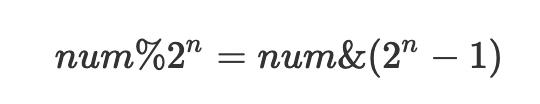
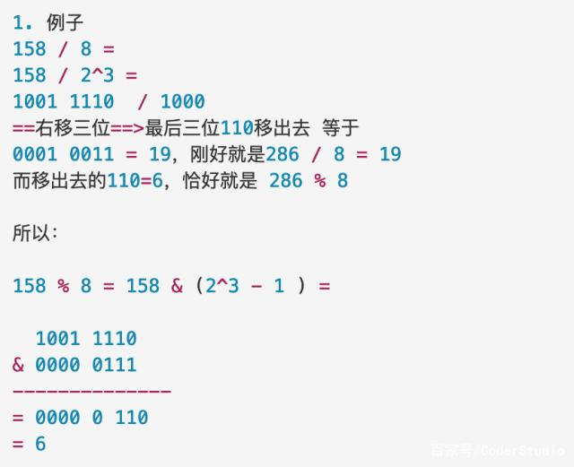
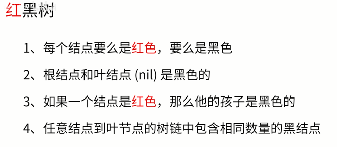
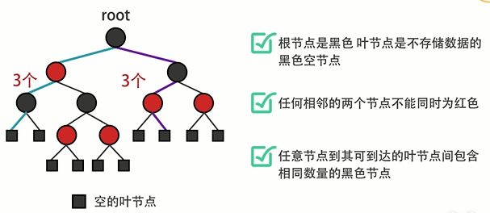

# 基本数据类型

# String

# 容器

## List

### Array

### ArrayList

接口实现

- 实现List接口

ArrayList 的扩容机制(jdk1.8)

- 结论：

  - ArrayList中维护了一个Object类型的数组elementData  ->Object[] elementData 
  - 创建ArrayList对象时，如果是无参构造器，则elementData 容量为0，第一次添加时扩容为10，再次扩容为1.5倍(jdk1.7无参构造容量为10)
  - 指定大小创建时，elementData 容量为指定大小，下一次扩容为1.5倍

- 源码分析
  - ArrayList中最主要的几个变量

  - ```java
    //定义一个空数组以供使用
    private static final Object[] EMPTY_ELEMENTDATA = {};
    //也是一个空数组，跟上边的空数组不同之处在于，这个是在默认构造器时返回的，扩容时需要用到这个作判断，后面会讲到
    private static final Object[] DEFAULTCAPACITY_EMPTY_ELEMENTDATA = {};
    //存放数组中的元素，注意此变量是transient修饰的，不参与序列化
    transient Object[] elementData;
    //数组的长度，此参数是数组中实际的参数，区别于elementData.length，后边会说到
    private int size;
    ```

  - ArrayList有三个构造函数，不同的构造函数会影响后边的扩容机制判断

    - 默认的无参构造

    - ```java
      public ArrayList() {
      	this.elementData = DEFAULTCAPACITY_EMPTY_ELEMENTDATA;
      }
      //可以看到，调用此构造函数，返回了一个空的数组DEFAULTCAPACITY_EMPTY_ELEMENTDATA，此数组长度为0.
      ```

    - 给定初始容量的构造函数

    - ```java
      public ArrayList(int initialCapacity) {
          if (initialCapacity > 0) {
              this.elementData = new Object[initialCapacity];
          } else if (initialCapacity == 0) {
              this.elementData = EMPTY_ELEMENTDATA;
          } else {
              throw new IllegalArgumentException("Illegal Capacity: "+
                                                 initialCapacity);
          }
      }
      //逻辑很简单，就是构造一个具有指定长度的空数组，当initialCapacity为0时，返回EMPTY_ELEMENTDATA
      ```

    - 包含特定集合元素的构造函数

    - ```java
      public ArrayList(Collection<? extends E> c) {
          elementData = c.toArray();
          if ((size = elementData.length) != 0) {
              // c.toArray might (incorrectly) not return Object[] (see 6260652)
              if (elementData.getClass() != Object[].class)
                  elementData = Arrays.copyOf(elementData, size, Object[].class);
          } else {
              // replace with empty array.
              this.elementData = EMPTY_ELEMENTDATA;
          }
      }
      //把传入的集合转换为数组，然后通过Arrays.copyOf方法把集合中的元素拷贝到elementData中。同样，若传入的集合长度为0，返回EMPTY_ELEMENTDATA
      ```

  - 扩容开始于集合添加元素方法，添加元素有两种方法

    - ```java
      public boolean add(E e) {
          ensureCapacityInternal(size + 1);  // Increments modCount!!
          elementData[size++] = e;
          return true;
      }
      public void add(int index, E element) {
          rangeCheckForAdd(index);
      
         ensureCapacityInternal(size + 1);  // Increments modCount!!
          System.arraycopy(elementData, index, elementData, index + 1,size - index);
          elementData[index] = element;
          size++;
      }
      ```

    - 两个方法都调用了ensureCapacityInternal(size + 1)方法，把数组长度加1以确保能存下下一个数据

    - 此方法会先调用calculateCapacity方法，此时minCapacity为1，即size+1，因为初始时size为0

    - ```java
      private static int calculateCapacity(Object[] elementData, int minCapacity) {
          if (elementData == DEFAULTCAPACITY_EMPTY_ELEMENTDATA) {
              return Math.max(DEFAULT_CAPACITY, minCapacity);
          }
          return minCapacity;
      }
      ```

## Map

### HashMap

jdk7是数组+链表  jdk8是数组+链表+红黑树

- 数组 table
  - 默认为null
  - java7 默认长度16
  - 存放node节点
- 链表
  - 超过8并且table>=64  就变成红黑树
- 加载因子loadfactor
  - 初始化为0.75

源码-变量

```java
//初始化数组容量
static final int DEFAULT_INITIAL_CAPACITY = 1 << 4; // aka 16
//数组最大容量
static final int MAXIMUM_CAPACITY = 1 << 30;
//加载因子
 static final float DEFAULT_LOAD_FACTOR = 0.75f;
//树化阈值
static final int TREEIFY_THRESHOLD = 8;
//树降级成为链表的阈值
static final int UNTREEIFY_THRESHOLD = 6;
//最小树化数组容量
static final int MIN_TREEIFY_CAPACITY = 64;

//数组
transient Node<K,V>[] table;
transient Set<Map.Entry<K,V>> entrySet;
transient int size;
//操作数，put或get操作会使其+1
transient int modCount;
// = capacity * loadFactor
int threshold;
//负载因子
final float loadFactor;
```

构造方法

```java
//无参构造
public HashMap() {this.loadFactor = DEFAULT_LOAD_FACTOR;}
//自己初始大小
public HashMap(int initialCapacity) {
    this(initialCapacity, DEFAULT_LOAD_FACTOR);
}
//自己设置初始大小和加载因子
public HashMap(int initialCapacity, float loadFactor) {
    if (initialCapacity < 0)
        throw new IllegalArgumentException("Illegal initial capacity: 											" +initialCapacity);
    if (initialCapacity > MAXIMUM_CAPACITY)
        initialCapacity = MAXIMUM_CAPACITY;
    if (loadFactor <= 0 || Float.isNaN(loadFactor))
        throw new IllegalArgumentException("Illegal load factor: " +
                                           loadFactor);
    this.loadFactor = loadFactor;
    this.threshold = tableSizeFor(initialCapacity);
}

//给一个map构造
public HashMap(Map<? extends K, ? extends V> m) {
    this.loadFactor = DEFAULT_LOAD_FACTOR;
    putMapEntries(m, false);
}
```

构造方法补充函数-指定大小如何变成刚刚好比其大的2N

```java
/**
这个函数吧输入的 变成 2.N次方
刚刚好比这个数大的 2.N次方
与运算 、 右移
*/
static final int tableSizeFor(int cap) {
    int n = cap - 1;
    n |= n >>> 1;
    n |= n >>> 2;
    n |= n >>> 4;
    n |= n >>> 8;
    n |= n >>> 16;
    return (n < 0) ? 1 : (n >= MAXIMUM_CAPACITY) ? MAXIMUM_CAPACITY : 																n + 1;
}
```

put方法

```java
//第一个put套娃开始
public V put(K key, V value) {
    return putVal(hash(key), key, value, false, true);}
//put用到的hash方法
//1.null放在数组的0号位置
//2.作用：让高16位也参与路由运算，减少hash冲突概率（hashcode方法得到16位二进制）
static final int hash(Object key) {
    int h;
    return (key == null) ? 0 : (h = key.hashCode()) ^ (h >>> 16);
}
```

>
>
> 当元素只是孤家寡人即元素的next==null(源码)711时，位置为e.hash & (newCap - 1)（源码712）
>7.2 当元素有next节点时，该链表上的元素分两类
>7.21 e.hash & oldCap = 0的，在新表中与旧表中的位置一样(源码738）
>
>7.22 e.hash & oldCap != 0的，位置为旧表位置+旧表容量，源码742

put流程   扩容

- 初始化table  null

- 第一次添加table扩容为16，扩容阈值threshold为12(16*0.75)
  - 新table的数据迁移
    - 一个桶位一个桶位的迁移
    - 桶位为null  不用处理
    - 桶位为单个node(即node.next=null)   直接迁移
- 达到扩容阈值后再扩容，table为原来的2倍，临界值也为原来的2倍，以此类推
  - 并不是乘以二，二是二进制左移一位
  - 因为CPU不支持乘法运算，乘法运算都是转换成加法运算
- 链表长度超过8，并且table>=64  就变成红黑树
- add
  - 当table/node该位为null时直接插入
  - 不是null时，equals方法比较
    - 相同则覆盖
    - 不同尾插法，插入node

索引计算

- 索引要求

  - 性能高效
  - 分布均匀

- 为了解决取模效率的问题，Java官方采用了位运算的方法

  - ```
    index = hash值 & （length -1）
    ```

  - length的长度必须是2的n次幂,这个时候以下公式成立

  - 

  - 一个数num除以2**n,相当于右移n位，那么移出去的那些数自然就是余数了

  - 

### 红黑树

一些相关定义的图片





### ConcurrentHashMap

- 保证存数据线程安全，取不用管

## Set

常用方法

- set接口也是Collerction的子接口，常用方法和collerction接口一样

遍历

- 可以使用迭代器
- 增强for
- 不能使用索引方法获取

特性

- 无序的，set中元素顺序和存入顺序无关，但是取出的顺序固定
  - 底层 是数组＋链表
- 可以存null
- 不允许重复

### HashSet

特点

- 实现set接口
- 可以放null

用法

- remove删除
- add  返回bool

底层结构

- hashmap
- HashSet 的值是作为 HashMap 的 key

add流程

- 计算索引   
  - 看hashmap
- 查找数据表table，看该索引位置是否有元素
  - 没有  添加
  - 有  用equals方法比较，如果相同放弃添加，不同则添加到最后
  - java8中
    - 如果链表元素大于8
    - 并且table大小大于等于64，就会转换成红黑树


HashSet 的实现是依赖于 HashMap 的，HashSet 的值都是存储在 HashMap 中的。在 HashSet 的构造法中会初始化一个 HashMap 对象，HashSet 不允许值重复。因此，HashSet 的值是作为 HashMap 的 key 存储在 HashMap 中的，当存储的值已经存在时返回 false。


# Object相关

## equals()

和 == 比较

- 对于基本类型，== 判断两个值是否相等，基本类型没有 equals() 方法
- 对于引用类型，== 判断两个变量是否引用同一个对象，而 equals() 判断引用的对象是否等价

## hashCode()

```
hashcode方法返回该对象的哈希码值。支持该方法是为哈希表提供一些优点，例如，java.util.Hashtable 提供的哈希表。 

hashCode 的常规协定是： 
在 Java 应用程序执行期间，在同一对象上多次调用 hashCode 方法时，必须一致地返回相同的整数，前提是对象上 equals 比较中所用的信息没有被修改。从某一应用程序的一次执行到同一应用程序的另一次执行，该整数无需保持一致。 
如果根据 equals(Object) 方法，两个对象是相等的，那么在两个对象中的每个对象上调用 hashCode 方法都必须生成相同的整数结果。 
以下情况不 是必需的：如果根据 equals(java.lang.Object) 方法，两个对象不相等，那么在两个对象中的任一对象上调用 hashCode 方法必定会生成不同的整数结果。但是，程序员应该知道，为不相等的对象生成不同整数结果可以提高哈希表的性能。 
实际上，由 Object 类定义的 hashCode 方法确实会针对不同的对象返回不同的整数。（这一般是通过将该对象的内部地址转换成一个整数来实现的，但是 JavaTM 编程语言不需要这种实现技巧。） 

当equals方法被重写时，通常有必要重写 hashCode 方法，以维护 hashCode 方法的常规协定，该协定声明相等对象必须具有相等的哈希码。
```

说明简洁版

```
用equal方法判断对象是否相等

1、如果两个对象相等，则 hashCode 一定也是相同的；

2、两个对象相等，对两个对象分别调用 equals 方法都返回 true；

3、两个对象有相同的 hashCode 值，它们也不一定是相等的；

4、因此，equals 方法被覆盖过，则 hashCode 方法也必须被覆盖；

5、hashCode() 的默认行为是对堆上的对象产生独特值。如果没有重写 hashCode()，则该 class 的两个对象无论如何都不会相等（即使这两个对象指向相同的数据）。

重写了equals方法，判断相等的条件变了，有概率相等的对象hashcode会不相同。拿hashmap举例，插入{"1","test1"}和{"1","test2"}，test2不一定会覆盖test1，因为算出了2个hashcode，是错误的。
```

- hashCode是用于查找使用的，而equals是用于比较两个对象的是否相等的

- 重写 equals() 就一定要重写 hashCode()

# 继承相关

# 反射

## 反射三种实现

- Foo foo = new Foo();

- ```java
  第一种：通过Object类的getClass方法
  Class cla = foo.getClass();
  ```

- ```java
  第二种：通过对象实例方法获取对象
  Class cla = foo.class;
  ```

- ```java
  第三种：通过Class.forName方式
  Class cla = Class.forName("xx.xx.Foo");
  ```

- ```java
  对于有空构造函数的类 可以直接用字节码文件获取实例：
  Object o = clazz.newInstance();　
  ```

## 动态代理

### JDK动态代理

特性

- 基于接口的动态代理，被代理的类必须实现一个接口。代理方法由JDK提供

### CGLIB动态代理

特性

- 继承

# 序列化

# 泛型

## 概念

Java泛型（generics）是JDK5中引入的一个新特性，泛型提供了编译时类型安全监测机制，该机制允许我们在编译时检测到非法的类型数据结构。泛型的本质就是参数化类型，也就是所操作的数据类型被指定为一个参数。

## 作用

- 类型安全
- 消除了强制类型的转换

一个被举了无数次的例子：

```java
List arrayList = new ArrayList();
arrayList.add("aaaa");
arrayList.add(100);

for(int i = 0; i< arrayList.size();i++){
    String item = (String)arrayList.get(i);
    Log.d("泛型测试","item = " + item);
}
```

毫无疑问，程序的运行结果会以崩溃结束：

```java
java.lang.ClassCastException: java.lang.Integer cannot be cast to java.lang.String
```

ArrayList可以存放任意类型，例子中添加了一个String类型，添加了一个Integer类型，再使用时都以String的方式使用，因此程序崩溃了。为了解决类似这样的问题（在编译阶段就可以解决），泛型应运而生。

## 特性

### 泛型类

- 类型：

  > E - Element (在集合中使用，因为集合中存放的是元素)
  > T - Type（表示Java 类，包括基本的类和我们自定义的类）
  > K - Key（表示键，比如Map中的key）
  > V - Value（表示值）
  > N - Number（表示数值类型）
  > ？ - （表示不确定的java类型）
  > S、U、V - 2nd、3rd、4th types

### 泛型接口

### 类型通配符

.什么是类型通配符
类型通配符一般是使用"?"代替具体的类型实参。
所以，类型通配符是类型实参，而不是类型形参。
2.类型通配符的上限
语法：
类/接口<? extends 实参类型>
要求该泛型的类型，只能是实参类型，或实参类型的子类类型。
3.类型通配符的下限
语法：
类/接口<? super 实参类型>
要求该泛型的类型，只能是实参类型，或实参类型的父类类型。

# CAS

CAS：Compare and Swap，即比较再交换。

- 对CAS的理解，CAS是一种无锁算法，CAS有3个操作数，内存值V，旧的预期值A，要修改的新值B。当且仅当预期值A和内存值V相同时，将内存值V修改为B，否则什么都不做。

-  AtomicInteger、LongAdder、Lock锁底层，此外，当然还包括 java.util.concurrent.atomic 并发包下的所有原子类都是基于 CAS 来实现的。

- ```
  // 提供自增易用的方法，返回增加1后的值
  public final int incrementAndGet() {
          return unsafe.getAndAddInt(this, valueOffset, 1) + 1;
  }
  
  // 额外提供的compareAndSet方法
  public final boolean compareAndSet(int expect, int update) {
          return unsafe.compareAndSwapInt(this, valueOffset, expect, update);
  }
  
  // Unsafe 类的提供的方法
  public final int getAndAddInt (Object o,long offset, int delta){
          int v;
          do {
                  v = getIntVolatile(o, offset);
          } while (!weakCompareAndSetInt(o, offset, v, v + delta));
          return v;
  }
  ```

- value 实际的变量，是由 volatile 关键字修饰的，为了保证在多线程下的内存可见

- ```
  // Unsafe实例
  private static final Unsafe unsafe = Unsafe.getUnsafe();
  private static final long valueOffset;
  
  static {
          try {
                // 获得value在AtomicInteger中的偏移量
                  valueOffset = unsafe.objectFieldOffset
                          (AtomicInteger.class.getDeclaredField("value"));
          } catch (Exception ex) { throw new Error(ex); }
  }
  // 实际变量的值
  private volatile int value;
  ```

- CPU如何实现原子操作

  - **总线锁定**

  当一个处理器要操作共享变量时，在 BUS 总线上发出一个 Lock 信号，其他处理就无法操作这个共享变量了。

  缺点很明显，总线锁定在阻塞其它处理器获取该共享变量的操作请求时，也可能会导致大量阻塞，从而增加系统的性能开销。

  - **缓存锁定**
  - 后来的处理器都提供了缓存锁定机制，也就说当某个处理器对缓存中的共享变量进行了操作，其他处理器会有个嗅探机制，将其他处理器的该共享变量的缓存失效，待其他线程读取时会重新从主内存中读取最新的数据，基于 MESI 缓存一致性协议来实现的。
  - 现代的处理器基本都支持和使用的缓存锁定机制。
  - 注意：
    - 有如下两种情况处理器不会使用缓存锁定：
      - 当操作的数据跨多个缓存行，或没被缓存在处理器内部，则处理器会使用总线锁定。
      - 有些处理器不支持缓存锁定，比如：Intel 486 和 Pentium 处理器也会调用总线锁定。

- 底层硬件通过将 CAS 里的多个操作在硬件层面语义实现上，通过一条处理器指令保证了原子性操

# 乐观锁悲观锁实现

- 

