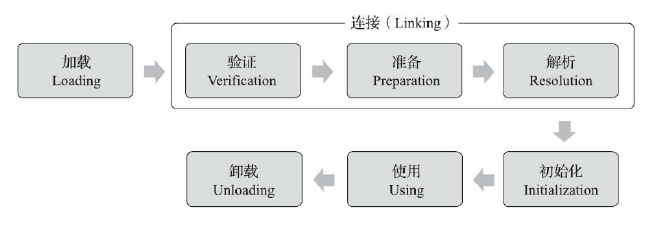
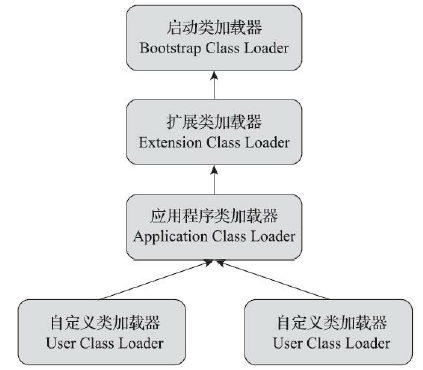
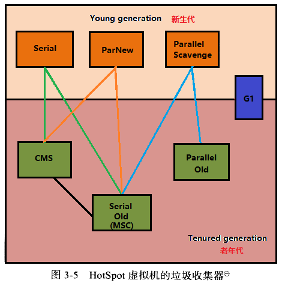
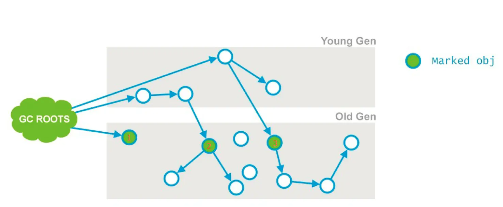
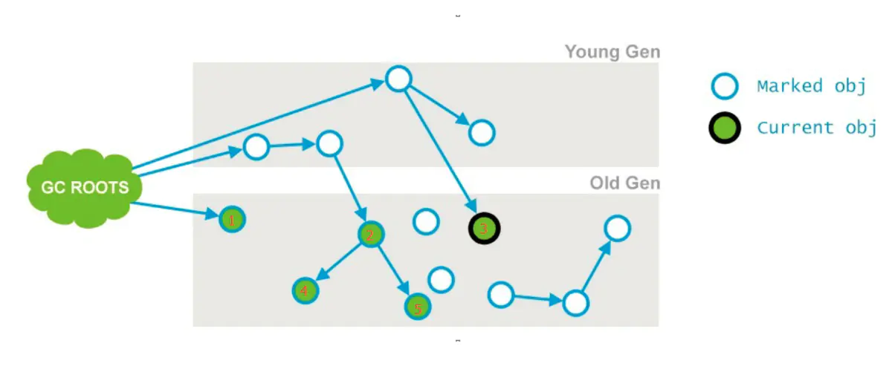

# 内存结构

## 1.程序计数器

- 可以看做是当前线程执行的字节码行号指示器

- 内存较小
- 作用：通过它来选取下一条要执行的字节码。
  - 分支、循环、跳转、异常、线程恢复都依赖这个计算器
- 线程私有，每个线程有一个
- 如果正在执行本地（Native）方法，这个计数器值应该为空

---

- 唯一一个在《java虚拟机规范》中没有任何OutOfMamoryError的区域

## 2.java虚拟机栈

- 线程私有，生命周期与线程相同

- 虚拟机栈描述的是  java方法执行的   线程内存模型

  - 每个方法执行，虚拟机同步创建栈帧（Stack Frame）

    栈帧 储存着

    - 局部变量表
    - 操作数栈
    - 动态连接
    - 方法出口

    每一个方法执行完毕，就意味着一个栈帧在虚拟机栈的入栈出栈过程

- 局部变量表 储存着

  - 编译期可知的java数据类型（boollean，byte，char，int等）
  - 对象引用（reference类型，指针、句柄或者其他位置指向）
  - returnAddress类型

- 局部变量表  内存空间

  - 用 **变量槽**（Slot）表示
  - 64位的long和double类型占用2个变量槽，其他类型占一个
  - 所需空间在编译时分配完成
  - 进入方法是，这个方法在栈帧中分配多大的局部变量空间是完全确定的，方法运行期间不会改变局部变量表的大小
  - 大小指局部变量表的**数量**，一个变量槽多大完全由虚拟机决定

---

- 线程请求的栈深度大于虚拟机允许的深度，抛出StackOverflowError
- 如果虚拟机栈容量可动态扩展，当扩展到无法申请到足够内存时，抛出OutOfMemoryError

## 3.本地方法栈

- 和虚拟机栈相似，区别就是
  - 虚拟机栈为虚拟机执行java方法（也就是字节码）服务
  - 本地方法栈为虚拟机执行本地（Native）方法服务
- 有的虚拟机（如HotSpot）直接把本地方法栈和虚拟机栈合二为一

---

- 异常抛出  和虚拟机栈一样

## 4.java堆

- 虚拟机管理内存中最大的一块
- 线程共享
- 在虚拟机启动时创建
- 此区域唯一目的：存放实例对象

---

- “几乎”所有的实例对象都在这里分配内存（种种迹象表明日后不会这么绝对）
- 垃圾收集器管理的内存区域（有的资料把这叫GC堆）
- 所有 线程共享的 java堆 中可以划分出多个线程私有的 **分配缓冲区**（Thread Local Allocation Buffer,**TLAB**）
- 《java虚拟机规范》:java堆可以处在物理上不连续的内存空间中，但在逻辑上它应该被视为连续的
- java堆既可以被实现为固定大小，也可以是可扩展的
  - 当前主流java虚拟机是按照可扩展来实现的

---

- java堆没有内存来完成实例分配时，抛出OutOfMemoryError

## 5.方法区

- 线程共享

- 方法区  储存着

  - 被虚拟机加载的类信息
  - 常量
  - 静态变量
  - 即时编译器编译后的代码缓存数据

- 和java堆一样，不需要连续内存、可选择固定大小或者可扩展

- 垃圾收集行为比较少出现，甚至可用选择不实现垃圾回收

- 但并不代表数据进入方法区就意味着进入永久代，永久存在了

- “永久代”

  - JDK8之前，HotSpot虚拟机使用永久代实现方法区

  - BEA JRockit、IBM J9没有永久代的概念

  - 永久代使得垃圾回收器像管理java堆一样管理方法区

  - ---

  - 永久代有-XX:MaxPermSize上限，即使不设置也有默认大小

  - J9和JRockit，只要没触碰到进程可用内存上限，就不会出现问题

  - 这使得java应用更容易出现内存溢出问题

  - JDK8之后HotSpot彻底废除永久代，和其他2个虚拟机一样使用元空间

  ---

- 当方法区无法满足新的内存分配需求时，抛出OutOfMemoryError

---

- 运行时常量池（方法区的一部分）

  - class 文件中  储存着

    - 版本
    - 字段
    - 方法
    - 接口描述信息
    - 常量池表
      - 用于存放编译时生成的各种字面量与符号引用
      - 这部分内容在类加载后存放到方法区的运行时常量池

  - java虚拟机对Class文件每一部分（包括常量池）的格式都有严格的规定

  - 但是对于运行时常量池，《java虚拟机规范》没有任何细节要求

  - 运行时常量池 和 Class文件常量池  区别特征：

    - 运行时常量池有动态性，运行时可以将新的常量放入池中

    ---

  - 当常量池无法再申请到内存时，抛出OutOfMemoryError

5.5直接内存

- 各个区域内存大于物理内存限制，导致动态扩展时出现OutOfMemoryError

二、HotSpot虚拟机对象

对象创建的过程。。。

1.加载检查

- java虚拟机遇到一条字节码 new指令时，
- 首先检测这个指令的参数是否能在常量池中定位到一个类的符号引用
- 并检查这个符号引用的类是否已被加载、解析和初始化过

2.分配内存

- 加载检查通过后，就为新生对象分配内存
- 对象所需内存在 类加载完成后就可以完全确定
- 内存加载方法：
  - ”指针碰撞“
    - java堆中的内存是绝对规整的，被使用过的内存放一边，空闲的内存在另一边
    - 中间有一个指针作为分界点
    - 分配内存就是 把指针向空闲区域挪动与对象大小相等的距离
  - “空闲列表”
    - java堆中的内存不规整，使用过和空闲的内存交错在一起
    - 有一个表，记录着哪些内存是空闲的
    - 分配内存就是从表中找到一块足够大的空间划分给实例对象，并在表上记录
  - 选择哪种方法由java堆是否规整决定，而java堆是否规整由所采用的垃圾回收器是否带有空间压缩整理能力决定
    - Serial、ParNew等带压缩整理过程的收集器时，就用指针碰撞，简单高效
    - CMS基于清除算法的收集器，就采用复杂的空闲列表

# 类加载机制

## 类的生命周期

加载、验证、准备、解析、初始化、使用和卸载。




类加载的过程

类的加载指的是将类的class文件中的二进制数据读入到内存中，将其放在运行时数据区的方法区内，然后在堆区创建一个对象，这个对象封装了类在方法区内的数据结构，并且提供了访问方法区内的类信息的接口。

### 加载

类加载过程的一个阶段：通过一个类的完全限定查找此类字节码文件，并利用字节码文件创建一个Class对象。

1. 通过全类名获取定义此类的二进制字节流
2. 将字节流所代表的静态存储结构转换为方法区的运行时数据结构
3. 在内存中生成一个代表该类的 Class 对象，作为方法区这些数据的访问入口

### 验证

确保Class文件的字节流中包含的信息符合虚拟机规范，保证这些信息被当作代码运行后不会危害虚拟机自身的安全。主要包括四种验证：文件格式验证，元数据验证，字节码验证，符号引用验证。

### 准备

为类变量分配内存并设置类变量初始值的阶段。此阶段进行内存分配的仅包括类变量，不包括实例变量和final修饰的static变量（因为final在编译的时候就会分配了），实例变量会在对象实例化时随着对象一块分配在 Java 堆中。

### 解析

虚拟机将常量池内的符号引用替换为直接引用的过程。符号引用用于描述目标，直接引用直接指向目标的地址。

### 初始化

初始化阶段就是执行类构造器<clinit>()方法的过程。<clinit>()并不是程序员在Java代码中直接编写的方法，它是Javac编译器的自动生成的，由编译器自动收集类中的所有类变量的赋值动作和静态语句块中的语句合并产生的。

### 卸载

需要同时满足下面 3 个条件才能算是 “无用的类” ：

- 该类所有的实例都已经被回收，也就是 Java 堆中不存在该类的任何实例。
- 加载该类的 ClassLoader 已经被回收。
- 该类对应的 java.lang.Class 对象没有在任何地方被引用，无法在任何地方通过反射访问该类的方法。

虚拟机可以对满足上述 3 个条件的无用类进行回收，但不一定被回收。

## 类加载器

### 定义

- java虚拟机设计团队，把“  通过一个类的全限定名来获取描述该类的二进制字节流”，的动作放到虚拟机外部实现，这个动作的代码称为“类加载器”

### 特点

- 每一个类加载器，都有一个独立的类名称空间
- 任意一个类，都必须由加载它的类加载器和这个类本身，来确定其在虚拟机中的唯一性
  - 通俗来说，就是比较2个类是否“相等”，必须在他们由同一个类加载器加载 的前提下才有意义
  - 这里的"相等"，包括
    - Class对象的equal()方法、isAssignableFrom(）、isInstance方法的放回结果
    - 也包括instanceof关键字

### forName和loaderClass区别

- Class.forName()得到的class是已经初始化完成的。
- Classloader.loaderClass得到的class是还没有链接（验证，准备，解析三个过程被称为链接）的。

## 双亲委派

### 类加载器的分层

从java虚拟机的角度，只有2种类加载器

- 启动类的类加载器（Bootstrap ClassLoader），用C++写的（仅限于hotstop），是虚拟机自身的一部分
- 其他的类加载器，都由java语言实现，独立于虚拟机之外，并继承自抽象类java.lan.ClassLoader

从开发人员的角度

- 自java1.2以来，java一直保持着三层类加载器、双亲委派类加载架构
  - 启动类加载器（Bootstrap ClassLoader）
  - 扩展类加载器
  - 应用程序类加载器

java9之前，都是由这三种类加载器互相配合完成加载的，如果用户觉得有必要，还可以加入自定义类加载器。

### 双亲委派



定义

- 类加载器之间的层次关系被称为类加载器的“双亲委派模型”

- 双亲委派要求除了顶层的启动类加载器外，其余的类加载器都应有自己的父类加载器
  - 类加载器之间的父子关系一般不是继承，而是使用组合关系来复用父加载器的代码

过程

- 如果一个类加载器收到了类加载的请求，它首先不会自己去加载这个类，而是把这个请求委派给父类加载器去完成，层层如此
- 只有当父类加载器反馈自己无法完成这个加载请求（它的搜索范围中没有找到所需的类），子类加载器才会自己去加载

好处

- java中的类随着它的加载器一起具备了带有优先级的层次关系
  - 如java.lang.Object，存放在rt.jar中，无论哪个类加载器要加载这个类，最终都会委派给最顶端的启动类加载器进行加载，一次Object类在程序的各种类加载器环境中都能保证是同一个类。
  - 反之，没有双亲委派，用户也写个Objet类到classpath中，系统中就会有多个不同的Object类，程序会变得一团糟
  - 自己写一个rt.jar中同名的类，发现可以正常编译，但永远不会被加载

双亲委派极为重要，但实现非常简单，loadClass()方法如下，只有短短的十余行

```java
public abstract class ClassLoader {
    // The parent class loader for delegation
    private final ClassLoader parent;

    public Class<?> loadClass(String name) throws ClassNotFoundException {
        return loadClass(name, false);
    }

    protected Class<?> loadClass(String name, boolean resolve) throws ClassNotFoundException {
        synchronized (getClassLoadingLock(name)) {
            // First, check if the class has already been loaded
            Class<?> c = findLoadedClass(name);
            if (c == null) {
                try {
                    if (parent != null) {
                        c = parent.loadClass(name, false);
                    } else {
                        c = findBootstrapClassOrNull(name);
                    }
                } catch (ClassNotFoundException e) {
                    // ClassNotFoundException thrown if class not found
                    // from the non-null parent class loader
                }

                if (c == null) {
                    // If still not found, then invoke findClass in order
                    // to find the class.
                    c = findClass(name);
                }
            }
            if (resolve) {
                resolveClass(c);
            }
            return c;
        }
    }

    protected Class<?> findClass(String name) throws ClassNotFoundException {
        throw new ClassNotFoundException(name);
    }
}
```

### 打破双亲委派

双亲委派并不是一个强制的约束，而是设计者推荐给开发者的类加载模式

打破双亲委派的方法

- 自定义类加载器，并重写loadClass方法

历史上的打破例子

- 父类加载器需要调用子类加载器的情况
  - 如JNDI、JDBC、JCE、JAXB、JBI等
  - 这些功能接口定义在java基本包中，由顶层的启动类加载器进行加载，但是又需要调用其他厂商的服务接口（Service Provider Interface SPI）
  - 设计了一个线程上下文加载器（Thread Context ClassLoader,这个方式不太优雅）
    - 这个类加载器可以通过java.lang.Thread类的setContextClassLoader()方法进行设置。
    - 如果创建线程还未设置，就从父线程基础，如果在应用程序全局范围内都没有设置过，这个类加载器就是应用程序类加载器（Application ClassLoader）
    - 应用程序加载器由jvm启动，在Launcher构造方法放入当前线程中
    - 线程上下文加载器使得加载驱动包下的Driver实现类时，没有向上委派，直接让ApplicatonClassLoader加载好了
  - 为什么不向上委派
    - 应该是Bootstrap ClassLoader和Extension ClassLoader,他们只能加载自己指定目录下的类，无法加载运行时的，其他目录下的类
    - JDBC嘛，就是接口都是由jdk提供，具体实现是由第三方数据库产商提供的,所以也只能采用这种方式去加载驱动实现类了。

# 垃圾收集

## 收集策略与算法

### GC root

java中可作为GC root 的对象

1. 虚拟机栈(栈桢中的本地变量表)中的引用的对象 ；
2. 方法区中的类静态属性引用的对象 ；
3. 方法区中的常量引用的对象 ；
4. 本地方法栈中JNI的引用的对象；

ps：对于CMS为了加快此阶段处理速度，减少停顿时间，可以开启初始标记并行化，-XX:+CMSParallelInitialMarkEnabled，同时调大并行标记的线程数，线程数不要超过cpu的核数。

### 复制算法

### 标记-清除-整理

### 三色标记

### 轻GC 和重GC

- Minor GC：回收新生代，因为新生代对象存活时间很短，因此 Minor GC 会频繁执行，执行的速度一般也会比较快。
- Full GC：回收老年代和新生代，老年代对象其存活时间长，因此 Full GC 很少执行，执行速度会比 Minor GC 慢很多。

### 内存分配策略

- 对象优先在 Eden 分配

大多数情况下，对象在新生代 Eden 上分配，当 Eden 空间不够时，发起 Minor GC。

- 大对象直接进入老年代

大对象是指需要连续内存空间的对象，最典型的大对象是那种很长的字符串以及数组。经常出现大对象会提前触发垃圾收集以获取足够的连续空间分配给大对象。

可以设置JVM参数 -XX:PretenureSizeThreshold，大于此值的对象直接在老年代分配，避免在 Eden 和 Survivor 之间的大量内存复制。

- 长期存活的对象进入老年代

通过参数 `-XX:MaxTenuringThreshold` 可以设置对象进入老年代的年龄阈值。对象在 Survivor 中每经过一次 MinorGC，年龄就增加 1 岁，当它的年龄增加到一定程度，就会被晋升到老年代中。

- 动态对象年龄判定

虚拟机并不是永远要求对象的年龄必须达到 MaxTenuringThreshold 才能晋升老年代，如果在 Survivor 中相同年龄所有对象大小的总和大于 Survivor 空间的一半，则年龄大于或等于该年龄的对象可以直接进入老年代，无需等到 MaxTenuringThreshold 中要求的年龄。

- 空间分配担保

在发生 Minor GC 之前，虚拟机先检查老年代最大可用的连续空间是否大于新生代所有对象总空间，如果条件成立的话，那么 Minor GC 可以确认是安全的。如果不成立的话虚拟机会查看 HandlePromotionFailure 的值是否允许担保失败。如果允许，那么就会继续检查老年代最大可用的连续空间是否大于历次晋升到老年代对象的平均大小，如果大于，将尝试着进行一次 Minor GC；如果小于，或者 HandlePromotionFailure 的值不允许冒险，那么就要进行一次 Full GC。

### 重GC触发条件

1. 调用 System.gc()

只是建议虚拟机执行 Full GC，但是虚拟机不一定真正去执行。不建议使用这种方式，而是让虚拟机管理内存。

2. 老年代空间不足

老年代空间不足的常见场景为前文所讲的大对象直接进入老年代、长期存活的对象进入老年代等。为了避免以上原因引起的 Full GC，应当尽量不要创建过大的对象以及数组。除此之外，可以通过 -Xmn 参数调大新生代的大小，让对象尽量在新生代被回收掉，不进入老年代。还可以通过 -XX:MaxTenuringThreshold 调大对象进入老年代的年龄，让对象在新生代多存活一段时间。

3. 空间分配担保失败

使用复制算法的 Minor GC 需要老年代的内存空间作担保，如果担保失败会执行一次 Full GC。

## 垃圾收集器



- jdk1.7 默认垃圾收集器Parallel Scavenge（新生代【标记-复制算法】）+Parallel Old（老年代【标记整理算法】）
- jdk1.8 默认垃圾收集器Parallel Scavenge（新生代）+Parallel Old（老年代）
- jdk1.9 默认垃圾收集器G1【从局部(两个Region之间)来看是基于"标记—复制"算法实现，从整体来看是基于"标记-整理"算法实现】


### G1

### CMS

过程：

1. 初始化标记(CMS-initial-mark) ,标记root，会导致stw；
2. 并发标记(CMS-concurrent-mark)，与用户线程同时运行；
3. 预清理（CMS-concurrent-preclean），与用户线程同时运行；
4. 重新标记(CMS-remark) ，会导致stw；
5. 并发清除(CMS-concurrent-sweep)，与用户线程同时运行；
6. 调整堆大小，设置CMS在清理之后进行内存压缩，目的是清理内存中的碎片；
7. 并发重置状态等待下次CMS的触发(CMS-concurrent-reset)，与用户线程同时运行；

初始标记



1. 标记老年代中所有的GC Roots对象

2. 标记年轻代中活着的对象引用到的老年代的对象（指的是年轻带中还存活的引用类型对象，引用指向老年代中的对象）如图节点2、3

并发标记



- 从“初始标记”阶段标记的对象开始找出所有存活的对象;
-  因为是并发运行的，在运行期间会发生新生代的对象晋升到老年代、或者是直接在老年代分配对象、或者更新老年代对象的引用关系等等，对于这些对象，都是需要进行重新标记的，否则有些对象就会被遗漏，发生漏标的情况。为了提高重新标记的效率，该阶段会把上述对象所在的Card标识为Dirty，后续只需扫描这些Dirty Card的对象，避免扫描整个老年代；
-  并发标记阶段只负责将引用发生改变的Card标记为Dirty状态，不负责处理；
   如图所示，也就是节点1、2、3，最终找到了节点4和5。并发标记的特点是和应用程序线程同时运行。并不是老年代的所有存活对象都会被标记，因为标记的同时应用程序会改变一些对象的引用等。
   由于这个阶段是和用户线程并发的，可能会导致concurrent mode failure。

预清理


- 前一个阶段已经说明，不能标记出老年代全部的存活对象，是因为标记的同时应用程序会改变一些对象引用，这个阶段就是用来处理前一个阶段因为引用关系改变导致没有标记到的存活对象的，它会扫描所有标记为Dirty的Card
- 如图所示，在并发清理阶段，节点3的引用指向了6；则会把节点3的card标记为Dirty；

- 最后将6标记为存活

可终止预处理

- 这个阶段尝试着去承担下一个阶段Final Remark阶段足够多的工作。这个阶段持续的时间依赖好多的因素，由于这个阶段是重复的做相同的事情直到发生abort的条件（比如：重复的次数、多少量的工作、持续的时间等等）之一才会停止。
-  ps:此阶段最大持续时间为5秒，之所以可以持续5秒，另外一个原因也是为了期待这5秒内能够发生一次ygc，清理年轻带的引用，是的下个阶段的重新标记阶段，扫描年轻带指向老年代的引用的时间减少；

重新标记

- 这个阶段会导致第二次stop the word，该阶段的任务是完成标记整个年老代的所有的存活对象。
- 这个阶段，重新标记的内存范围是整个堆，包含_young_gen和_old_gen。为什么要扫描新生代呢，因为对于老年代中的对象，如果被新生代中的对象引用，那么就会被视为存活对象，即使新生代的对象已经不可达了，也会使用这些不可达的对象当做cms的“gc root”，来扫描老年代； 因此对于老年代来说，引用了老年代中对象的新生代的对象，也会被老年代视作“GC ROOTS”
- 当此阶段耗时较长的时候，可以加入参数-XX:+CMSScavengeBeforeRemark，在重新标记之前，先执行一次ygc，回收掉年轻带的对象无用的对象，并将对象放入幸存带或晋升到老年代，这样再进行年轻带扫描时，只需要扫描幸存区的对象即可，一般幸存带非常小，这大大减少了扫描时间。
- 一般CMS的GC耗时80%都在remark阶段，如果发现remark阶段停顿时间很长，可以尝试添加该参数：
   -XX:+CMSScavengeBeforeRemark。
   在执行remark操作之前先做一次Young GC，目的在于减少年轻代对老年代的无效引用，降低remark时的开销。
- 由于之前的预处理阶段是与用户线程并发执行的，这时候可能年轻带的对象对老年代的引用已经发生了很多改变，这个时候，remark阶段要花很多时间处理这些改变，会导致很长stop the word，所以通常CMS尽量运行Final Remark阶段在年轻代是足够干净的时候。
   另外，还可以开启并行收集：-XX:+CMSParallelRemarkEnabled。