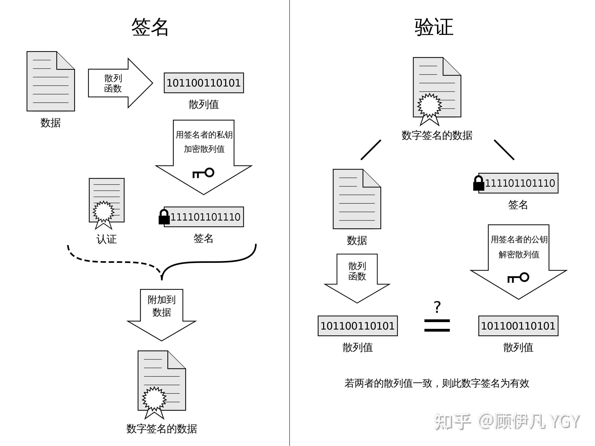

# 体系结构

| 层         |                        功能                        |                           各层设备                           |                   协议                    |
| ---------- | :------------------------------------------------: | :----------------------------------------------------------: | :---------------------------------------: |
| 物理层     |   通过媒介传输比特,确定机械及电气规范（比特Bit）   | 各种传输媒体（光线、网线），各类DTE和DCE之间通讯的物理设备（如：计算机、HUB），各类插槽、插座。 |          RJ45、CLOCK、IEEE802.3           |
| 数据链路层 |      将比特组装成帧和点到点的传递（帧Frame）       | 分为两个子层：逻辑链路控制层（LLC）和媒体访问控制层（MAC）。网卡（有争议）、网桥和二层交换机 |         PPP、FR、HDLC、VLAN、MAC          |
| 网络层     |   负责数据包从源到宿的传递和网际互连（包PackeT）   |                   路由器、网关和三层交换机                   | IP、IPX、OSPF、RIP、IGRP、ICMP、ARP、RARP |
| 传输层     |  提供端到端的可靠报文传递和错误恢复（段Segment）   |                          四层交换机                          |               TCP、UDP、SPX               |
| 会话层     |    建立、管理和终止会话（会话协议数据单元SPDU）    |                          五层交换机                          |          NFS、SQL、NETBIOS、RPC           |
| 表示层     | 对数据进行翻译、加密和压缩（表示协议数据单元PPDU） |                          六层交换机                          |             JPEG、MPEG、ASII              |
| 应用层     |   允许访问OSI环境的手段（应用协议数据单元APDU）    |                 计算机、负载均衡和七层交换机                 |     Telnet、HTTP、FTP、WWW、NFS、SMTP     |

# 网络层

## ip地址分类
- 一个A类IP地址由1字节（每个字节是8位）的网络地址和3个字节主机地址组成，网络地址的最高位必须是“0”,即第一段数字范围为1～126。每个A类地址可连接16387064台主机，Internet有126个A类地址。  
- 一个B类IP地址由2个字节的网络地址和2个字节的主机地址组成，网络地址的最高位必须是“10”，即第一段数字范围为128～191。每个B类地址可连接64516台主机，Internet有16256个B类地址。  
- 一个C类地址是由3个字节的网络地址和1个字节的主机地址组成，网络地址的最高位必须是“110”，即第一段数字范围为192～223。每个C类地址可连接254台主机，Internet有2054512个C类地址。
## 子网掩码
子网掩码是一个32位的2进制数，其对应网络地址的所有位置都为1，对应于主机地址的所有位置都为0。
由此可知，A类网络的默认子网掩码是255.0.0.0，B类网络的默认子网掩码是255.255.0.0，C类网络的默认子网掩码是255.255.255.0。将子网掩码和IP地址按位进行逻辑“与”运算，得到IP地址的网络地址，剩下的部分就是主机地址，从而区分出任意IP地址中的网络地址和主机地址。
## 私有保留地址
A类：10.0.0.0 - 10.255.255.255
B类：172.16.0.0 - 172.31.255.255
C类：192.168.0.0 - 192.168.255.255
## 地址解析协议 ARP
ARP 实现由 IP 地址得到 MAC 地址。
每个主机都有一个 ARP 高速缓存，里面有本局域网上的各主机和路由器的 IP 地址到 MAC 地址的映射表。
如果主机 A 知道主机 B 的 IP 地址，但是 ARP 高速缓存中没有该 IP 地址到 MAC 地址的映射，此时主机 A 通过广播的方式发送 ARP 请求分组，主机 B 收到该请求后会发送 ARP 响应分组给主机 A 告知其 MAC 地址，随后主机 A 向其高速缓存中写入主机 B 的 IP 地址到 MAC 地址的映射。
## 网际控制报文协议 ICMP
- Ping
Ping 是 ICMP 的一个重要应用，主要用来测试两台主机之间的连通性。
Ping 的原理是通过向目的主机发送 ICMP Echo 请求报文，目的主机收到之后会发送 Echo 回答报文。Ping 会根据时间和成功响应的次数估算出数据包往返时间以及丢包率。
- Traceroute
Traceroute 是 ICMP 的另一个应用，用来跟踪一个分组从源点到终点的路径。
Traceroute 发送的 IP 数据报封装的是无法交付的 UDP 用户数据报，并由目的主机发送终点不可达差错报告报文。
源主机向目的主机发送一连串的 IP 数据报。第一个数据报 P1 的生存时间 TTL 设置为 1，当 P1 到达路径上的第一个路由器 R1 时，R1 收下它并把 TTL 减 1，此时 TTL 等于 0，R1 就把 P1 丢弃，并向源主机发送一个 ICMP 时间超过差错报告报文；
源主机接着发送第二个数据报 P2，并把 TTL 设置为 2。P2 先到达 R1，R1 收下后把 TTL 减 1 再转发给 R2，R2 收下后也把 TTL 减 1，由于此时 TTL 等于 0，R2 就丢弃 P2，并向源主机发送一个 ICMP 时间超过差错报文。
不断执行这样的步骤，直到最后一个数据报刚刚到达目的主机，主机不转发数据报，也不把 TTL 值减 1。但是因为数据报封装的是无法交付的 UDP，因此目的主机要向源主机发送 ICMP 终点不可达差错报告报文。
之后源主机知道了到达目的主机所经过的路由器 IP 地址以及到达每个路由器的往返时间。
# 传输层
## UDP和TCP区别
- 用户数据报协议 UDP（User Datagram Protocol）是无连接的，尽最大可能交付，没有拥塞控制，面向报文（对于应用程序传下来的报文不合并也不拆分，只是添加 UDP 首部），支持一对一、一对多、多对一和多对多的交互通信。
- 传输控制协议 TCP（Transmission Control Protocol）是面向连接的，提供可靠交付，有流量控制，拥塞控制，提供全双工通信，面向字节流（把应用层传下来的报文看成字节流，把字节流组织成大小不等的数据块），每一条 TCP 连接只能是点对点的（一对一）。
TCP传输速度比UDP慢
## TCP三次握手和四次挥手
`三次握手`
- 第一次握手：客户端发送syn包(syn=x)到服务器，并进入SYN_SEND状态，等待服务器确认；
- 第二次握手：服务器收到syn包，必须确认客户的SYN（ack=x+1），同时自己也发送一个SYN包（syn=y），即SYN+ACK包，此时服务器进入SYN_RECV状态；
- 第三次握手：客户端收到服务器的SYN＋ACK包，向服务器发送确认包ACK(ack=y+1)，此包发送完毕，客户端和服务器进入ESTABLISHED状态，完成三次握手。
- 握手过程中传送的包里不包含数据，三次握手完毕后，客户端与服务器才正式开始传送数据。理想状态下，TCP连接一旦建立，在通信双方中的任何一方主动关闭连接之前，TCP 连接都将被一直保持下去。
`三次原因`
第三次握手是为了防止失效的连接请求到达服务器，让服务器错误打开连接。
客户端发送的连接请求如果在网络中滞留，那么就会隔很长一段时间才能收到服务器端发回的连接确认。客户端等待一个超时重传时间之后，就会重新请求连接。但是这个滞留的连接请求最后还是会到达服务器，如果不进行三次握手，那么服务器就会打开两个连接。如果有第三次握手，客户端会忽略服务器之后发送的对滞留连接请求的连接确认，不进行第三次握手，因此就不会再次打开连接。
`四次挥手`
与建立连接的“三次握手”类似，断开一个TCP连接则需要“四次挥手”。
- 第一次挥手：主动关闭方发送一个FIN，用来关闭主动方到被动关闭方的数据传送，也就是主动关闭方告诉被动关闭方：我已经不会再给你发数据了(当然，在fin包之前发送出去的数据，如果没有收到对应的ack确认报文，主动关闭方依然会重发这些数据)，但是，此时主动关闭方还可 以接受数据。
- 第二次挥手：被动关闭方收到FIN包后，发送一个ACK给对方，确认序号为收到序号+1（与SYN相同，一个FIN占用一个序号）。
- 第三次挥手：被动关闭方发送一个FIN，用来关闭被动关闭方到主动关闭方的数据传送，也就是告诉主动关闭方，我的数据也发送完了，不会再给你发数据了。
- 第四次挥手：主动关闭方收到FIN后，发送一个ACK给被动关闭方，进入 TIME-WAIT 状态，等待 2 MSL（最大报文存活时间）后释放连接。确认序号为收到序号+1，至此，完成四次挥手。
`四次原因`：
客户端发送了 FIN 连接释放报文之后，服务器收到了这个报文，就进入了 CLOSE-WAIT 状态。这个状态是为了让服务器端发送还未传送完毕的数据，传送完毕之后，服务器会发送 FIN 连接释放报文。
TIME_WAIT
客户端接收到服务器端的 FIN 报文后进入此状态，此时并不是直接进入 CLOSED 状态，还需要等待一个时间计时器设置的时间 2MSL。这么做有两个理由：
确保最后一个确认报文能够到达。如果 B 没收到 A 发送来的确认报文，那么就会重新发送连接释放请求报文，A 等待一段时间就是为了处理这种情况的发生。
## TCP首部报文
- Source Port And Destination Port（源端口与目的端口）：各占 2 个字节，分别写入源端口号与目的端口号。
- Sequence Number（序列号）：占 4 个字节，范围是[0， 232 - 1]，序号增加到 232 - 1 后，下一个序号就又回到 0。在 TCP 连接中传送的字节流中的每一个字节都要按顺序编号，起始序号在连接建立时就完成设置。因此序列号可以用来解决网络包乱序（reordering）问题。
- Acknowledgement Number（确认号）：占 4 个字节，表示期望收到对方下一个报文段的第一个数据字节的序号。可以用来解决不丢包的问题。
- Offset（数据偏移）：占 4 位，指出 TCP 报文段的数据起始处距离 TCP 报文段的起始处有多远。这个字段实际上是指出 TCP 报文段的首部长度。
Reserved（保留）：保留为今后使用，目前应置为 0。
- TCP Flags：数据包的属性，用于控制 TCP 的状态机。下面介绍其中的一些属性
  - ACK（确认）：只有当 ACK＝1 时确认号字段才有效,代表这个封包为确认封包。当 ACK＝0 时，确认号无效。TCP 规定，在连接建立后所有传送的报文段都必须把这个字段的值置为 1。
  - 同步 SYN ：在连接建立时用来同步序号。当 SYN=1，ACK=0 时表示这是一个连接请求报文段。若对方同意建立连接，则响应报文中 SYN=1，ACK=1。
  - 终止 FIN ：用来释放一个连接，当 FIN=1 时，表示此报文段的发送方的数据已发送完毕，并要求释放连接。
  - RST复位，用来异常的关闭连接，在TCP的设计中它是不可或缺的。就像上面说的一样，发送RST包关闭连接时，不必等缓冲区的包都发出去（不像上面的FIN包），直接就丢弃缓存区的包发送RST包。而接收端收到RST包后，也不必发送ACK包来确认。
- Window（窗口）：占 2 个字节，窗口值是一个 [0， 216 - 1] 之间的整数。窗口指的是发送本报文段的一方的接收窗口（而不是自己的发送窗口）。窗口值用于告诉对方：从本报文段首部中的确认号算起，接受方目前允许对方发送的数据量（以字节为单位）。之所以要有这个限制，是因为接受方的数据空间是有限的。
- Checksum（校验和）：占 2 个字节，校验和字段检验的范围包括首部和数据两部分。
- Urgent Pointer（紧急指针）：占 2 个字节，紧急指针仅在 URG = 1时才有意义，它指出本报文段中的紧急数据的字节数。因此，紧急指针指出了紧急数据的末尾在报文段中的位置。
- TCP Options（选项）：长度可变，最长可达 40 字节。当没有使用“选项时”，TCP 的首部长度是 20 字节。
## TCP可靠传输
TCP 使用超时重传来实现可靠传输：如果一个已经发送的报文段在超时时间内没有收到确认，那么就重传这个报文段。
一个报文段从发送再到接收到确认所经过的时间称为往返时间 RTT，超时时间 RTO 应该略大于 RTTs。
## TCP滑动窗口
TCP中窗口大小是指tcp协议一次传输多少个数据。窗口是缓存的一部分，用来暂时存放字节流。发送方和接收方各有一个窗口，接收方通过 TCP 报文段中的窗口字段告诉发送方自己的窗口大小，发送方根据这个值和其它信息设置自己的窗口大小。
数据在传输时，TCP会对所有数据进行编号，发送方在发送过程中始终保持着一个窗口，只有落在发送窗口内的数据帧才允许被发送；同时接收方也始终保持着一个接收窗口，只有落在窗口内的数据才会被接收。这样通过改变发送窗口和接收窗口的大小就可以实现流量控制。
接收窗口只会对窗口内最后一个按序到达的字节进行确认，发送方得到一个字节的确认之后，就知道这个字节之前的所有字节都已经被接收。

## TCP流量控制与拥塞控制
### 流量控制
流量控制是为了控制发送方发送速率，保证接收方来得及接收。
接收方发送的确认报文中的窗口字段可以用来控制发送方窗口大小，从而影响发送方的发送速率。将窗口字段设置为 0，则发送方不能发送数据。
- 流量控制死锁
当发送者收到了一个窗口为0的应答，发送者便停止发送，等待接收者的下一个应答。但是如果这个窗口不为0的应答在传输过程丢失，发送者一直等待下去，而接收者以为发送者已经收到该应答，等待接收新数据，这样双方就相互等待，从而产生死锁。
为了避免流量控制引发的死锁，TCP使用了持续计时器。每当发送者收到一个零窗口的应答后就启动该计时器。时间一到便主动发送报文询问接收者的窗口大小。若接收者仍然返回零窗口，则重置该计时器继续等待；若窗口不为0，则表示应答报文丢失了，此时重置发送窗口后开始发送，这样就避免了死锁的产生。
### 拥塞控制
- 慢开始，拥塞避免
发送的最初执行慢开始，令 cwnd = 1，发送方只能发送 1 个报文段；当收到确认后，将 cwnd 加倍，因此之后发送方能够发送的报文段数量为：2、4、8、16 ...
注意到慢开始每个轮次都将 cwnd 加倍，这样会让 cwnd 增长速度非常快，从而使得发送方发送的速度增长速度过快，网络拥塞的可能性也就更高。设置一个慢开始门限 ssthresh，当 cwnd >= ssthresh 时，进入拥塞避免，每个轮次只将 cwnd 加 1。
如果出现了超时，则令 ssthresh = cwnd / 2，然后重新执行慢开始。cwnd=1
- 快重传，快恢复
当发送方连续收到三个重复确认时，就执行“乘法减小”算法，把ssthresh门限减半（为了预防网络发生拥塞）。但是接下去并不执行慢开始算法

考虑到如果网络出现拥塞的话就不会收到好几个重复的确认，所以发送方现在认为网络可能没有出现拥塞。所以此时不执行慢开始算法，令 ssthresh = cwnd / 2 ，cwnd = ssthresh，然后执行拥塞避免算法，使cwnd缓慢增大。
慢开始和快恢复的快慢指的是 cwnd 的设定值，而不是 cwnd 的增长速率。慢开始 cwnd 设定为 1，而快恢复 cwnd 设定为 ssthresh。
### 两者异同
拥塞控制：拥塞控制是作用于网络的，它是防止过多的数据注入到网络中，避免出现网络负载过大的情况；常用的方法就是：（ 1 ）慢开始、拥塞避免（ 2 ）快重传、快恢复。
流量控制：流量控制是作用于接收者的，它是控制发送者的发送速度从而使接收者来得及接收，防止分组丢失的。
## SYN洪泛攻击
A（攻击者）发送TCP SYN，SYN是TCP三次握手中的第一个数据包，而当这个服务器返回ACK以后，A不再进行确认，那这个连接就处在了一个挂起的状态，也就是半连接的意思，那么服务器收不到再确认的一个消息，还会重复发送ACK给A。这样一来就会更加浪费服务器的资源。A就对服务器发送非法大量的这种TCP连接，由于每一个都没法完成握手的机制，所以它就会消耗服务器的内存最后可能导致服务器死机，就无法正常工作了。更进一步说，如果这些半连接的握手请求是恶意程序发出，并且持续不断，那么就会导致服务端较长时间内丧失服务功能——这样就形成了DoS攻击。这种攻击方式就称为SYN泛洪攻击。
其实最常用的一个手段就是优化主机系统设置。比如降低SYN timeout时间，使得主机尽快释放半连接的占用或者采用SYN cookie设置，如果短时间内收到了某个IP的重复SYN请求，我们就认为受到了攻击。
## TCP粘包
TCP粘包就是指发送方发送的若干包数据到达接收方时粘成了一包，从接收缓冲区来看，后一包数据的头紧接着前一包数据的尾，出现粘包的原因是多方面的，可能是来自发送方，也可能是来自接收方。
UDP则是面向消息传输的，是有保护消息边界的，接收方一次只接受一条独立的信息，所以不存在粘包问题。
## TCP心跳包
跳包之所以叫心跳包是因为：它像心跳一样每隔固定时间发一次，以此来告诉服务器，这个客户端还活着。
事实上这是为了保持长连接，至于这个包的内容，是没有什么特别规定的，不过一般都是很小的包，或者只包含包头的一个空包。
## UDP可靠传输
UDP在传输层上无法实现可靠传输，只能在应用层实现，需要实现确认机制、重传机制、窗口确认机制。
已经实现的udp可靠传输有RUDP协议等。
## TCP对应的协议：
（1） FTP：定义了文件传输协议，使用21端口。
（2） Telnet：一种用于远程登陆的端口，使用23端口，用户可以以自己的身份远程连接到计算机上，可提供基于DOS模式下的通信服务。
（3） SMTP：邮件传送协议，用于发送邮件。服务器开放的是25号端口。
（4） POP3：它是和SMTP对应，POP3用于接收邮件。POP3协议所用的是110端口。
（5）HTTP：是从Web服务器传输超文本到本地浏览器的传送协议。
## UDP对应的协议：
（1） DNS：用于域名解析服务，将域名地址转换为IP地址。DNS用的是53号端口。
（2） SNMP：简单网络管理协议，使用161号端口，是用来管理网络设备的。由于网络设备很多，无连接的服务就体现出其优势。
（3） TFTP(Trival File Tran敏感词er Protocal)，简单文件传输协议，该协议在熟知端口69上使用UDP服务。
# 应用层
## DNS
- DNS 是一个分布式数据库，提供了主机名和 IP 地址之间相互转换的服务。DNS与域名一样具有层次结构，从上到下依次为：根域名、顶级域名、二级域名。
- DNS 可以使用 UDP 或者 TCP 进行传输，使用的端口号都为 53。大多数情况下 DNS 使用 UDP 进行传输，这就要求域名解析器和域名服务器都必须自己处理超时和重传从而保证可靠性。在两种情况下会使用 TCP 进行传输：
- 如果返回的响应超过的 512 字节（UDP 最大只支持 512 字节的数据）。
  区域传送（区域传送是主域名服务器向辅助域名服务器传送变化的那部分数据）。

## 页面请求过程
根据主机名先在浏览器缓存中查询，没有查询到在本地host文件中查询，没有查询到在本地DNS解析器缓存，没有查询到在本地DNS服务器查询。如果还没有查询到就向上级DNS服务器请求，直至查询到或者到根域名服务器。
得到主机名对应的ip后，应用层发送HTTP请求，传输层发起TCP三次握手。服务器接受HTTP请求后，查找客户端请求的资源，并返回响应报文。
请求成功后，服务器会返回相应的HTML文件。浏览器解析渲染文件：
根据 HTML 解析出 DOM 树
根据 CSS 解析生成 CSS 规则树
结合 DOM 树和 CSS 规则树，生成渲染树
根据渲染树计算每一个节点的信息
根据计算好的信息绘制页面
如果还有夹杂的css,js之类的会继续异步请求，可能会发生重绘。最后端口连接，tcp四次挥手。

## cookie，session，token
- Cookie就是存储在客户端的一小段数据，它可以存在硬盘中（永久Cookie），也可以存在内存中（临时Cookie），单个cookie保存的数据不能超过4K。
如果用cookie存储密码等重要信息，很容易被破解。不安全
- Session是服务器端使用的一种记录客户端状态的机制，重要数据存放在服务器端，因此session多时对服务器压力比较大。区别session一般选择在cookie中存放session id，不能使用cookie时可以选择直接在链接中附带session ID。为了保证session ID安全，建议每次登录时都会更好session ID。
session虽然比cookie安全一些，但是对于服务器的压力比较大，因为我们引入了token。
- token 也称作令牌，由uid+time+sign[+固定参数]
token 的认证方式类似于临时的证书签名, 并且是一种服务端无状态的认证方式, 非常适合于 REST API 的场景. 所谓无状态就是服务端并不会保存身份认证相关的数据。所以适合水平扩展服务器。
token 的认证流程与cookie很相似.
用户登录，成功后服务器返回Token给客户端。
客户端收到数据后保存在客户端
客户端再次访问服务器，将token放入headers中
服务器端采用filter过滤器校验。校验成功则返回请求数据，校验失败则返回错误码
请求中发送token而不再是发送cookie能够防止CSRF(跨站请求伪造)。即使在客户端使用cookie存储token，cookie也仅仅是一个存储机制而不是用于认证。不将信息存储在Session中，让我们少了对session操作。
token是有时效的，一段时间之后用户需要重新验证
## HTTP请求和响应报文结构
- 请求报文结构：
第一行是包含了请求方法、URL、协议版本；
接下来的多行都是请求首部 Header，每个首部都有一个首部名称，以及对应的值。
一个空行用来分隔首部和内容主体 Body
最后是请求的内容主体
- 响应报文结构：
第一行包含协议版本、状态码以及描述，最常见的是 200 OK 表示请求成功了
接下来多行也是首部内容
一个空行分隔首部和内容主体
最后是响应的内容主体
- 请求报文首部
Client-IP：提供了运行客户端的机器的IP地址
From：提供了客户端用户的E-mail地址
Host：给出了接收请求的服务器的主机名和端口号
Referer：提供了包含当前请求URI的文档的URL
UA-Color：提供了与客户端显示器的显示颜色有关的信息
UA-CPU：给出了客户端CPU的类型或制造商
UA-OS：给出了运行在客户端机器上的操作系统名称及版本
User-Agent：将发起请求的应用程序名称告知服务器
Accept：告诉服务器能够发送哪些媒体类型
Accept-Charset：告诉服务器能够发送哪些字符集
Accept-Encoding：告诉服务器能够发送哪些编码方式
Accept-Language：告诉服务器能够发送哪些语言
TE：告诉服务器可以使用那些扩展传输编码
Expect：允许客户端列出某请求所要求的服务器行为
Range：如果服务器支持范围请求，就请求资源的指定范围
Cookie：客户端用它向服务器传送数据
Cookie2：用来说明请求端支持的cookie版本
- 响应报文首部
Age：(从最初创建开始)响应持续时间
Public：服务器为其资源支持的请求方法列表
Retry-After：如果资源不可用的话，在此日期或时间重试
Server：服务器应用程序软件的名称和版本
Title：对HTML文档来说，就是HTML文档的源端给出的标题
Warning：比原因短语更详细一些的警告报文
Accept-Ranges：对此资源来说，服务器可接受的范围类型
Vary：服务器会根据这些首部的内容挑选出最适合的资源版本发送给客户端
Proxy-Authenticate：来自代理的对客户端的质询列表
Set-Cookie：在客户端设置数据，以便服务器对客户端进行标识
Set-Cookie2：与Set-Cookie类似
WWW-Authenticate：服务器对客户端的认证信息
## HTTP状态码
1XX Informational（信息性状态码）	接收的请求正在处理

- 100 Continue ：表明到目前为止都很正常，客户端可以继续发送请求或者忽略这个响应。

2XX  Success（成功状态码）	请求正常处理完毕

- 200 OK
- 204 No Content ：请求已经成功处理，但是返回的响应报文不包含实体的主体部分。一般在只需要从客户端往服务器发送信息，而不需要返回数据时使用。
- 206 Partial Content ：表示客户端进行了范围请求，响应报文包含由 Content-Range 指定范围的实体内容。

3XX Redirection（重定向状态码）	需要进行附加操作以完成请求

- 301 Moved Permanently ：永久性重定向
- 302 Found ：临时性重定向
- 303 See Other ：和 302 有着相同的功能，但是 303 明确要求客户端应该采用 GET 方法获取资源。
- 304 Not Modified ：如果请求报文首部包含一些条件，例如：If-Match，If-Modified-Since，If-None-Match，If-Range，If-Unmodified-Since，如果不满足条件，则服务器会返回 304 状态码。
- 307 Temporary Redirect ：临时重定向，与 302 的含义类似，但是 307 要求浏览器不会把重定向请求的 POST 方法改成 GET 方法。
- 虽然 HTTP 协议规定 301、302 状态下重定向时不允许把 POST 方法改成 GET 方法，但是大多数浏览器都会在 301、302 和 303 状态下的重定向把 POST 方法改成 GET 方法。

4XX Client Error（客户端错误状态码）	服务器无法处理请求

- 400 Bad Request ：请求报文中存在语法错误。
- 401 Unauthorized ：该状态码表示发送的请求需要有认证信息（BASIC 认证、DIGEST 认证）。如果之前已进行过一次请求，则表示用户认证失败。
- 403 Forbidden ：请求被拒绝。
- 404 Not Found

5XX Server Error（服务器错误状态码）	服务器处理请求出错

- 500 Internal Server Error ：服务器正在执行请求时发生错误。
- 503 Service Unavailable ：服务器暂时处于超负载或正在进行停机维护，现在无法处理请求

## HTTPS

### 加密方式推导

- 对称加密

同一个key加密解密

- 非对称加密

简单说就是有两把密钥，通常一把叫做公钥、一把叫私钥，用公钥加密的内容必须用私钥才能解开，同样，私钥加密的内容只有公钥能解开。

- 用非对称加密可行吗？

鉴于非对称加密的机制，我们可能会有这种思路：服务器先把公钥以明文方式传输给浏览器，之后浏览器向服务器传数据前都先用这个公钥加密好再传，这条数据的安全似乎可以保障了！**因为只有服务器有相应的私钥能解开公钥加密的数据**。

然而反过来**由服务器到浏览器的这条路怎么保障安全？**如果服务器用它的私钥加密数据传给浏览器，那么浏览器用公钥可以解密它，而这个公钥是一开始通过明文传输给浏览器的，若这个公钥被中间人劫持到了，那他也能用该公钥解密服务器传来的信息了。所以**目前似乎只能保证由浏览器向服务器传输数据的安全性**（其实仍有漏洞，下文会说），那利用这点你能想到什么解决方案吗？

- 改良的非对称加密方案，似乎可以？

我们已经理解通过一组公钥私钥，可以保证单个方向传输的安全性，那用两组公钥私钥，是否就能保证双向传输都安全了？请看下面的过程：

1. 某网站服务器拥有公钥A与对应的私钥A’；浏览器拥有公钥B与对应的私钥B’。
2. 浏览器把公钥B明文传输给服务器。
3. 服务器把公钥A明文给传输浏览器。
4. 之后浏览器向服务器传输的内容都用公钥A加密，服务器收到后用私钥A’解密。由于只有服务器拥有私钥A’，所以能保证这条数据的安全。
5. 同理，服务器向浏览器传输的内容都用公钥B加密，浏览器收到后用私钥B’解密。同上也可以保证这条数据的安全。

的确可以！抛开这里面仍有的漏洞不谈（下文会讲），HTTPS的加密却没使用这种方案，为什么？很重要的原因是非对称加密算法非常耗时，而对称加密快很多。那我们能不能运用非对称加密的特性解决前面提到的对称加密的漏洞？

### HTTPS加密方式

- 非对称加密+对称加密？√

1. 某网站拥有用于非对称加密的公钥A、私钥A’。
2. 浏览器向网站服务器请求，服务器把公钥A明文给传输浏览器。
3. 浏览器随机生成一个用于对称加密的密钥X，用公钥A加密后传给服务器。
4. 服务器拿到后用私钥A’解密得到密钥X。
5. 这样双方就都拥有密钥X了，且别人无法知道它。之后双方所有数据都通过密钥X加密解密即可。

### 中间人攻击

1. 某网站有用于非对称加密的公钥A、私钥A’。
2. 浏览器向网站服务器请求，服务器把公钥A明文给传输浏览器。
3. **中间人劫持到公钥A，保存下来，把数据包中的公钥A替换成自己伪造的公钥B（它当然也拥有公钥B对应的私钥B’）**。
4. 浏览器生成一个用于对称加密的密钥X，用**公钥B**（浏览器无法得知公钥被替换了）加密后传给服务器。
5. **中间人劫持后用私钥B’解密得到密钥X，再用公钥A加密后传给服务器**。
6. 服务器拿到后用私钥A’解密得到密钥X。

### ca的保证

- ca过程

1. CA机构拥有非对称加密的私钥和公钥。
2. CA机构对证书明文数据T进行hash。
3. 对hash后的值用私钥加密，得到数字签名S。

- 浏览器验证过程

1. 拿到证书，得到明文T，签名S。
2. 用CA机构的公钥对S解密（由于是浏览器信任的机构，所以浏览器保有它的公钥。详情见下文），得到S’。
3. 用证书里指明的hash算法对明文T进行hash得到T’。
4. 显然通过以上步骤，T’应当等于S‘，除非明文或签名被篡改。所以此时比较S’是否等于T’，等于则表明证书可信。

### HTTPS完整全过程

1. 客户端发起SSL请求
2. 服务器（有公钥A，私钥A'）发送  公钥A+数字签名
3. 客户端验证公钥，成功生成秘钥K，并使用A进行加密
4. 客户端把K发给服务端
5. K只有服务端的A'能进行解密，解密后双方靠K进行对称加密交流

### HTTP,HTTPS区别

HTTPS和HTTP的区别主要如下：
1、https协议需要到ca申请证书，一般免费证书较少，因而需要一定费用。
2、http是超文本传输协议，信息是明文传输，https则是具有安全性的ssl加密传输协议。
3、http和https使用的是完全不同的连接方式，用的端口也不一样，前者是80，后者是443。
4、http的连接很简单，是无状态的；HTTPS协议是由SSL+HTTP协议构建的可进行加密传输、身份认证的网络协议，比http协议安全。
5、HTTP 页面响应速度比 HTTPS 快，主要是因为 HTTP 使用 TCP 三次握手建立连接，客户端和服务器需要交换 3 个包，而 HTTPS除了 TCP 的三个包，还要加上 ssl 握手需要的 9 个包，所以一共是 12 个包。

## HTTP1.0、HTTP1.1、HTTP2.0
### HTTP1.0、1.1对比
- 缓存处理，在HTTP1.0中主要使用header里的If-Modified-Since,Expires来做为缓存判断的标准，HTTP1.1则引入了更多的缓存控制策略例如Entity tag，If-Unmodified-Since, If-Match, If-None-Match等更多可供选择的缓存头来控制缓存策略。
- 带宽优化及网络连接的使用，HTTP1.0中，存在一些浪费带宽的现象，例如客户端只是需要某个对象的一部分，而服务器却将整个对象送过来了，并且不支持断点续传功能，HTTP1.1则在请求头引入了range头域，它允许只请求资源的某个部分，即返回码是206（Partial Content），这样就方便了开发者自由的选择以便于充分利用带宽和连接。
- 错误通知的管理，在HTTP1.1中新增了24个错误状态响应码，如409（Conflict）表示请求的资源与资源的当前状态发生冲突；410（Gone）表示服务器上的某个资源被永久性的删除。
- Host头处理，在HTTP1.0中认为每台服务器都绑定一个唯一的IP地址，因此，请求消息中的URL并没有传递主机名（hostname）。但随着虚拟主机技术的发展，在一台物理服务器上可以存在多个虚拟主机（Multi-homed Web Servers），并且它们共享一个IP地址。HTTP1.1的请求消息和响应消息都应支持Host头域，且请求消息中如果没有Host头域会报告一个错误（400 Bad Request）。
- 长连接，HTTP 1.1支持长连接（PersistentConnection）和请求的流水线（Pipelining）处理，在一个TCP连接上可以传送多个HTTP请求和响应，减少了建立和关闭连接的消耗和延迟，在HTTP1.1中默认开启Connection： keep-alive，一定程度上弥补了HTTP1.0每次请求都要创建连接的缺点
### HTTP2.0与前面对比
- 二进制分帧
引入二进制数据帧和流的概念，其中帧对数据进行顺序标识这样浏览器收到数据之后，就可以按照序列对数据进行合并，而不会出现合并后数据错乱的情况。同样是因为有了序列，服务器就可以并行的传输数据，这就是流所做的事情。
- 多路复用（或连接共享）
所有的http2.0通信都在一个tcp连接上完成，并且这个连接可以处理任意数量的请求，所以把多个js、css文件合并成一个对于页面的优化已经没什么效果了。
不同的请求对应着不同的stream id，当有请求被阻塞时，服务器就会先处理别的请求，然后再根据stream id找到被阻塞的请求进行处理。
HTTP/1.1 长连接解决方式为，若干个请求排队串行化单线程处理，后面的请求等待前面请求的返回才能获得执行机会，一旦有某请求超时等，后续请求只能被阻塞，毫无办法，也就是人们常说的线头阻塞；
HTTP/2多个请求可同时在一个连接上并行执行。某个请求任务耗时严重，不会影响到其它连接的正常执行；
- 头部压缩
在http2.0之前，头部是以纯文本的形式发送的，通常会给每个请求增加500-800字节的负荷，而http2.0利用HPACK对消息头进行压缩传输，并且相同的头部信息不会通过请求发送，会使用之前请求携带的头部信息，节省了报文头占用的流量。
- 服务器推送
服务端推送能把客户端所需要的资源伴随着index.html一起发送到客户端，省去了客户端重复请求的步骤。正因为没有发起请求，建立连接等操作，所以静态资源通过服务端推送的方式可以极大地提升速度。

